# ER-модель — Скалодром «Вертикаль»

> Модель данных клиентского мобильного приложения. Источник истины для большинства сущностей — **бэкенд-API**; приложение потребляет данные и инициирует изменения через контракт API.

---

## 1. Диаграмма сущностей и связей

```mermaid
erDiagram
    CLIENT ||--o{ BOOKING : "оформляет"
    CLIENT ||--o| NOTIFICATION_PREFERENCES : "имеет"
    CLIENT ||--o{ INSTRUCTOR_CLEARANCE : "получает"
    CLIENT ||--o{ INSTRUCTOR_RATING : "оставляет (post-MVP)"

    TRAINING_SLOT ||--o{ BOOKING : "содержит"
    TRAINING_SLOT }o--|| TRAINING_ZONE : "проводится в"
    TRAINING_SLOT }o--|| INSTRUCTOR : "ведёт"
    TRAINING_SLOT }o--|| GYM_VENUE : "расположен в"
    TRAINING_SLOT ||--o{ SLOT_RENTAL_AVAILABILITY : "имеет фонд"

    BOOKING ||--|{ BOOKING_RENTAL_LINE : "включает прокат"
    BOOKING }o--o| CANCELLATION_REASON : "причина отмены скалодромом"
    BOOKING ||--|| PAYMENT_INFO : "имеет оплату"

    RENTAL_EQUIPMENT_TYPE ||--o{ BOOKING_RENTAL_LINE : "тип позиции"
    RENTAL_EQUIPMENT_TYPE ||--o{ SLOT_RENTAL_AVAILABILITY : "тип позиции"

    INSTRUCTOR ||--o{ INSTRUCTOR_RATING : "получает оценки"
    INSTRUCTOR ||--o{ INSTRUCTOR_CLEARANCE : "подтверждает допуск"
    BOOKING }o--o| INSTRUCTOR_RATING : "оценивается (post-MVP)"

    SYSTEM_CONFIG ||--|| GYM_VENUE : "параметры для"

    CLIENT {
        uuid id PK
        string full_name
        string phone UK
        date birth_date
        boolean risk_consent_accepted
        int completed_visits_count
        boolean is_loyal_client
        decimal loyalty_discount
        int late_cancellation_count
        int no_show_count
    }

    TRAINING_SLOT {
        uuid id PK
        datetime starts_at
        int duration_minutes
        int capacity
        int free_spots
        decimal training_price
        decimal rental_tariff
        enum slot_status "active | cancelled_by_gym"
        string address
    }

    TRAINING_ZONE {
        uuid id PK
        string name
        enum format_type "bouldering_instruction | rope_routes"
        enum difficulty "beginner | experienced"
        int max_group_size
    }

    INSTRUCTOR {
        uuid id PK
        string full_name
        decimal average_rating "nullable, post-MVP"
    }

    GYM_VENUE {
        uuid id PK
        string name
        string address
    }

    BOOKING {
        uuid id PK
        enum booking_status "booked | cancelled_by_client | cancelled_by_gym | completed | no_show"
        datetime created_at
        datetime cancelled_at
        boolean uses_own_equipment
        boolean rebooking_forbidden "при отмене скалодромом"
    }

    BOOKING_RENTAL_LINE {
        uuid id PK
        int quantity
        decimal unit_price
    }

    RENTAL_EQUIPMENT_TYPE {
        uuid id PK
        enum code "shoes | harness | helmet | chalk"
        string name
        decimal default_price
    }

    SLOT_RENTAL_AVAILABILITY {
        uuid id PK
        int available_quantity
    }

    PAYMENT_INFO {
        uuid id PK
        decimal training_amount
        decimal rental_amount
        decimal total_amount
        decimal discount_amount
        enum payment_status "unpaid | paid | refund"
    }

    CANCELLATION_REASON {
        uuid id PK
        string code UK
        string title
        string apology_text
    }

    INSTRUCTOR_CLEARANCE {
        uuid id PK
        boolean is_granted
        datetime granted_at
    }

    INSTRUCTOR_RATING {
        uuid id PK
        int stars "1-5"
        datetime rated_at
    }

    NOTIFICATION_PREFERENCES {
        uuid id PK
        boolean booking_confirmation_enabled
        boolean rating_invitation_enabled
        boolean reminders_enabled "всегда true, read-only"
        boolean gym_cancellation_enabled "всегда true, read-only"
    }

    SYSTEM_CONFIG {
        uuid id PK
        int reminder_hours_before
        int visits_for_loyalty
        int violations_for_sanctions
        int booking_cutoff_minutes "30"
        int cancellation_forbidden_minutes "60"
    }
```

---

## 2. Легенда доступа приложения

| Маркер | Значение |
|--------|----------|
| **R** | Только чтение — данные приходят из бэкенда, приложение не изменяет |
| **W** | Запись/изменение — приложение инициирует операцию через API |
| **R/W** | Чтение из API + изменение через API |
| **L** | Локальные данные устройства (кэш, push-токен, настройки UI) |

---

## 3. Сводная таблица сущностей

| Сущность | Доступ приложения | Источник изменений | MVP |
|----------|-------------------|--------------------|-----|
| Клиент (Client) | **R/W** | Регистрация, согласие на риск — приложение; лояльность, санкции — бэкенд | Да |
| Слот тренировки (TrainingSlot) | **R** | Админка скалодрома | Да |
| Зона/формат (TrainingZone) | **R** | Админка скалодрома | Да |
| Инструктор (Instructor) | **R** | Админка скалодрома | Да |
| Скалодром (GymVenue) | **R** | Админка скалодрома | Да |
| Запись (Booking) | **R/W** | Создание, отмена клиентом, изменение проката — приложение; статусы завершения/неявки — бэкенд | Да |
| Строка проката (BookingRentalLine) | **R/W** | При создании/изменении записи через приложение | Да |
| Тип снаряжения (RentalEquipmentType) | **R** | Справочник бэкенда | Да |
| Прокатный фонд слота (SlotRentalAvailability) | **R** | Бэкенд (актуальность при бронировании) | Да |
| Оплата (PaymentInfo) | **R** | Офлайн-оплата и возврат — бэкенд/админка | Да |
| Причина отмены (CancellationReason) | **R** | Справочник бэкенда | Да |
| Допуск инструктора (InstructorClearance) | **R** | Интерфейс инструктора (вне скоупа приложения) | Да |
| Настройки уведомлений (NotificationPreferences) | **R/W** | Приложение (отключаемые типы) | Да |
| Оценка инструктора (InstructorRating) | **R/W** | Создание — приложение (post-MVP) | Post-MVP |
| Системные параметры (SystemConfig) | **R** | Конфигурация бэкенда | Да |

---

## 4. Ключевые связи и кардинальность

| Связь | Кратность | Бизнес-правило |
|-------|-----------|----------------|
| Клиент → Запись | 1 : N | Клиент может иметь несколько активных записей (BR-005) |
| Слот → Запись | 1 : N | Группа до 16 чел., новичковые — до 8 (раздел 4.2) |
| Запись → Строка проката | 1 : 0..N | Прокат опционален; комбинация «своё + прокат» разрешена (BR-002) |
| Слот → Прокатный фонд | 1 : N | Актуальное наличие позиций на момент запроса (NFR-002) |
| Клиент → Допуск | 1 : N | Допуск требуется для «трасс с верёвкой» (BR-007) |
| Запись → Оплата | 1 : 1 | Статус не блокирует запись (BR-024) |
| Слот → Причина отмены | через Запись | Только при статусе «отменена скалодромом» (BR-016) |

---

## 5. Перечисления (enum)

### Статус слота (`slot_status`)
- `active` — слот доступен для записи (с учётом мест и времени)
- `cancelled_by_gym` — слот отменён скалодромом, остаётся в списке с пометкой (BR-019)

### Статус записи (`booking_status`)
- `booked` — активная запись
- `cancelled_by_client` — отмена клиентом
- `cancelled_by_gym` — отмена скалодромом
- `completed` — тренировка состоялась
- `no_show` — неявка (учёт санкций, BR-015)

### Статус оплаты (`payment_status`)
- `unpaid` — не оплачено
- `paid` — оплачено (офлайн)
- `refund` — возврат при отмене скалодромом после оплаты (BR-021)

### Формат тренировки (`format_type`)
- `bouldering_instruction` — болдеринг с инструктажем (новички)
- `rope_routes` — трассы с верёвкой (опытные, нужен допуск)

---

## 6. Границы модели

**В модели клиентского приложения:**
- Представление данных API-контракта для UI и бизнес-логики клиента
- Локальный кэш для offline-first отображения (не отдельная сущность ER)

**Вне модели (другие системы):**
- Создание и редактирование расписания, слотов, зон — админка
- Подтверждение допуска инструктором — интерфейс инструктора
- Фиксация офлайн-оплаты — админка/бэкенд
- Отмена слота скалодромом — существующая инфраструктура (BR-022)

---

## 7. Трассировка к требованиям

| Элемент модели | Требования |
|----------------|------------|
| TrainingSlot, TrainingZone | FR-001–FR-009, US-001–US-004, US-023 |
| Booking, BookingRentalLine | FR-010–FR-014, FR-016–FR-019, FR-028, US-005–US-011, US-019 |
| PaymentInfo | FR-011, FR-023, US-006, US-015 |
| InstructorClearance | FR-009, BR-007, US-004 |
| CancellationReason | FR-020–FR-022, US-012–US-014 |
| NotificationPreferences | FR-032, UC-011, US-021 |
| Client (loyalty) | FR-027, UC-007, US-018 |
| InstructorRating | FR-029–FR-031, UC-009–UC-010, US-020, US-022 |
