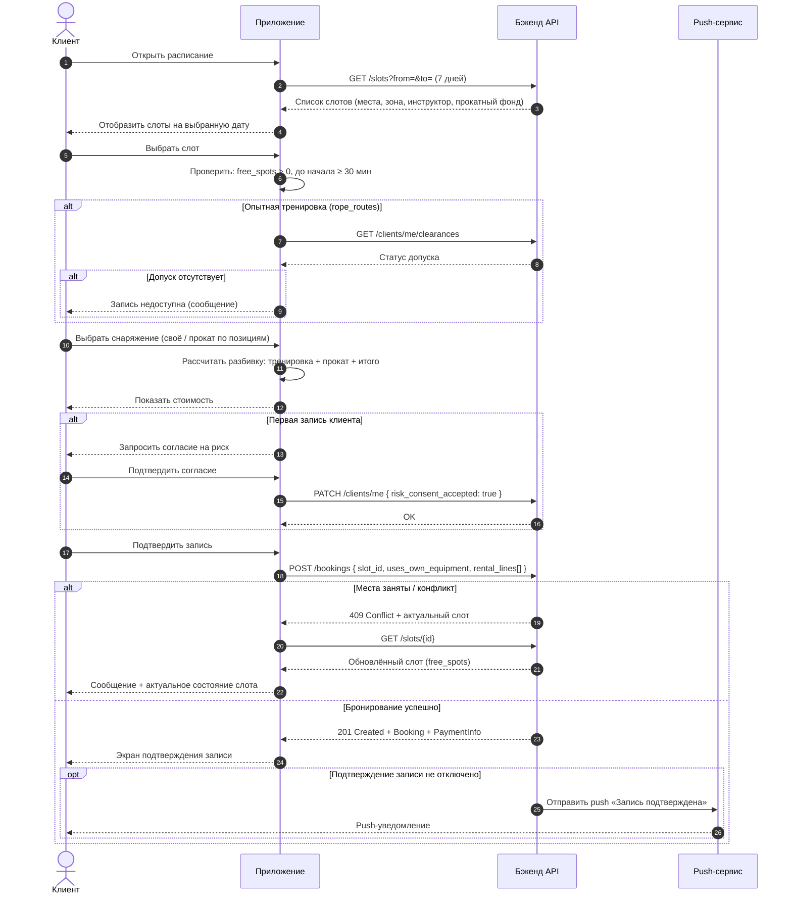
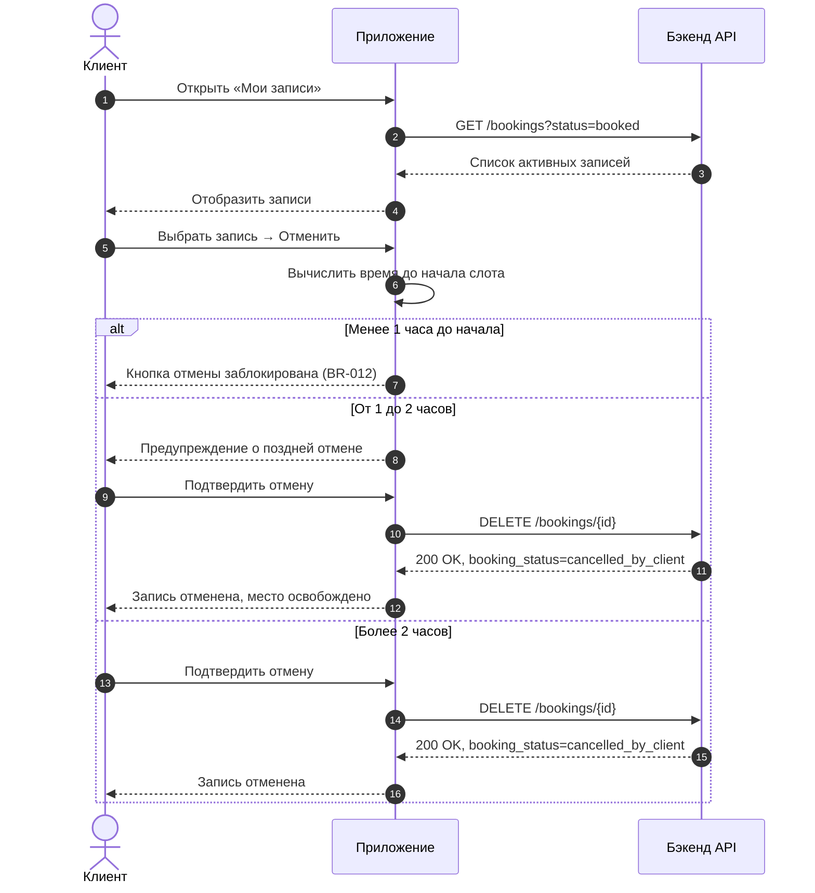
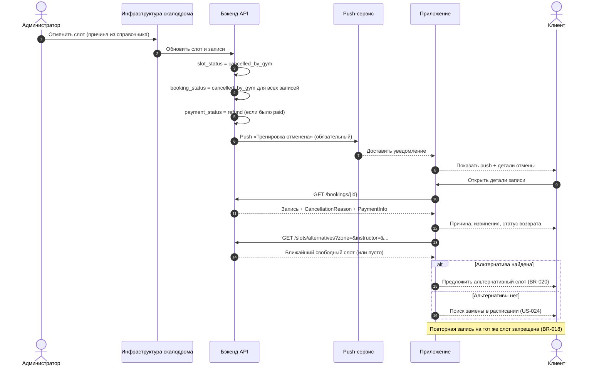
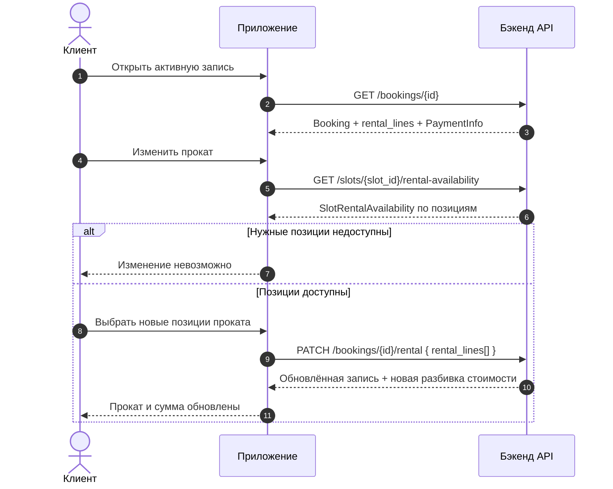
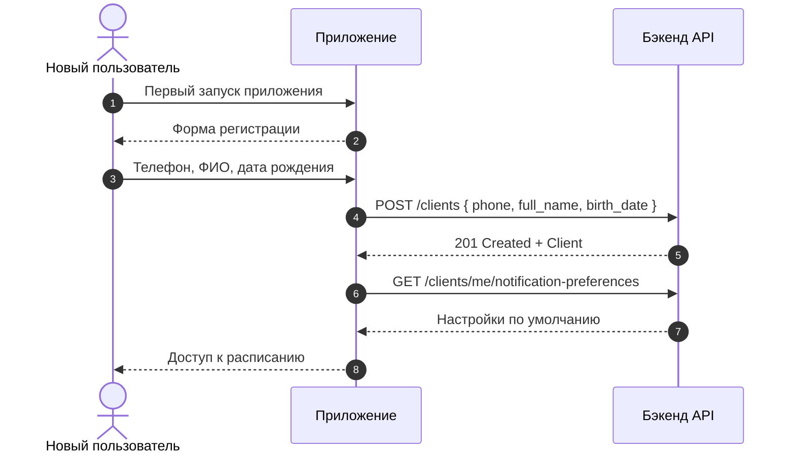
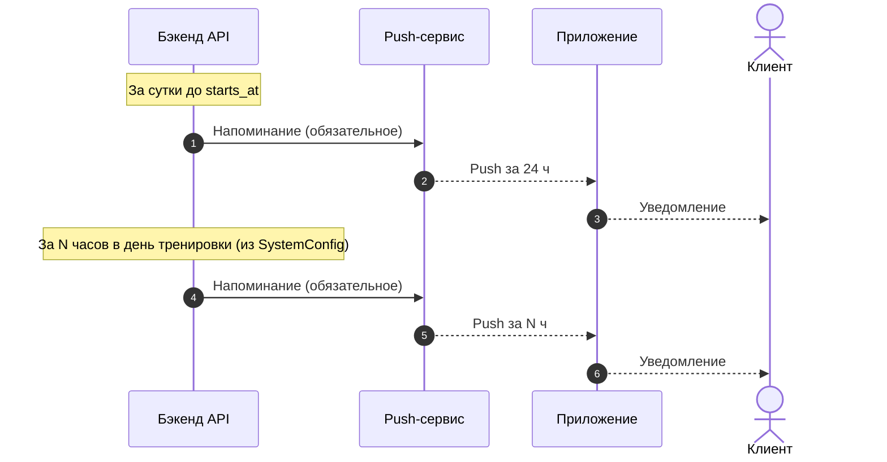
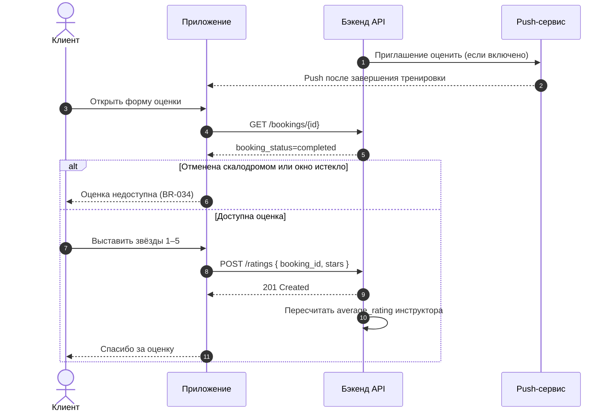

# Sequence-диаграммы — Скалодром «Вертикаль»

> Взаимодействие участников в ключевых сценариях клиентского приложения.

**Участники:**
- **Клиент** — пользователь мобильного приложения
- **Приложение** — клиентское мобильное приложение (UI + локальная логика)
- **API** — бэкенд скалодрома (источник истины)
- **Push** — сервис push-уведомлений

---

## 1. UC-002: Запись на тренировку (основной сценарий)

**Связанные требования:** UC-002, FR-008–FR-014, BR-002–BR-008, US-003–US-008.

---

## 2. UC-003: Отмена записи клиентом

**Связанные требования:** UC-003, FR-017–FR-019, BR-010–BR-013, US-010–US-011.

---

## 3. UC-004: Отмена тренировки скалодромом (реакция приложения)

> Инициатор отмены — администратор в существующей инфраструктуре; приложение **только потребляет** обновлённые данные и push.

**Связанные требования:** UC-004, FR-020–FR-022, BR-016–BR-021, US-012–US-014, US-025.

---

## 4. UC-008: Изменение проката после записи

**Связанные требования:** UC-008, FR-028, US-019.

---

## 5. UC-005 + UC-006: Регистрация и напоминания

### 5.1. Регистрация (UC-006)

### 5.2. Push-напоминания (UC-005)

**Связанные требования:** UC-005, UC-006, FR-024–FR-026, BR-027–BR-028, US-016–US-017.

---

## 6. UC-009: Оценка инструктора (Post-MVP)

**Связанные требования:** UC-009, FR-029–FR-031, BR-033–BR-035, US-020.

---

## 7. Карта диаграмм к use cases

| Диаграмма | Use Case | Приоритет |
|-----------|----------|-----------|
| §1 Запись на тренировку | UC-002 | MVP |
| §2 Отмена клиентом | UC-003 | MVP |
| §3 Отмена скалодромом | UC-004 | MVP |
| §4 Изменение проката | UC-008 | MVP |
| §5.1 Регистрация | UC-006 | MVP |
| §5.2 Напоминания | UC-005 | MVP |
| §6 Оценка инструктора | UC-009 | Post-MVP |
