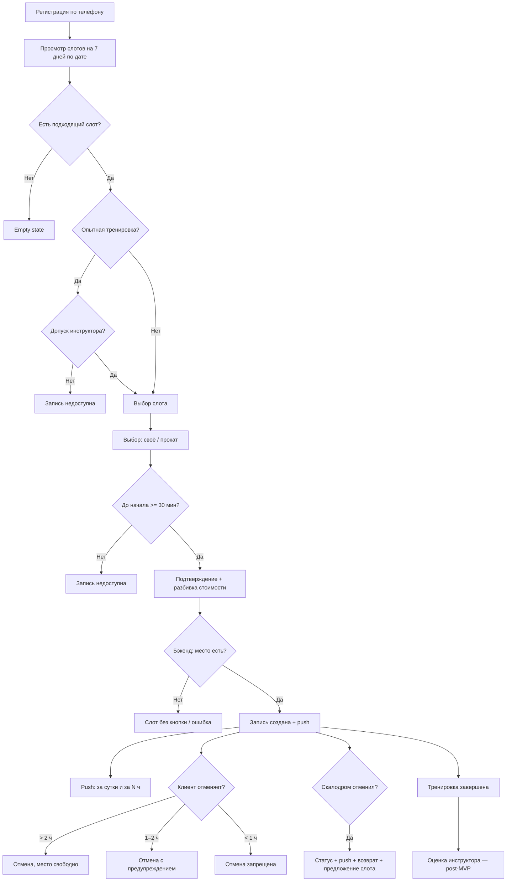

# Описание домена — скалодром «Вертикаль»

> Сформировано на основе брифа [`brief-climbing.md`](../0-customer-brief/brief-climbing.md), уточнений по скоупу и ответов заказчика [`customer-answers.md`](./customer-answers.md).

---

## 1. Контекст бизнеса

**Скалодром «Вертикаль»** — indoor-скалодром в бывшем складском ангаре. Организация проводит **групповые тренировки** под руководством инструкторов. Основная боль заказчика — **ручная запись** через Telegram и бумажную тетрадь: в часы пик возникают двойные бронирования, путаница с занятостью инструкторов и мест в группах.

**Цель системы (для текущей поставки):** дать **клиентам** мобильное приложение для самостоятельного просмотра расписания и записи на тренировки, снижая нагрузку на владельца.

**Ограничения проекта:**
- срок — к началу нового сезона (~2 месяца);
- бюджет ограничен → приоритет MVP;
- основной канал использования — **смартфон** (клиенты в зале);
- язык интерфейса MVP — **только русский**.

---

## 2. Границы текущей поставки

| В скоупе | Вне скоупа (уже есть / другая команда) |
|----------|----------------------------------------|
| Клиентское **мобильное приложение** | Интерфейс **инструктора** |
| **API** для клиентского приложения | Интерфейс **владельца / администратора** |
| Сценарии **роли «Клиент»** | Создание и редактирование расписания, слотов, зон |
| Потребление данных из бэкенда | Транзакционность, SLA, внутренние модели бэкенда |
| Обработка ответов API (в т.ч. отказ при нет мест) | Гарантия «0 двойных броней» на стороне клиента |
| Подтверждение допуска инструктором (отображение статуса) | Действие инструктора по допуску (в его интерфейсе) |

**Существующий бэкенд** — black-box **источник истины**: слоты, зоны/форматы, инструкторы, прокатный фонд поступают через API. Атомарная проверка свободных мест при бронировании — **на стороне бэкенда**. Детали аутентификации и маппинга статусов — **вне обсуждения с заказчиком** (сторонний бэкенд).

**Каноническая модель данных** для клиентского приложения — **контракт API** (исторических данных и легаси-схемы нет).

### MVP vs Post-MVP

| Обязательно в MVP | Можно отложить |
|-------------------|----------------|
| Просмотр слотов на 7 дней (поиск по дате) | Оценка инструктора после тренировки |
| Запись с выбором проката | Онлайн-оплата |
| Просмотр своих записей | Другие языки интерфейса |
| Отмена записи клиентом | Оферта / политика ПДн |
| Push при отмене скалодромом | Расширенные способы регистрации (e-mail и др.) |
| Push: подтверждение записи, напоминания | |
| Сумма и статус оплаты (офлайн) | |
| Бейдж и бонус постоянного клиента | |
| Согласие на риск при первой записи | |

---

## 3. Участники (акторы)

| Актор | Роль в домене | В текущей поставке |
|-------|---------------|-------------------|
| **Клиент** | Записывается на тренировки, выбирает прокат, отменяет запись, оценивает инструктора | **Да** — основной пользователь приложения |
| **Инструктор** | Ведёт групповую тренировку (~1,5 ч); **подтверждает допуск** клиента на «опытные» тренировки | Нет (интерфейс существует отдельно) |
| **Владелец / администратор (Оля)** | Управляет расписанием, инструкторами, отменами, профилактикой | Нет (админка существует отдельно) |
| **Бэкенд / API** | Хранит данные, формирует расписание, выполняет бронирование | Интеграционная граница |

---

## 4. Ключевые понятия домена

### 4.1. Тренировка (слот)

Единица расписания, на которую записывается клиент.

**Атрибуты (из брифа и контракта API):**
- дата и время начала;
- длительность ~**1,5 часа**;
- **зона / формат** тренировки;
- **инструктор** (со **средней оценкой** — post-MVP для отображения);
- количество **свободных мест** и **вместимость** группы (отображается как «осталось X из Y»);
- **прокатный тариф** на снаряжение;
- **адрес скалодрома** (схема проезда не обязательна).

**Форматы тренировок:**
- **Болдеринг с инструктажем** — для новичков;
- **Трассы с верёвкой** — для более опытных; запись возможна только при **допуске инструктора**.

**Горизонт планирования:** расписание на **неделю вперёд**. В приложении по умолчанию — **7 дней**; более длинный период — через фильтр дат. Основной способ навигации — **по дате**. При отсутствии слотов — **empty state**. Отменённые скалодромом слоты **остаются в списке с пометкой**.

**Ограничение записи:** не позднее чем за **30 минут** до начала.

### 4.2. Группа и вместимость

- Общий максимум в группе — **до 16 человек**.
- На **новичковые** тренировки — **не более 8**.
- При **0 свободных мест** слот отображается **без кнопки записи** (лист ожидания не используется).

### 4.3. Инструктор

Сотрудник, ведущий тренировку. У заказчика **5 постоянных** инструкторов, в сезон — **подработчики**. Клиент видит **среднюю оценку** инструктора до записи (post-MVP сценарий оценки; отображение рейтинга может быть включено раньше, если данные приходят из API).

### 4.4. Клиент

Человек, записывающийся на тренировку. Регистрация по **телефону**; обязательные поля: **ФИО, телефон, дата рождения**. При **первой записи** — подтверждение **согласия на риск**.

**Постоянный клиент:** после **N** посещённых тренировок (N — конфигурируемый параметр) — **бейдж «постоянный клиент»** и **скидка/бонус**.

Может иметь **несколько активных записей** одновременно.

### 4.5. Запись (бронирование)

Связь **клиент ↔ слот**. Запись **действительна сразу** после подтверждения бэкендом, без ожидания оплаты.

**Решения клиента при записи:**
- участие **со своим снаряжением** и/или **прокат** по позициям;
- выбор слота с учётом свободных мест и **прокатного фонда**.

**Изменение проката** после записи — разрешено, если нужные позиции есть в свободном фонде.

**Перенос записи** не поддерживается — только **отмена + новая запись**.

### 4.6. Снаряжение и прокат

**Позиции проката:** скальные туфли, страховочная система, каска, магнезия.

- Комбинация **своё + прокат** — разрешена.
- При исчерпании прокатного фонда запись **без проката** всё равно возможна.

**Стоимость в UI:** разбивка **тренировка + прокат + итого**.

### 4.7. Оценка инструктора *(post-MVP)*

- Формат: **звёзды 1–5**, без текста.
- Окно: **1–2 суток** после завершения тренировки.
- При **отмене скалодромом** — оценить **нельзя**.
- **Средняя оценка** видна клиенту **до записи**.

### 4.8. Оплата

На старте — **офлайн** (наличные, перевод). В приложении:
- **сумма к оплате** (разбивка по п. 4.6);
- статус: **«не оплачено»** / **«оплачено»** / **«возврат»** (при отмене скалодромом после оплаты).

Задел под **онлайн-оплату** в следующих итерациях.

---

## 5. Бизнес-правила

### 5.1. Запись

| ID | Правило |
|----|---------|
| BR-001 | Клиент видит доступные слоты и записывается самостоятельно. |
| BR-002 | При записи клиент выбирает прокат по позициям или указывает своё снаряжение. |
| BR-003 | Бронирование успешно только при подтверждении бэкенда; при отказе — актуальное состояние слота. |
| BR-004 | Двойная запись исключается **на стороне бэкенда**. |
| BR-005 | Клиент может иметь **несколько активных записей** одновременно. |
| BR-006 | Запись на слот не позднее чем за **30 минут** до начала. |
| BR-007 | На «опытные» тренировки (трассы с верёвкой) — только при **допуске инструктора**. |
| BR-008 | При 0 свободных мест — слот **без кнопки записи**. |
| BR-009 | Отображать **конкретное число** свободных мест («осталось X из Y»). |
| BR-027 | По умолчанию слоты на **7 дней**; навигация **по дате**. |

### 5.2. Отмена клиентом

| ID | Правило |
|----|---------|
| BR-010 | **> 2 ч до начала** — обычная отмена, место освобождается. |
| BR-011 | **1–2 ч до начала** — отмена **с предупреждением**, место освобождается. |
| BR-012 | **< 1 ч до начала** — отмена **запрещена** в UI. |
| BR-013 | Перенос не поддерживается — **отмена + новая запись**. |
| BR-014 | За **N** поздних отмен и **неявок** — санкции (N — конфигурируемый параметр). |
| BR-015 | **Неявка** учитывается вместе с поздними отменами для санкций. |

### 5.3. Отмена скалодромом

| ID | Правило |
|----|---------|
| BR-016 | Запись переводится в **«Отменена скалодромом»** с **причиной** из **фиксированного списка** + краткие извинения. |
| BR-017 | Клиент получает **обязательный push**. |
| BR-018 | **Повторная запись на тот же слот запрещена**. |
| BR-019 | Слот **остаётся в списке с пометкой** об отмене. |
| BR-020 | Предложить **ближайший свободный слот** с теми же параметрами (зона, сложность, инструктор, прокат); если нет — клиент ищет замену **сам**. |
| BR-021 | Статус оплаты меняется на **«возврат»**, если была оплата. |
| BR-022 | Отмена слота выполняется в **существующей инфраструктуре**. |

### 5.4. Оплата

| ID | Правило |
|----|---------|
| BR-023 | MVP: **офлайн-оплата**; в приложении — сумма и статус. |
| BR-024 | Запись **не блокируется** ожиданием оплаты. |
| BR-025 | Статусы оплаты: **не оплачено**, **оплачено**, **возврат**. |

### 5.5. Уведомления

| ID | Правило |
|----|---------|
| BR-026 | Push в MVP: **подтверждение записи**, **напоминания**, **отмена скалодромом**, **приглашение оценить** (post-MVP сценарий, push можно включить позже). |
| BR-027 | Напоминания: **за сутки** и **за N часов** в день тренировки (N — конфигурируемый). |
| BR-028 | **Обязательные** (не отключаются): напоминания, отмена скалодромом. |
| BR-029 | **Отключаемые:** подтверждение записи, приглашение к оценке. |

### 5.6. Профиль и лояльность

| ID | Правило |
|----|---------|
| BR-030 | Регистрация по **телефону**; поля: **ФИО, телефон, дата рождения**. |
| BR-031 | При **первой записи** — **согласие на риск**. |
| BR-032 | После **N** посещений — бейдж **«постоянный клиент»** + скидка/бонус (N — конфигурируемый). |

### 5.7. Оценка инструктора *(post-MVP)*

| ID | Правило |
|----|---------|
| BR-033 | Оценка: **звёзды 1–5**, в течение **1–2 суток** после завершения. |
| BR-034 | При отмене скалодромом — оценка **недоступна**. |
| BR-035 | **Средняя оценка** инструктора видна **до записи**. |

---

## 6. Основные процессы (клиентская перспектива)

---

## 7. Статусы записи (логическая модель)

| Статус | Описание |
|--------|----------|
| **Забронировано** | Активная запись на предстоящий слот |
| **Отменено клиентом** | Клиент отменил (> 2 ч или 1–2 ч с предупреждением) |
| **Отменена скалодромом** | Слот отменён организатором; причина из списка; push; возможен возврат |
| **Завершено** | Тренировка состоялась |
| **Неявка** | Клиент не пришёл; учитывается для санкций |

**Статусы оплаты (отдельная ось):** не оплачено → оплачено → возврат.

---

## 8. Нефункциональные ожидания

- **Мобильный-first UX** — быстрый доступ к слотам по дате и своим записям.
- **Актуальность данных** — свободные места и прокатный фонд из API.
- **Понятные сообщения** — при конфликте бронирования, запрете отмены, отсутствии допуска.
- **Push** — обязательны для отмены скалодромом и напоминаний.
- **Язык** — русский в MVP.
- **Конфигурируемые параметры** — N часов напоминания, N посещений для лояльности, N нарушений для санкций.

---

## 9. Отложенные области

| Тема | Статус |
|------|--------|
| Оценка инструктора | **Post-MVP** (единственный отложенный пользовательский сценарий) |
| Онлайн-оплата | Следующая итерация (UI уже готовит сумму и статус) |
| Другие языки | После MVP |
| Оферта / ПДн | Не нужны в первой версии |
| Лист ожидания | **Не используется** (решение заказчика) |
| Детали интеграции с бэкендом | Вне обсуждения с заказчиком |

---

## 10. Глоссарий

| Термин | Определение |
|--------|-------------|
| **Болдеринг** | Скалолазание на невысоких стенах без верёвки, с матами |
| **Трассы с верёвкой** | Скалолазание со страховочной системой; требует допуска инструктора |
| **Слот** | Конкретная тренировка в расписании |
| **Профилактика** | Плановые работы в зоне, влекущие отмену тренировок |
| **Прокатный фонд** | Доступное на слот снаряжение для аренды |
| **Empty state** | «Пока нет доступных тренировок» |
| **Неявка** | Клиент не пришёл и не отменил заранее |
| **Постоянный клиент** | Статус после N посещений: бейдж + скидка/бонус |
