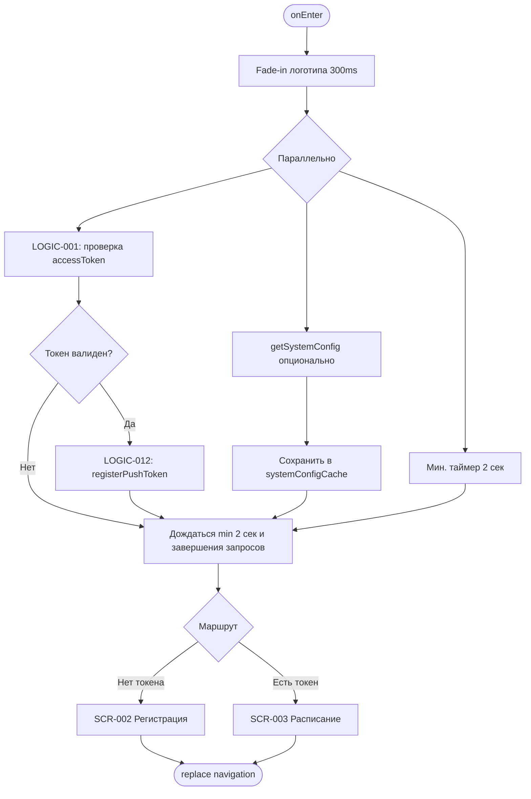
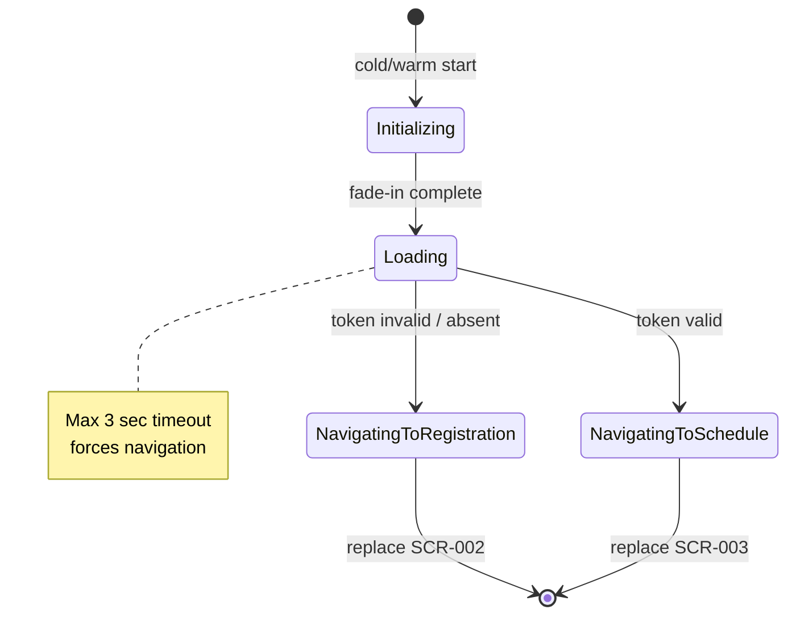

# Экран загрузки приложения

**ID:** SCR-001  
**Тип:** Экран  
**Домен:** 01. Авторизация  
**Приоритет:** Critical  
**Статус:** Актуален  
**Функциональные блоки:** FB-AUTH-001  
**Зона авторизации:** НЗ  
**Дизайн-макет:** [DB-001 Splash Screen](../../3-design-brief/design-briefs.md#db-001-splash-screen) — версия 1.0

---

## Содержание

- [История изменений](#история-изменений)
- [Обзор](#обзор)
- [Навигация](#навигация)
- [Входные данные](#входные-данные)
- [Применяемые логики](#применяемые-логики)
- [Инициализация](#инициализация)
- [Используемые запросы](#используемые-запросы)
- [Макет экрана](#макет-экрана)
- [Элементы экрана](#элементы-экрана)
- [Состояния экрана](#состояния-экрана)
- [Действия пользователя](#действия-пользователя)
- [Связанные требования](#связанные-требования)
- [Критерии приёмки](#критерии-приёмки)

---

## История изменений

| Релиз | ТЗ | Описание изменений |
|-------|-----|-------------------|
| 1.0.0 | [SCR-001 Splash Screen](SCR-001_Splash-Screen.md) | Первоначальная документация экрана загрузки |

---

## Обзор

Начальный экран приложения «Вертикаль», отображаемый при каждом холодном и тёплом запуске. Экран формирует первое впечатление о бренде, выполняет проверку локальной сессии пользователя, опционально загружает системную конфигурацию и инициирует регистрацию push-токена для авторизованных пользователей. Минимальное время отображения — 2 секунды; максимальное — 3 секунды до принудительного перехода.

### User Story

> Как клиент скалодрома, я хочу видеть брендированный экран загрузки при запуске приложения,
> чтобы понимать, что приложение инициализируется, и сразу попадать на нужный экран — регистрацию или расписание.

### Бизнес-ценность

- Создаёт профессиональное первое впечатление о скалодроме «Вертикаль»
- Сокращает время до основного сценария (просмотр расписания) за счёт автоматической проверки сессии
- Обеспечивает доставку push-уведомлений через раннюю регистрацию токена устройства

---

## Навигация

### Входящая (откуда открывается)

| Источник | Триггер | Условие | Передаваемые параметры |
|----------|---------|---------|------------------------|
| Система (OS) | Запуск приложения | Холодный / тёплый старт | — |
| Deep link | `vertikal://` | Редирект после инициализации | `{targetRoute}` (сохраняется до завершения splash) |

### Исходящая (куда ведёт)

| Назначение | Триггер | Передаваемые параметры |
|------------|---------|------------------------|
| [SCR-002 Registration Screen](SCR-002_Registration-Screen.md) | Автоматически после инициализации | — |
| [SCR-003 Schedule Screen](../02_Schedule/SCR-003_Schedule-Screen.md) | Автоматически после инициализации | — |

---

## Входные данные

| Название | Тип | Возможные значения | Описание |
|----------|-----|-------------------|----------|
| `accessToken` | Защищённое хранилище (Keychain/Keystore) | JWT-строка, `null` | Токен авторизации, сохранённый при регистрации |
| `systemConfigCache` | Локальный кэш | `SystemConfig`, `null` | Кэшированные системные параметры (TTL 24 ч) |
| `pendingDeepLink` | Состояние приложения | URI, `null` | Отложенный deep link для навигации после splash |
| `appVersion` | Локальные метаданные | SemVer, напр. `1.0.0` | Версия приложения для опционального отображения |
| `themeMode` | Системные настройки / локальные prefs | `light`, `dark`, `system` | Тема оформления экрана |

---

## Применяемые логики

| Логика | Элемент/Триггер | Описание |
|--------|-----------------|----------|
| [LOGIC-001](../09_Logics/LOGIC-001_Проверка-сессии-при-запуске.md) | Инициализация экрана | Проверка наличия и валидности `accessToken`, выбор маршрута SCR-002 / SCR-003 |
| [LOGIC-012](../09_Logics/LOGIC-012_Регистрация-push-токена.md) | После подтверждения авторизации | Отправка FCM/APNs токена на сервер при наличии валидной сессии |

---

## Инициализация

> При открытии экрана выполняется параллельная проверка локального токена и опциональный запрос системной конфигурации. Push-токен регистрируется только после подтверждения авторизации.

### Диаграмма загрузки



### Запросы при открытии

| № | Запрос | Критичный | Зависит от | Условие |
|---|--------|-----------|------------|---------|
| 1 | [getSystemConfig](#getsystemconfig) | Нет | — | Кэш отсутствует или TTL истёк |
| 2 | [registerPushToken](#registerpushtoken) | Нет | № логики LOGIC-001 | `accessToken` валиден |

> Полное описание запросов см. в секции [Используемые запросы](#используемые-запросы).

---

## Используемые запросы

### getSystemConfig

**Тип:** REST  
**Метод:** GET  
**Спецификация:** [openapi.yaml](../../api/openapi.yaml) → `getSystemConfig`

**Триггер:** Инициализация (фоново, некритично)

**Параметры:**

| Параметр | Тип | Обязательность | Источник | Описание |
|----------|-----|----------------|----------|----------|
| — | — | — | — | Запрос без параметров |

**Обработка ответа:**

| Результат | Условие | UI-реакция |
|-----------|---------|------------|
| Загрузка | — | Без изменений UI (splash продолжает отображаться) |
| Успех | HTTP 200 | Сохранить `SystemConfig` в `systemConfigCache` (в т.ч. `booking_cutoff_minutes`) |
| HTTP 4xx/5xx | — | Использовать закэшированный конфиг или значения по умолчанию (`booking_cutoff_minutes = 30`) |
| Сеть | Нет соединения | Использовать кэш; при отсутствии кэша — дефолты |

---

### registerPushToken

**Тип:** REST  
**Метод:** PUT  
**Спецификация:** [openapi.yaml](../../api/openapi.yaml) → `registerPushToken`

**Триггер:** После успешной проверки сессии (LOGIC-001 → авторизован)

**Параметры:**

| Параметр | Тип | Обязательность | Источник | Описание |
|----------|-----|----------------|----------|----------|
| `token` | string | Да | FCM / APNs SDK | Push-токен устройства |
| `platform` | string | Да | OS | `ios` или `android` |
| `Authorization` | header | Да | `accessToken` | Bearer JWT |

**Обработка ответа:**

| Результат | Условие | UI-реакция |
|-----------|---------|------------|
| Загрузка | — | Без блокировки перехода с splash |
| Успех | HTTP 204 | Переход на SCR-003 (не дожидаясь, если min timer истёк) |
| HTTP 401 | — | Очистить `accessToken`, переход на SCR-002 |
| HTTP 4xx/5xx | — | Логирование ошибки; переход на SCR-003 без блокировки |
| Сеть | Нет соединения | Отложенная повторная отправка в фоне; переход на SCR-003 |

---

## Макет экрана

### Структура

```
┌─────────────────────────────────────┐
│                                     │
│                                     │
│         [Логотип «Вертикаль»]       │  ← Центр экрана
│              120×120 px             │
│                                     │
│           ◌ Spinner                 │  ← Под логотипом
│                                     │
│                                     │
│         v1.0.0 (опционально)        │  ← Низ экрана, caption
└─────────────────────────────────────┘
```

### Компоненты

| Компонент | Описание | Обязательность |
|-----------|----------|----------------|
| Логотип | SVG/PNG бренда «Вертикаль», fade-in 300 ms | Да |
| Spinner | Циклический индикатор загрузки в акцентном цвете | Да |
| Версия приложения | Caption, 12 sp, вторичный цвет | Опционально |
| Фон | Сплошной цвет или градиент бренда; light/dark | Да |

---

## Элементы экрана

### 1. Брендинг и индикация загрузки

| Элемент | Описание | Источник данных | Валидация | Действие |
|---------|----------|-----------------|-----------|----------|
| Логотип «Вертикаль» | Центрированный логотип скалодрома, min 120×120 dp | Локальный asset | — | — |
| Spinner | Анимированный индикатор под логотипом | — | — | — |
| Текст версии | «v{appVersion}» внизу экрана | `appVersion` | — | — |

**Логика:**
- Логотип: анимация fade-in 300 ms при `onEnter`
- Spinner: бесконечная циклическая анимация до завершения инициализации
- Тема: фон и цвет spinner адаптируются под `themeMode` (светлая / тёмная)

**Условия доступности:**
- Текст версии скрыт, если `appVersion` недоступен
- Экран не содержит интерактивных элементов — пользователь не может прервать загрузку

---

## Состояния экрана

### Таблица состояний

| Состояние | Условие | Отображение |
|-----------|---------|-------------|
| Initializing | `onEnter` — первые 300 ms | Логотип с fade-in, spinner |
| Loading | Проверка токена + опциональные запросы | Логотип + spinner (min 2 сек) |
| Navigating | Инициализация завершена | Fade-out 200 ms → replace на целевой экран |
| Error (silent) | Сбой getSystemConfig / registerPushToken | Splash без изменений; переход по маршруту LOGIC-001 |

### Диаграмма переходов



---

## Действия пользователя

| Действие | Элемент | Триггер | Результат |
|----------|---------|---------|-----------|
| — | — | — | Экран полностью пассивный; навигация автоматическая |

> Системная кнопка «Назад» на Android на splash не отображается (root экран стека). Жест «назад» закрывает приложение.

---

## Связанные требования

### Функциональные (FR)

| ID | Название | Приоритет |
|----|----------|-----------|
| FR-026 | Регистрация по телефону | Высокий (MVP) |

### Нефункциональные

| ID | Название | Приоритет |
|----|----------|-----------|
| NFR-006 | Конфигурируемые параметры через SystemConfig | Средний |
| NFR-UI-001 | Поддержка светлой и тёмной темы | Высокий |
| NFR-UI-002 | Время splash ≤ 3 секунд | Высокий |

---

## Критерии приёмки

### Позитивные сценарии

| ID | Критерий | Приоритет |
|----|----------|-----------|
| AC-001 | **Дано** приложение установлено впервые (нет `accessToken`), **Когда** пользователь запускает приложение, **Тогда** отображается splash с логотипом и spinner минимум 2 сек, затем переход на SCR-002 | P0 |
| AC-002 | **Дано** пользователь ранее зарегистрирован (`accessToken` валиден), **Когда** запуск приложения, **Тогда** splash ≥ 2 сек, затем переход на SCR-003 | P0 |
| AC-003 | **Дано** валидный `accessToken` и получен push-токен от OS, **Когда** завершение splash, **Тогда** отправляется `registerPushToken` с Bearer-токеном | P0 |
| AC-004 | **Дано** кэш `systemConfigCache` отсутствует, **Когда** splash, **Тогда** выполняется `getSystemConfig` и результат сохраняется локально | P1 |
| AC-005 | **Дано** включена тёмная тема, **Когда** splash, **Тогда** фон и элементы соответствуют dark palette | P1 |
| AC-006 | **Дано** cold start с deep link, **Когда** splash завершён и пользователь авторизован, **Тогда** после SCR-003 выполняется навигация на целевой deep link | P2 |

### Негативные сценарии

| ID | Критерий | Приоритет |
|----|----------|-----------|
| AC-N01 | **Дано** `accessToken` просрочен (401 при registerPushToken), **Когда** splash, **Тогда** токен очищается, переход на SCR-002 | P0 |
| AC-N02 | **Дано** нет сети при getSystemConfig, **Когда** splash, **Тогда** используется кэш или дефолты, переход не блокируется | P0 |
| AC-N03 | **Дано** registerPushToken вернул 5xx, **Когда** splash, **Тогда** переход на SCR-003 выполняется, ошибка логируется | P1 |

### Граничные условия (Edge Cases)

| ID | Критерий | Приоритет |
|----|----------|-----------|
| AC-E01 | **Дано** инициализация заняла > 3 сек, **Когда** таймаут splash, **Тогда** принудительный переход по результату LOGIC-001 | P0 |
| AC-E02 | **Дано** тёплый старт из background, **Когда** приложение восстановлено, **Тогда** splash не показывается повторно (возврат на текущий экран) | P1 |
| AC-E03 | **Дано** экран малой ширины (320 dp), **Когда** splash, **Тогда** логотип масштабируется без обрезки, spinner виден | P2 |

---
