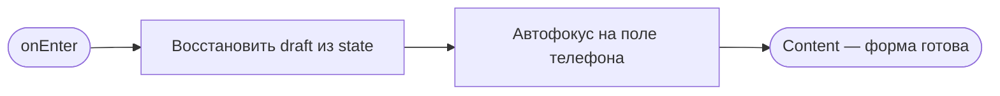
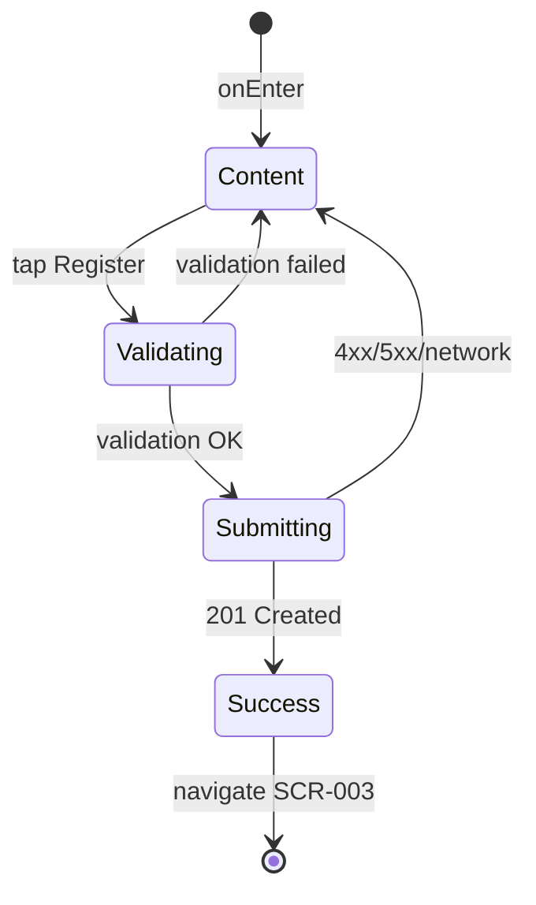

# Экран регистрации по телефону

**ID:** SCR-002  
**Тип:** Экран  
**Домен:** 01. Авторизация  
**Приоритет:** Critical  
**Статус:** Актуален  
**Функциональные блоки:** FB-AUTH-002  
**Зона авторизации:** НЗ  
**Дизайн-макет:** [DB-002 Registration Screen](../../3-design-brief/design-briefs.md#db-002-registration-screen) — версия 1.0

---

## Содержание

- [История изменений](#история-изменений)
- [Обзор](#обзор)
- [Навигация](#навигация)
- [Входные данные](#входные-данные)
- [Применяемые логики](#применяемые-логики)
- [Инициализация](#инициализация)
- [Используемые запросы](#используемые-запросы)
- [Макет экрана](#макет-экрана)
- [Элементы экрана](#элементы-экрана)
- [Состояния экрана](#состояния-экрана)
- [Действия пользователя](#действия-пользователя)
- [Связанные требования](#связанные-требования)
- [Критерии приёмки](#критерии-приёмки)

---

## История изменений

| Релиз | ТЗ | Описание изменений |
|-------|-----|-------------------|
| 1.0.0 | [SCR-002 Registration Screen](SCR-002_Registration-Screen.md) | Первоначальная документация экрана регистрации |

---

## Обзор

Экран первичной регистрации клиента скалодрома «Вертикаль» по номеру телефона. Пользователь вводит телефон, ФИО и дату рождения; после успешной валидации отправляется запрос регистрации. При успехе сохраняется JWT-токен и профиль клиента, выполняется регистрация push-токена и переход на экран расписания.

### User Story

> Как новый клиент скалодрома, я хочу быстро зарегистрироваться по номеру телефона,
> чтобы получить доступ к расписанию тренировок и записи на занятия.

### Бизнес-ценность

- Минимальный барьер входа — три обязательных поля (BR-030)
- Единая точка создания учётной записи и получения токена авторизации
- Формирование клиентской базы для последующих записей и лояльности

---

## Навигация

### Входящая (откуда открывается)

| Источник | Триггер | Условие | Передаваемые параметры |
|----------|---------|---------|------------------------|
| [SCR-001 Splash Screen](SCR-001_Splash-Screen.md) | Автоматический переход | `accessToken` отсутствует или невалиден | — |
| [SCR-010 Profile Screen](../10_Профиль/SCR-010_Profile-Screen.md) | «Выйти» → повторный вход | Пользователь вышел из аккаунта | — |

### Исходящая (куда ведёт)

| Назначение | Триггер | Передаваемые параметры |
|------------|---------|------------------------|
| [SCR-003 Schedule Screen](../02_Schedule/SCR-003_Schedule-Screen.md) | Успешная регистрация (HTTP 201) | — |

---

## Входные данные

| Название | Тип | Возможные значения | Описание |
|----------|-----|-------------------|----------|
| `draftPhone` | Состояние формы | Строка, `""` | Черновик номера телефона (сохраняется при повороте экрана) |
| `draftFullName` | Состояние формы | Строка, `""` | Черновик ФИО |
| `draftBirthDate` | Состояние формы | `Date`, `null` | Черновик даты рождения |

---

## Применяемые логики

| Логика | Элемент/Триггер | Описание |
|--------|-----------------|----------|
| [LOGIC-002](../09_Logics/LOGIC-002_Регистрация-клиента.md) | Кнопка «Зарегистрироваться» | Валидация полей, формирование E.164, вызов `registerClient`, сохранение токена |
| [LOGIC-012](../09_Logics/LOGIC-012_Регистрация-push-токена.md) | После успешной регистрации | Регистрация push-токена устройства |

---

## Инициализация

> При открытии экрана API-запросы не выполняются. Данные берутся из локального состояния формы или пустых значений по умолчанию.

### Диаграмма загрузки



### Запросы при открытии

| № | Запрос | Критичный | Зависит от | Условие |
|---|--------|-----------|------------|---------|
| — | — | — | — | Запросы при открытии не выполняются |

---

## Используемые запросы

### registerClient

**Тип:** REST  
**Метод:** POST  
**Спецификация:** [openapi.yaml](../../api/openapi.yaml) → `registerClient`

**Триггер:** Тап на кнопку «Зарегистрироваться» после успешной клиентской валидации

**Параметры:**

| Параметр | Тип | Обязательность | Источник | Описание |
|----------|-----|----------------|----------|----------|
| `phone` | string | Да | Поле «Телефон» | Формат E.164, напр. `+79001234567` |
| `full_name` | string | Да | Поле «ФИО» | 1–200 символов |
| `birth_date` | string (date) | Да | Date picker | ISO 8601: `YYYY-MM-DD` |

**Тело запроса (пример):**

```json
{
  "phone": "+79001234567",
  "full_name": "Иванов Иван Иванович",
  "birth_date": "1995-03-15"
}
```

**Обработка ответа:**

| Результат | Условие | UI-реакция |
|-----------|---------|------------|
| Загрузка | — | Spinner на кнопке «Зарегистрироваться», блокировка полей формы |
| Успех | HTTP 201 | Сохранить `access_token` и `client` в secure storage → LOGIC-012 → Snackbar «Регистрация успешна» → replace SCR-003 |
| HTTP 400 | `code` validation error | Подсветить поле, текст из `message` |
| HTTP 409 | `CLIENT_ALREADY_EXISTS` | Snackbar «Клиент с указанным номером телефона уже зарегистрирован» |
| HTTP 5xx | — | Snackbar «Произошла ошибка. Попробуйте позже» |
| Сеть | Нет соединения | Snackbar «Нет соединения. Проверьте подключение» |

---

### registerPushToken

**Тип:** REST  
**Метод:** PUT  
**Спецификация:** [openapi.yaml](../../api/openapi.yaml) → `registerPushToken`

**Триггер:** Сразу после успешного `registerClient` (LOGIC-012)

**Параметры:**

| Параметр | Тип | Обязательность | Источник | Описание |
|----------|-----|----------------|----------|----------|
| `token` | string | Да | FCM / APNs SDK | Push-токен устройства |
| `platform` | string | Да | OS | `ios` / `android` |
| `Authorization` | header | Да | `access_token` из ответа registerClient | Bearer JWT |

**Обработка ответа:**

| Результат | Условие | UI-реакция |
|-----------|---------|------------|
| Успех | HTTP 204 | Переход на SCR-003 |
| Ошибка | Любая | Логирование; переход на SCR-003 не блокируется |

---

## Макет экрана

### Структура

```
┌─────────────────────────────────────┐
│           Регистрация               │  ← Header (без кнопки назад)
├─────────────────────────────────────┤
│                                     │
│  Телефон*                           │
│  [+7 XXX XXX-XX-XX            ]     │
│                                     │
│  ФИО*                               │
│  [Иванов Иван Иванович        ]     │
│                                     │
│  Дата рождения*                     │
│  [15.03.1995              📅 ]      │
│                                     │
│         (Scrollable content)        │
├─────────────────────────────────────┤
│      [ Зарегистрироваться ]         │  ← Fixed bottom, primary
└─────────────────────────────────────┘
```

### Компоненты

| Компонент | Описание | Обязательность |
|-----------|----------|----------------|
| Header | Заголовок «Регистрация», без back (root после splash) | Да |
| Поле телефона | Маска +7, keyboard type: phone | Да |
| Поле ФИО | Text input, keyboard type: name | Да |
| Date picker | Нативный или inline picker даты рождения | Да |
| Кнопка регистрации | Primary, fixed bottom | Да |
| Inline-ошибки | Красная рамка + текст под полем | Да |

---

## Элементы экрана

### 1. Форма регистрации

| Элемент | Описание | Источник данных | Валидация | Действие |
|---------|----------|-----------------|-----------|----------|
| Поле «Телефон*» | Маска ввода +7 XXX XXX-XX-XX | `draftPhone` | 10 цифр после +7. Ошибка: «Введите корректный номер телефона» | — |
| Поле «ФИО*» | Полное имя одной строкой | `draftFullName` | 2–200 символов, кириллица/латиница, мин. 2 слова. Ошибка: «Укажите фамилию и имя» | — |
| Поле «Дата рождения*» | Date picker, формат отображения ДД.ММ.ГГГГ | `draftBirthDate` | Дата ≤ сегодня; возраст ≥ 6 лет. Ошибка: «Укажите корректную дату рождения» | Открыть date picker |
| Кнопка «Зарегистрироваться» | Primary button | — | — | LOGIC-002 → [registerClient](#registerclient) |

**Момент валидации:** При потере фокуса (onBlur) для каждого поля; повторная полная валидация при тапе на кнопку.

**Логика:**
- Поле «Телефон»: маска автоматически добавляет префикс `+7`; при отправке формируется E.164 (`+7` + 10 цифр)
- Поле «ФИО»: trim пробелов по краям; множественные пробелы схлопываются до одного
- Date picker: максимальная дата — сегодня; минимальная — 100 лет назад
- Кнопка «Зарегистрироваться»: [LOGIC-002](../09_Logics/LOGIC-002_Регистрация-клиента.md) — валидация → API → сохранение сессии → LOGIC-012

**Условия доступности:**
- Кнопка «Зарегистрироваться» активна, если: все три поля заполнены И клиентская валидация пройдена И запрос не в процессе
- Кнопка заблокирована (disabled + spinner), если: выполняется `registerClient`

---

## Состояния экрана

### Таблица состояний

| Состояние | Условие | Отображение |
|-----------|---------|-------------|
| Content | Экран открыт | Форма с полями, кнопка в состоянии enabled/disabled |
| Validating | Тап «Зарегистрироваться», ошибки в полях | Подсветка невалидных полей |
| Submitting | Запрос registerClient in-flight | Spinner на кнопке, поля disabled |
| Success | HTTP 201 | Snackbar + переход SCR-003 |
| Error | 4xx/5xx/сеть | Snackbar и/или inline-ошибки полей |

### Диаграмма переходов



---

## Действия пользователя

| Действие | Элемент | Триггер | Результат |
|----------|---------|---------|-----------|
| Ввод телефона | Поле «Телефон» | Keyboard | Обновление `draftPhone`, маска +7 |
| Ввод ФИО | Поле «ФИО» | Keyboard | Обновление `draftFullName` |
| Выбор даты | Поле «Дата рождения» | Tap | Открытие date picker |
| Регистрация | Кнопка «Зарегистрироваться» | Tap | LOGIC-002 → registerClient |
| Системная «Назад» | OS | Back gesture | Закрытие приложения (root экран) |

---

## Связанные требования

### Функциональные (FR)

| ID | Название | Приоритет |
|----|----------|-----------|
| FR-026 | Регистрация по телефону | Высокий (MVP) |

### Бизнес-правила

| ID | Описание |
|----|----------|
| BR-030 | Регистрация по телефону; обязательные поля: ФИО, телефон, дата рождения |

---

## Критерии приёмки

### Позитивные сценарии

| ID | Критерий | Приоритет |
|----|----------|-----------|
| AC-001 | **Дано** новый пользователь на SCR-002, **Когда** вводит валидные телефон, ФИО, дату рождения и нажимает «Зарегистрироваться», **Тогда** POST registerClient с E.164 телефоном, сохраняется токен, переход на SCR-003 | P0 |
| AC-002 | **Дано** форма открыта, **Когда** onEnter, **Тогда** автофокус на поле телефона | P1 |
| AC-003 | **Дано** успешная регистрация, **Когда** получен access_token, **Тогда** выполняется registerPushToken (LOGIC-012) | P0 |
| AC-004 | **Дано** пользователь поворачивает экран при заполненной форме, **When** возврат в portrait, **Тогда** введённые данные сохранены | P1 |

### Негативные сценарии

| ID | Критерий | Приоритет |
|----|----------|-----------|
| AC-N01 | **Дано** телефон уже зарегистрирован, **Когда** registerClient, **Тогда** HTTP 409, Snackbar с текстом «Клиент с указанным номером телефона уже зарегистрирован» | P0 |
| AC-N02 | **Дано** неполная форма, **Когда** тап «Зарегистрироваться», **Тогда** кнопка неактивна или показаны ошибки валидации | P0 |
| AC-N03 | **Дано** нет сети, **Когда** отправка формы, **Тогда** Snackbar «Нет соединения. Проверьте подключение», форма разблокирована | P0 |
| AC-N04 | **Дано** дата рождения в будущем, **Когда** blur поля, **Тогда** ошибка «Укажите корректную дату рождения» | P1 |

### Граничные условия (Edge Cases)

| ID | Критерий | Приоритет |
|----|----------|-----------|
| AC-E01 | **Дано** ФИО ровно 200 символов, **Когда** регистрация, **Тогда** запрос успешен | P2 |
| AC-E02 | **Дано** возраст ровно 6 лет, **Когда** регистрация, **Тогда** запрос успешен | P2 |
| AC-E03 | **Дано** двойной тап на «Зарегистрироваться», **Когда** первый запрос in-flight, **Тогда** повторный запрос не отправляется | P0 |

---
