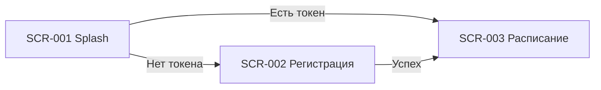

# 01. Авторизация — индекс экранов

**Домен:** 01. Авторизация  
**Приложение:** Скалодром «Вертикаль»  
**Релиз:** 1.0.0

---

## Экраны домена

| ID | Название | Файл ТЗ | Приоритет | Зона авторизации | Статус |
|----|----------|---------|-----------|------------------|--------|
| SCR-001 | Splash Screen | [SCR-001_Splash-Screen.md](SCR-001_Splash-Screen.md) | Critical | НЗ | Актуален |
| SCR-002 | Registration Screen | [SCR-002_Registration-Screen.md](SCR-002_Registration-Screen.md) | Critical | НЗ | Актуален |

---

## Связанные логики

| Логика | Экраны | Описание |
|--------|--------|----------|
| [LOGIC-001](../09_Logics/LOGIC-001_Проверка-сессии-при-запуске.md) | SCR-001 | Проверка локального токена и маршрутизация при старте |
| [LOGIC-002](../09_Logics/LOGIC-002_Регистрация-клиента.md) | SCR-002 | Регистрация по телефону через API |
| [LOGIC-012](../09_Logics/LOGIC-012_Регистрация-push-токена.md) | SCR-001 | Регистрация push-токена после успешной авторизации |

---

## Навигация домена

---

## Связанные требования

- [FR-026](../../2-requirements/functional-requirements.md) — регистрация по телефону
- [DB-001, DB-002](../../3-design-brief/design-briefs.md) — постановки на дизайн
