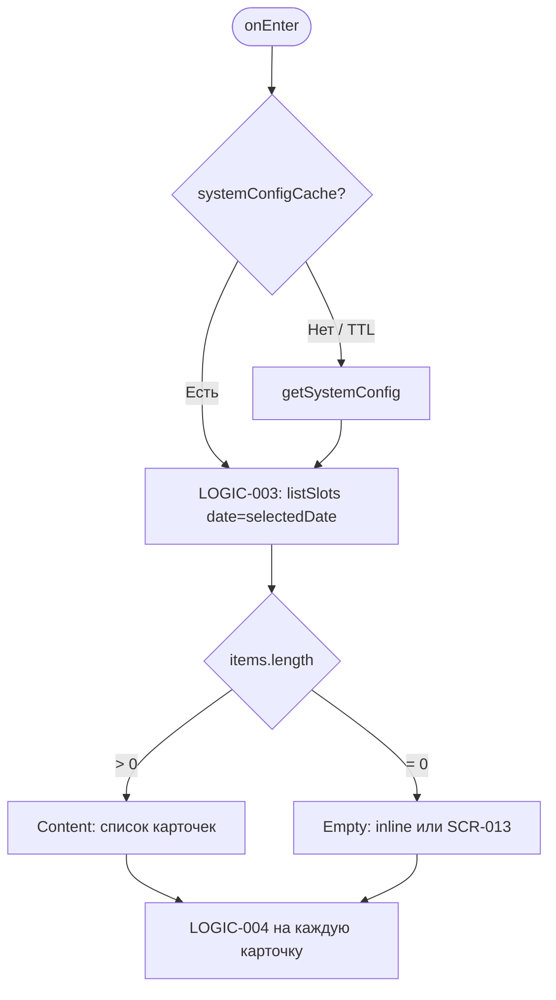
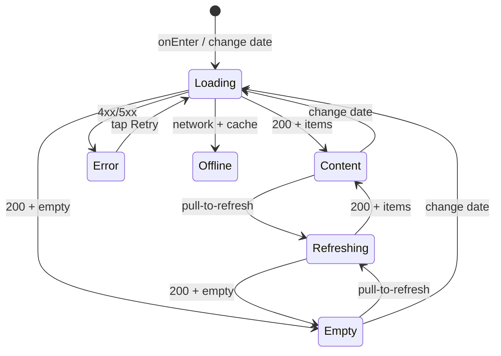

# Экран расписания тренировок

**ID:** SCR-003  
**Тип:** Экран  
**Домен:** 02. Расписание  
**Приоритет:** High  
**Статус:** Актуален  
**Функциональные блоки:** FB-SCHED-001, FB-SCHED-002  
**Зона авторизации:** НЗ (просмотр)  
**Дизайн-макет:** [DB-003 Schedule Screen](../../3-design-brief/design-briefs.md#db-003-schedule-screen) — версия 1.0

---

## Содержание

- [История изменений](#история-изменений)
- [Обзор](#обзор)
- [Навигация](#навигация)
- [Входные данные](#входные-данные)
- [Применяемые логики](#применяемые-логики)
- [Инициализация](#инициализация)
- [Используемые запросы](#используемые-запросы)
- [Макет экрана](#макет-экрана)
- [Элементы экрана](#элементы-экрана)
- [Состояния экрана](#состояния-экрана)
- [Действия пользователя](#действия-пользователя)
- [Связанные требования](#связанные-требования)
- [Критерии приёмки](#критерии-приёмки)

---

## История изменений

| Релиз | ТЗ | Описание изменений |
|-------|-----|-------------------|
| 1.0.0 | [SCR-003 Schedule Screen](SCR-003_Schedule-Screen.md) | Первоначальная документация экрана расписания |

---

## Обзор

Основной экран приложения для просмотра доступных тренировочных слотов на 7 дней вперёд. Пользователь выбирает дату в горизонтальном переключателе и видит список карточек слотов с ключевой информацией и состоянием доступности записи. Экран доступен без авторизации для просмотра; запись на тренировку потребует авторизации на последующих экранах.

### User Story

> Как клиент скалодрома, я хочу просматривать расписание тренировок на неделю вперёд,
> чтобы выбрать подходящий слот по времени, зоне и инструктору.

### Бизнес-ценность

- Главная точка входа в сценарий записи на тренировку
- Прозрачное отображение доступности мест и ограничений записи (BR-006, BR-007, BR-008)
- Снижение нагрузки на администраторов за счёт self-service просмотра расписания

---

## Навигация

### Входящая (откуда открывается)

| Источник | Триггер | Условие | Передаваемые параметры |
|----------|---------|---------|------------------------|
| [SCR-001 Splash Screen](../01_Authentication/SCR-001_Splash-Screen.md) | Автоматический переход | Пользователь авторизован | — |
| [SCR-002 Registration Screen](../01_Authentication/SCR-002_Registration-Screen.md) | После регистрации | HTTP 201 | — |
| [SCR-004 Slot Detail Screen](SCR-004_Slot-Detail-Screen.md) | Кнопка «Назад» | Всегда | — |
| [SCR-006 My Bookings Screen](../03_Записи/SCR-006_My-Bookings-Screen.md) | «Записаться на тренировку» | Empty state записей | — |
| [SCR-013 Empty State Screen](SCR-013_Empty-State-Screen.md) | «Выбрать другую дату» | — | — |
| Bottom Navigation | Таб «Расписание» | Если реализован tab bar | `{selectedDate?}` |

### Исходящая (куда ведёт)

| Назначение | Триггер | Передаваемые параметры |
|------------|---------|------------------------|
| [SCR-004 Slot Detail Screen](SCR-004_Slot-Detail-Screen.md) | Тап на карточку слота / «Подробнее» | `slotId` |
| [SCR-013 Empty State Screen](SCR-013_Empty-State-Screen.md) | Пустой список слотов (опционально full-screen) | `selectedDate` |

---

## Входные данные

| Название | Тип | Возможные значения | Описание |
|----------|-----|-------------------|----------|
| `selectedDate` | Состояние экрана | ISO date, напр. `2026-07-10` | Выбранная дата в переключателе; по умолчанию — сегодня |
| `systemConfigCache` | Локальный кэш | `SystemConfig` | Параметр `booking_cutoff_minutes` для LOGIC-004 |
| `slotsCache` | Локальный кэш | `Map<date, TrainingSlotSummary[]>` | Офлайн-кэш слотов по датам |
| `accessToken` | Secure storage | JWT / `null` | Для учёта `clearance_granted` в availability (если API учитывает auth) |

---

## Применяемые логики

| Логика | Элемент/Триггер | Описание |
|--------|-----------------|----------|
| [LOGIC-003](../09_Logics/LOGIC-003_Загрузка-расписания-слотов.md) | onEnter, смена даты, pull-to-refresh | Загрузка `listSlots`, кэширование, сортировка по `starts_at` |
| [LOGIC-004](../09_Logics/LOGIC-004_Отображение-доступности-слота.md) | Карточка слота, кнопка «Записаться» | Определение UI-состояния: доступен, мало мест, нет мест, запись закрыта, нужен допуск, отменено |

---

## Инициализация

### Диаграмма загрузки



### Запросы при открытии

| № | Запрос | Критичный | Зависит от | Условие |
|---|--------|-----------|------------|---------|
| 1 | [getSystemConfig](#getsystemconfig) | Нет | — | Кэш отсутствует или TTL истёк |
| 2 | [listSlots](#listslots) | Да | — | Всегда при onEnter и смене `selectedDate` |

---

## Используемые запросы

### getSystemConfig

**Тип:** REST  
**Метод:** GET  
**Спецификация:** [openapi.yaml](../../api/openapi.yaml) → `getSystemConfig`

**Триггер:** Инициализация (если кэш пуст)

**Параметры:**

| Параметр | Тип | Обязательность | Источник | Описание |
|----------|-----|----------------|----------|----------|
| — | — | — | — | Без параметров |

**Обработка ответа:**

| Результат | Условие | UI-реакция |
|-----------|---------|------------|
| Успех | HTTP 200 | Сохранить в `systemConfigCache`; использовать `booking_cutoff_minutes` |
| Ошибка | 4xx/5xx/сеть | Fallback: `booking_cutoff_minutes = 30` |

---

### listSlots

**Тип:** REST  
**Метод:** GET  
**Спецификация:** [openapi.yaml](../../api/openapi.yaml) → `listSlots`

**Триггер:** Инициализация, смена даты, pull-to-refresh

**Параметры:**

| Параметр | Тип | Обязательность | Источник | Описание |
|----------|-----|----------------|----------|----------|
| `date` | string (date) | Да | `selectedDate` | Фильтр слотов на конкретный день (FR-002) |

**Обработка ответа:**

| Результат | Условие | UI-реакция |
|-----------|---------|------------|
| Загрузка | — | Skeleton loader (3–5 карточек-шиммеров) |
| Успех | `items.length > 0` | Список карточек слотов, LOGIC-004 |
| Успех | `items.length = 0` | Inline empty state «Пока нет доступных тренировок» + кнопка «Выбрать другую дату»; опционально navigate SCR-013 |
| HTTP 400 | — | Snackbar «Некорректная дата» |
| HTTP 4xx/5xx | — | Error state с кнопкой «Обновить» |
| Сеть | Нет соединения | Показать `slotsCache[selectedDate]` если есть; иначе Error state |

**Маппинг полей карточки:**

| UI-элемент | Поле API |
|------------|----------|
| Время начала | `starts_at` → формат «HH:mm» |
| Длительность | `duration_minutes` → «~1,5 ч» при 90 |
| Зона/формат | `zone.name`, `zone.format_type` |
| Инструктор | `instructor.full_name` |
| Свободные места | `free_spots`, `capacity` → «осталось X из Y» |
| Прокат | `rental_tariff` → «от N ₽» |
| Адрес | `address` или `venue.address` |
| Статус отмены | `slot_status = cancelled_by_gym` |
| Доступность записи | `availability.*` + LOGIC-004 |

---

## Макет экрана

### Структура

```
┌─────────────────────────────────────┐
│  Расписание                         │  ← Header
├─────────────────────────────────────┤
│ [<] Пн,15  Вт,16  Ср,17 ... [>]     │  ← Date switcher (7 дней)
├─────────────────────────────────────┤
│ ┌─────────────────────────────────┐ │
│ │ 18:00          ~1,5 ч           │ │
│ │ 🧗 Болдеринг с инструктажем     │ │
│ │ 👤 Петров А.С.                  │ │
│ │ 🟢 осталось 5 из 8              │ │
│ │ Прокат: от 500 ₽                │ │
│ │ г. Москва, ул. ...              │ │
│ │              [ Записаться ]     │ │
│ └─────────────────────────────────┘ │
│         ... (Scrollable list)       │
└─────────────────────────────────────┘
```

### Компоненты

| Компонент | Описание | Обязательность |
|-----------|----------|----------------|
| Date Switcher | Горизонтальный скролл 7 дней от сегодня | Да |
| Sticky date label | «Сегодня» / «Пн, 15 янв» при прокрутке | Да |
| Slot Card | Карточка слота с иерархией информации | Да |
| Pull-to-refresh | Обновление listSlots | Да |
| Skeleton loader | Шиммер карточек при загрузке | Да |
| Inline Empty State | Иллюстрация + текст + CTA | Да |
| Error State | Иконка + «Не удалось загрузить» + Retry | Да |

---

## Элементы экрана

### 1. Переключатель дат

| Элемент | Описание | Источник данных | Валидация | Действие |
|---------|----------|-----------------|-----------|----------|
| Chip даты | Кнопка дня: «Пн, 15 янв» / «Сегодня» | Локально: today + 6 дней | — | Установить `selectedDate`, вызвать listSlots |
| Стрелка влево | Сдвиг окна дат (опционально) | — | — | — |
| Стрелка вправо | Сдвиг окна дат (опционально) | — | Disabled если достигнут +7 день | — |
| Sticky header | Название выбранной даты | `selectedDate` | — | — |

**Логика:**
- Диапазон: 7 календарных дней начиная с сегодня (BR-027, FR-001)
- Текущий день: chip с акцентным фоном; подпись «Сегодня» вместо даты при совпадении
- При смене даты: [LOGIC-003](../09_Logics/LOGIC-003_Загрузка-расписания-слотов.md) → listSlots

---

### 2. Карточка слота

| Элемент | Описание | Источник данных | Валидация | Действие |
|---------|----------|-----------------|-----------|----------|
| Время начала | Крупный жирный текст | `starts_at` | — | Tap карточки → SCR-004 |
| Длительность | «~1,5 ч» | `duration_minutes` | — | — |
| Бейдж зоны | Иконка + `zone.name` | `zone` | — | — |
| Цвет зоны | Болдеринг — зелёный; верёвка — синий | `zone.format_type` | — | — |
| Инструктор | ФИО | `instructor.full_name` | — | — |
| Рейтинг инструктора | Звёзды 1–5 | `instructor.average_rating` | — | Post-MVP: скрыт если null |
| Индикатор мест | «осталось X из Y» | `free_spots`, `capacity` | — | — |
| Прокатный тариф | «Прокат: от N ₽» | `rental_tariff` | — | Скрыт если null |
| Адрес | Мелкий текст | `address` | — | — |
| Бейдж «Отменено» | Штамп на карточке | `slot_status = cancelled_by_gym` | — | — |
| Кнопка «Записаться» | Primary compact | LOGIC-004 | — | SCR-004 (tap карточки) или SCR-005* |
| Статус «Нет мест» | Серый текст вместо кнопки | `availability.has_free_spots = false` | — | — |
| Статус «Запись закрыта» | Серый текст | `within_booking_window = false` | — | — |
| Статус «Нужен допуск» | Оранжевый текст | `clearance_required && !clearance_granted` | — | — |
| Индикатор «мало мест» | Оранжевый, «осталось мало» | `free_spots < 3 && free_spots > 0` | — | — |

> *Прямой переход на SCR-005 из списка не реализуется в MVP — пользователь сначала открывает SCR-004.

**Логика:**
- Карточка целиком: [LOGIC-004](../09_Logics/LOGIC-004_Отображение-доступности-слота.md) определяет состояние кнопки и индикаторов
- Отменённые слоты (`cancelled_by_gym`): карточка с пониженной opacity, бейдж «Отменено», кнопка записи скрыта (FR-006, BR-019)
- Сортировка: по `starts_at` ascending

**Условия доступности кнопки «Записаться»:**

| Состояние | Условие | UI |
|-----------|---------|-----|
| available | `availability.can_book = true` | Активная кнопка, зелёный акцент |
| few_spots | `free_spots ∈ [1,2]` | Кнопка активна, оранжевый индикатор |
| no_spots | `free_spots = 0` | Кнопка скрыта, «Мест нет» (FR-007) |
| booking_closed | `!within_booking_window` | Кнопка disabled, «Запись закрыта» (FR-008) |
| clearance_required | `clearance_required && !clearance_granted` | Кнопка disabled, «Нужен допуск инструктора» (FR-009) |
| cancelled | `slot_status = cancelled_by_gym` | Кнопка скрыта, бейдж «Отменено» |

---

### 3. Empty State (inline)

| Элемент | Описание | Источник данных | Валидация | Действие |
|---------|----------|-----------------|-----------|----------|
| Иллюстрация | Пустой календарь / скалолаз | Local asset | — | — |
| Заголовок | «Пока нет доступных тренировок» | — | — | — |
| Подзаголовок | «Попробуйте выбрать другую дату» | — | — | — |
| Кнопка «Выбрать другую дату» | Primary | — | — | Фокус на date switcher или SCR-013 |

---

## Состояния экрана

### Таблица состояний

| Состояние | Условие | Отображение |
|-----------|---------|-------------|
| Loading | listSlots in-flight | Skeleton 3–5 карточек |
| Content | HTTP 200, items > 0 | Date switcher + список карточек |
| Empty | HTTP 200, items = 0 | Date switcher + inline empty state |
| Error | 4xx/5xx без кэша | Error state + «Обновить» |
| Offline | Нет сети, есть кэш | Content из кэша + banner «Офлайн-режим» |
| Refreshing | Pull-to-refresh | Контент + refresh indicator |

### Диаграмма переходов



---

## Действия пользователя

| Действие | Элемент | Триггер | Результат |
|----------|---------|---------|-----------|
| Выбор даты | Chip даты | Tap | listSlots с новым `date` |
| Просмотр деталей | Карточка слота | Tap | SCR-004 с `slotId` |
| Обновление списка | Список | Pull-to-refresh | LOGIC-003 → listSlots |
| Повтор загрузки | Кнопка «Обновить» | Tap | LOGIC-003 → listSlots |
| Выбор другой даты | Empty state CTA | Tap | Фокус date switcher / SCR-013 |

---

## Связанные требования

### Функциональные (FR)

| ID | Название | Приоритет |
|----|----------|-----------|
| FR-001 | Просмотр расписания на 7 дней | Высокий (MVP) |
| FR-002 | Фильтрация слотов по дате | Высокий (MVP) |
| FR-003 | Отображение информации о слоте | Высокий (MVP) |
| FR-004 | Отображение средней оценки инструктора | Низкий (Post-MVP) |
| FR-005 | Empty state при отсутствии слотов | Высокий (MVP) |
| FR-006 | Отображение отменённых слотов | Высокий (MVP) |
| FR-007 | Блокировка кнопки при 0 мест | Высокий (MVP) |
| FR-008 | Блокировка записи < 30 мин | Высокий (MVP) |
| FR-009 | Блокировка без допуска | Высокий (MVP) |

### Бизнес-правила

| ID | Описание |
|----|----------|
| BR-006 | Запись не позднее чем за 30 мин до начала |
| BR-007 | Верёвка — только с допуском |
| BR-008 | 0 мест — без кнопки записи |
| BR-009 | Формат «осталось X из Y» |
| BR-019 | Отменённые слоты в списке с пометкой |
| BR-027 | Горизонт 7 дней |

---

## Критерии приёмки

### Позитивные сценарии

| ID | Критерий | Приоритет |
|----|----------|-----------|
| AC-001 | **Дано** SCR-003 открыт, **Когда** onEnter, **Тогда** listSlots с `date=today`, skeleton → список карточек | P0 |
| AC-002 | **Дано** 7 дней в switcher, **Когда** выбор другой даты, **Тогда** новый запрос listSlots с соответствующим `date` | P0 |
| AC-003 | **Дано** слот с 5 свободными из 8, **Когда** отображение карточки, **Тогда** текст «осталось 5 из 8», активная кнопка «Записаться» | P0 |
| AC-004 | **Дано** слот `cancelled_by_gym`, **Когда** список, **Тогда** карточка с бейджем «Отменено», без кнопки записи | P0 |
| AC-005 | **Дано** pull-to-refresh, **Когда** жест, **Тогда** повторный listSlots, данные обновлены | P1 |
| AC-006 | **Дано** `free_spots = 2`, **Когда** карточка, **Тогда** оранжевый индикатор «осталось мало» | P1 |

### Негативные сценарии

| ID | Критерий | Приоритет |
|----|----------|-----------|
| AC-N01 | **Дано** `free_spots = 0`, **Когда** карточка, **Тогда** кнопка записи скрыта, текст «Мест нет» | P0 |
| AC-N02 | **Дано** до начала < `booking_cutoff_minutes`, **Когда** карточка, **Тогда** «Запись закрыта», кнопка disabled | P0 |
| AC-N03 | **Дано** `rope_routes` без допуска, **Когда** карточка, **Тогда** «Нужен допуск инструктора», кнопка disabled | P0 |
| AC-N04 | **Дано** API 500, **Когда** загрузка без кэша, **Тогда** error state с «Обновить» | P0 |
| AC-N05 | **Дано** items пуст, **Когда** 200 OK, **Тогда** «Пока нет доступных тренировок» | P0 |

### Граничные условия (Edge Cases)

| ID | Критерий | Приоритет |
|----|----------|-----------|
| AC-E01 | **Дано** последний день 7-дневного окна, **Когда** выбор даты, **Тогда** listSlots успешен | P1 |
| AC-E02 | **Дано** офлайн и есть slotsCache, **Когда** открытие, **Тогда** показ кэша + banner офлайн | P1 |
| AC-E03 | **Дано** смена даты во время loading, **Когда** два запроса, **Тогда** отображается результат последнего `selectedDate` | P0 |
| AC-E04 | **Дано** 20+ слотов на день, **Когда** скролл, **Тогда** плавная прокрутка без падения FPS | P2 |

---
