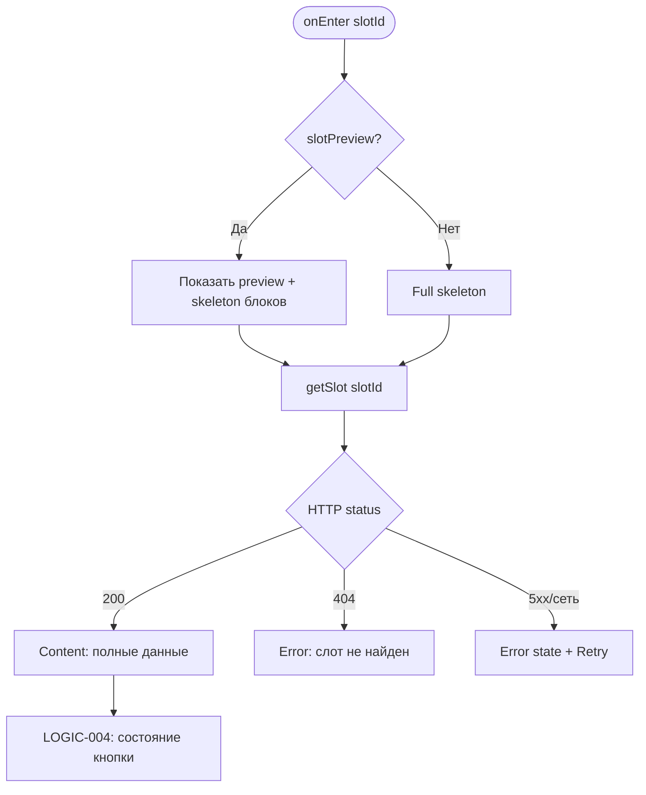
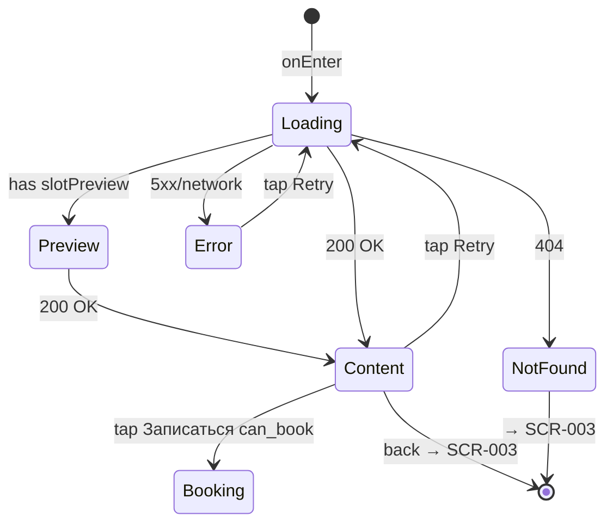

# Экран деталей слота тренировки

**ID:** SCR-004  
**Тип:** Экран  
**Домен:** 02. Расписание  
**Приоритет:** High  
**Статус:** Актуален  
**Функциональные блоки:** FB-SCHED-003  
**Зона авторизации:** НЗ (просмотр)  
**Дизайн-макет:** [DB-004 Slot Detail Screen](../../3-design-brief/design-briefs.md#db-004-slot-detail-screen) — версия 1.0

---

## Содержание

- [История изменений](#история-изменений)
- [Обзор](#обзор)
- [Навигация](#навигация)
- [Входные данные](#входные-данные)
- [Применяемые логики](#применяемые-логики)
- [Инициализация](#инициализация)
- [Используемые запросы](#используемые-запросы)
- [Макет экрана](#макет-экрана)
- [Элементы экрана](#элементы-экрана)
- [Состояния экрана](#состояния-экрана)
- [Действия пользователя](#действия-пользователя)
- [Связанные требования](#связанные-требования)
- [Критерии приёмки](#критерии-приёмки)

---

## История изменений

| Релиз | ТЗ | Описание изменений |
|-------|-----|-------------------|
| 1.0.0 | [SCR-004 Slot Detail Screen](SCR-004_Slot-Detail-Screen.md) | Первоначальная документация экрана деталей слота |

---

## Обзор

Экран подробной информации о выбранном тренировочном слоте. Отображает полные данные о дате, времени, зоне, инструкторе, доступности мест, прокате и адресе. Фиксированная кнопка «Записаться» внизу экрана ведёт на оформление записи (SCR-005) при доступном слоте. Просмотр доступен без авторизации; запись потребует авторизованной сессии.

### User Story

> Как клиент скалодрома, я хочу видеть полную информацию о тренировке перед записью,
> чтобы принять обоснованное решение о выборе времени, зоны и инструктора.

### Бизнес-ценность

- Снижает неопределённость перед записью — все параметры слота в одном месте
- Явно коммуницирует ограничения (нет мест, закрыта запись, нужен допуск)
- Точка конверсии из просмотра расписания в сценарий бронирования

---

## Навигация

### Входящая (откуда открывается)

| Источник | Триггер | Условие | Передаваемые параметры |
|----------|---------|---------|------------------------|
| [SCR-003 Schedule Screen](SCR-003_Schedule-Screen.md) | Тап на карточку слота | Всегда | `slotId` (UUID) |
| [SCR-005 Booking Screen](../03_Записи/SCR-005_Booking-Screen.md) | Кнопка «Отмена» | Возврат без записи | `slotId` |
| [SCR-015 Consent Screen](../04_Согласие/SCR-015_Consent-Screen.md) | Кнопка «Отмена» | — | `slotId` |
| Deep link | `vertikal://slots/{slotId}` | Слот существует | `slotId` |
| Push-уведомление | «Посмотреть детали» (напоминание) | `type = reminder` | `slotId` |

### Исходящая (куда ведёт)

| Назначение | Триггер | Передаваемые параметры |
|------------|---------|------------------------|
| [SCR-005 Booking Screen](../03_Записи/SCR-005_Booking-Screen.md) | Кнопка «Записаться» | `slotId`, snapshot слота |
| [SCR-003 Schedule Screen](SCR-003_Schedule-Screen.md) | Кнопка «Назад» / системный back | — |

---

## Входные данные

| Название | Тип | Возможные значения | Описание |
|----------|-----|-------------------|----------|
| `slotId` | Route param | UUID | Идентификатор слота из SCR-003 или deep link |
| `slotPreview` | Navigation extra | `TrainingSlotSummary`, `null` | Опциональный snapshot для мгновенного отображения до API |
| `systemConfigCache` | Локальный кэш | `SystemConfig` | `booking_cutoff_minutes` для LOGIC-004 |

---

## Применяемые логики

| Логика | Элемент/Триггер | Описание |
|--------|-----------------|----------|
| [LOGIC-004](../09_Logics/LOGIC-004_Отображение-доступности-слота.md) | Блок доступности, кнопка «Записаться», предупреждения | Определение UI-состояний: available, no_spots, booking_closed, clearance_required, cancelled |

---

## Инициализация

### Диаграмма загрузки



### Запросы при открытии

| № | Запрос | Критичный | Зависит от | Условие |
|---|--------|-----------|------------|---------|
| 1 | [getSlot](#getslot) | Да | `slotId` | Всегда при onEnter |

---

## Используемые запросы

### getSlot

**Тип:** REST  
**Метод:** GET  
**Спецификация:** [openapi.yaml](../../api/openapi.yaml) → `getSlot`

**Триггер:** Инициализация, pull-to-refresh (опционально), retry после ошибки

**Параметры:**

| Параметр | Тип | Обязательность | Источник | Описание |
|----------|-----|----------------|----------|----------|
| `slotId` | string (uuid) | Да | Route param | Path parameter |

**Обработка ответа:**

| Результат | Условие | UI-реакция |
|-----------|---------|------------|
| Загрузка | — | Skeleton / preview + shimmer детальных блоков |
| Успех | HTTP 200 | Отобразить `TrainingSlotDetail`; применить LOGIC-004 |
| HTTP 404 | — | Full-screen «Слот не найден» + кнопка «К расписанию» → SCR-003 |
| HTTP 4xx/5xx | — | Error state с кнопкой «Обновить» |
| Сеть | Нет соединения | Error state; если есть `slotPreview` — показать с banner «Данные могут быть неактуальны» |

**Дополнительные поля детального ответа:**

| UI-блок | Поле API |
|---------|----------|
| Прокатный фонд | `rental_availability[]` — тип снаряжения, `available_count`, `unit_price` |
| Все поля summary | См. SCR-003 listSlots mapping |

---

## Макет экрана

### Структура

```
┌─────────────────────────────────────┐
│ [←]  Детали тренировки              │  ← Header
├─────────────────────────────────────┤
│                                     │
│  Суббота, 10 июля                   │
│  18:00 — 19:30                      │  ← Крупный заголовок
│                                     │
│  ⏱ ~1,5 часа                        │
│  🧗 Болдеринг с инструктажем        │
│                                     │
│  ┌─ Инструктор ─────────────────┐   │
│  │ 👤 Петров Алексей Сергеевич  │   │
│  │ ★★★★☆ 4.2 (Post-MVP)         │   │
│  └──────────────────────────────┘   │
│                                     │
│  ┌─ Доступность ────────────────┐   │
│  │ ████████░░ 5 из 8            │   │
│  │ 🟢 Запись открыта            │   │
│  └──────────────────────────────┘   │
│                                     │
│  ┌─ Прокат ─────────────────────┐   │
│  │ от 500 ₽                     │   │
│  │ • Скальные туфли — 300 ₽     │   │
│  │ • Магнезия — 100 ₽           │   │
│  └──────────────────────────────┘   │
│                                     │
│  📍 г. Москва, ул. Скалолазная, 1   │
│                                     │
│  ⚠️ Баннер предупреждения (если)    │
├─────────────────────────────────────┤
│        [ Записаться ]               │  ← Fixed bottom
└─────────────────────────────────────┘
```

### Компоненты

| Компонент | Описание | Обязательность |
|-----------|----------|----------------|
| Header | «Детали тренировки» + back | Да |
| Hero datetime | Дата и время крупно | Да |
| Info blocks | Длительность, зона, инструктор | Да |
| Availability block | Progress bar + статус | Да |
| Rental block | Тариф и позиции из `rental_availability` | Да |
| Address row | Иконка + полный адрес | Да |
| Warning banner | Условный (допуск, закрыта запись) | Опционально |
| Fixed CTA | «Записаться» / статус-текст | Да |
| Cancelled stamp | Штамп «Отменено» | При `cancelled_by_gym` |

---

## Элементы экрана

### 1. Заголовок и время

| Элемент | Описание | Источник данных | Валидация | Действие |
|---------|----------|-----------------|-----------|----------|
| Кнопка «Назад» | Icon back | — | — | SCR-003 |
| Дата | «Суббота, 10 июля» | `starts_at` | — | — |
| Время | «18:00 — 19:30» | `starts_at`, `duration_minutes` | — | — |
| Штамп «Отменено» | Overlay при отмене | `slot_status` | — | — |

**Логика:**
- Время окончания: `starts_at + duration_minutes`
- Shared element transition с карточкой SCR-003 (опционально, 300 ms)

---

### 2. Информация о тренировке

| Элемент | Описание | Источник данных | Валидация | Действие |
|---------|----------|-----------------|-----------|----------|
| Длительность | «~1,5 часа» + иконка часов | `duration_minutes` | — | — |
| Зона/формат | Название + цветовой акцент | `zone.name`, `zone.format_type` | — | — |
| Сложность | beginner / experienced | `zone.difficulty` | — | — |
| Фото инструктора | Avatar placeholder | — | — | Post-MVP |
| ФИО инструктора | Полное имя | `instructor.full_name` | — | — |
| Рейтинг | Звёзды 1–5 | `instructor.average_rating` | — | Post-MVP, скрыт если null |

---

### 3. Блок доступности

| Элемент | Описание | Источник данных | Валидация | Действие |
|---------|----------|-----------------|-----------|----------|
| Progress bar | Заполнение `(capacity - free_spots) / capacity` | `free_spots`, `capacity` | — | — |
| Текст мест | «осталось X из Y» | `free_spots`, `capacity` | — | — |
| Статус-индикатор | Цвет + текст состояния | LOGIC-004 | — | — |

**Логика:** [LOGIC-004](../09_Logics/LOGIC-004_Отображение-доступности-слота.md)

| Состояние | Условие | Цвет | Текст статуса |
|-----------|---------|------|---------------|
| available | `can_book = true`, places ≥ 3 | Зелёный | «Запись открыта» |
| few_spots | `free_spots ∈ [1,2]` | Оранжевый | «Осталось мало мест» |
| no_spots | `free_spots = 0` | Красный | «Мест нет» |
| booking_closed | `!within_booking_window` | Серый | «Запись закрыта — менее 30 мин до начала»* |
| clearance_required | `clearance_required && !clearance_granted` | Оранжевый | «Нужен допуск инструктора» |
| cancelled | `slot_status = cancelled_by_gym` | Серый | «Тренировка отменена скалодромом» |

> *Текст использует значение `booking_cutoff_minutes` из SystemConfig.

---

### 4. Блок проката

| Элемент | Описание | Источник данных | Валидация | Действие |
|---------|----------|-----------------|-----------|----------|
| Базовый тариф | «от N ₽» | `rental_tariff` | — | — |
| Список позиций | Название + цена за единицу | `rental_availability[]` | — | — |
| Иконки снаряжения | Туфли, система, каска, магнезия | `equipment_type.code` | — | — |

**Логика:**
- Отображать только позиции с `available_count > 0`
- При пустом `rental_availability` — текст «Прокат уточняйте на месте»

---

### 5. Адрес

| Элемент | Описание | Источник данных | Валидация | Действие |
|---------|----------|-----------------|-----------|----------|
| Адрес | Полный адрес с иконкой pin | `address` / `venue.address` | — | — |
| Название площадки | «Вертикаль» | `venue.name` | — | — |

---

### 6. Кнопка действия (fixed bottom)

| Элемент | Описание | Источник данных | Валидация | Действие |
|---------|----------|-----------------|-----------|----------|
| Кнопка «Записаться» | Primary, full width | LOGIC-004 | — | SCR-005 с `slotId` |
| Haptic feedback | Light impact | — | — | При успешном tap |

**Условия доступности:**
- Кнопка **активна**, если: `availability.can_book = true` И `slot_status = active`
- Кнопка **скрыта**, если: `slot_status = cancelled_by_gym` ИЛИ `free_spots = 0`
- Кнопка **disabled** с пояснением, если: `!within_booking_window` ИЛИ (`clearance_required && !clearance_granted`)
- При disabled: текст на кнопке заменяется статусом («Запись закрыта», «Нужен допуск»)

---

## Состояния экрана

### Таблица состояний

| Состояние | Условие | Отображение |
|-----------|---------|-------------|
| Loading | getSlot in-flight, нет preview | Full skeleton |
| Preview | Есть slotPreview, API loading | Preview data + shimmer |
| Content | HTTP 200 | Все блоки + CTA по LOGIC-004 |
| NotFound | HTTP 404 | «Слот не найден» |
| Error | 5xx / сеть без preview | Error + Retry |
| Cancelled | `cancelled_by_gym` | Content с opacity + stamp, CTA скрыта |

### Диаграмма переходов



---

## Действия пользователя

| Действие | Элемент | Триггер | Результат |
|----------|---------|---------|-----------|
| Назад | Header back / gesture | Tap / swipe | SCR-003 |
| Запись | «Записаться» | Tap | SCR-005 (`slotId`, slot snapshot) |
| Обновить | Error state | Tap | getSlot retry |
| К расписанию | Not found CTA | Tap | SCR-003 |

---

## Связанные требования

### Функциональные (FR)

| ID | Название | Приоритет |
|----|----------|-----------|
| FR-003 | Отображение информации о слоте | Высокий (MVP) |
| FR-004 | Отображение средней оценки инструктора | Низкий (Post-MVP) |
| FR-006 | Отображение отменённых слотов | Высокий (MVP) |
| FR-007 | Блокировка кнопки при 0 мест | Высокий (MVP) |
| FR-008 | Блокировка записи < 30 мин | Высокий (MVP) |
| FR-009 | Блокировка без допуска | Высокий (MVP) |

### Бизнес-правила

| ID | Описание |
|----|----------|
| BR-006 | Cutoff 30 мин до начала |
| BR-007 | Допуск для верёвки |
| BR-008 | 0 мест — без записи |
| BR-009 | «осталось X из Y» |
| BR-019 | Отменённые слоты с пометкой |

---

## Критерии приёмки

### Позитивные сценарии

| ID | Критерий | Приоритет |
|----|----------|-----------|
| AC-001 | **Дано** переход с SCR-003 с `slotId`, **Когда** onEnter, **Тогда** GET getSlot, отображаются все блоки информации | P0 |
| AC-002 | **Дано** слот доступен (`can_book=true`), **Когда** экран загружен, **Тогда** активная кнопка «Записаться», tap → SCR-005 | P0 |
| AC-003 | **Дано** slotPreview передан из SCR-003, **Когда** загрузка API, **Тогда** мгновенный preview + обновление после 200 | P1 |
| AC-004 | **Дано** rental_availability с 4 позициями, **Когда** content, **Тогда** список проката с ценами | P1 |
| AC-005 | **Дано** успешный tap «Записаться», **Когда** haptic доступен, **Тогда** light haptic feedback | P2 |

### Негативные сценарии

| ID | Критерий | Приоритет |
|----|----------|-----------|
| AC-N01 | **Дано** `free_spots = 0`, **Когда** content, **Тогда** красный индикатор «Мест нет», кнопка скрыта | P0 |
| AC-N02 | **Дано** до начала < booking_cutoff_minutes, **Когда** content, **Тогда** «Запись закрыта», кнопка disabled | P0 |
| AC-N03 | **Дано** rope_routes без допуска, **Когда** content, **Тогда** баннер «Нужен допуск инструктора», кнопка disabled | P0 |
| AC-N04 | **Дано** slot_status = cancelled_by_gym, **Когда** content, **Тогда** штамп «Отменено», CTA скрыта | P0 |
| AC-N05 | **Дано** несуществующий slotId, **Когда** getSlot, **Тогда** HTTP 404, экран «Слот не найден» | P0 |
| AC-N06 | **Дано** ошибка сети без preview, **Когда** загрузка, **Тогда** error state + «Обновить» | P0 |

### Граничные условия (Edge Cases)

| ID | Критерий | Приоритет |
|----|----------|-----------|
| AC-E01 | **Дано** free_spots = 1, **Когда** content, **Тогда** оранжевый статус «Осталось мало мест», кнопка активна | P1 |
| AC-E02 | **Дано** deep link vertikal://slots/{id}, **Когда** cold start авторизован, **Тогда** splash → SCR-003 или прямой SCR-004 с getSlot | P2 |
| AC-E03 | **Дано** rental_tariff = null, **Когда** content, **Тогда** блок проката без «от N ₽», только позиции или fallback-текст | P2 |
| AC-E04 | **Дано** повторный tap «Записаться», **Когда** навигация на SCR-005, **Тогда** только один переход (debounce) | P1 |

---
