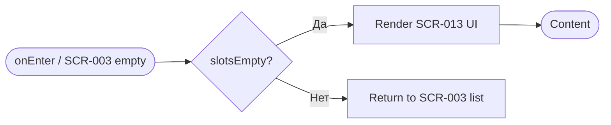
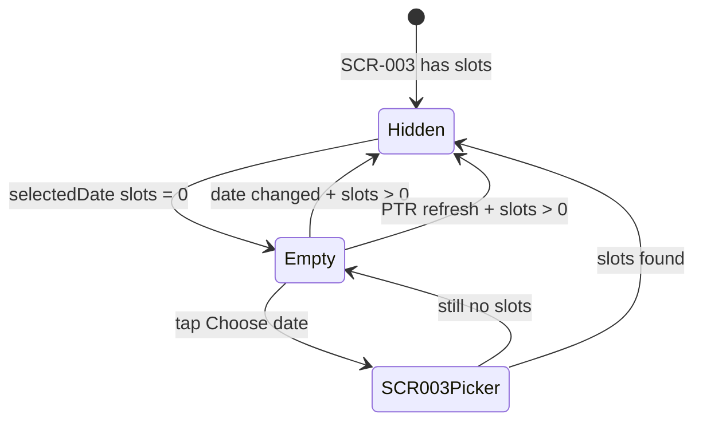

# Экран отсутствия доступных тренировок

**ID:** SCR-013  
**Тип:** Экран  
**Домен:** 02. Расписание  
**Приоритет:** High  
**Статус:** Актуален  
**Функциональные блоки:** FB-SCHED-003  
**Зона авторизации:** НЗ  
**Дизайн-макет:** [DB-013](../../3-design-brief/design-briefs.md#db-013-empty-state-screen) — версия 1.0

---

## Содержание

- [История изменений](#история-изменений)
- [Обзор](#обзор)
- [Навигация](#навигация)
- [Входные данные](#входные-данные)
- [Применяемые логики](#применяемые-логики)
- [Инициализация](#инициализация)
- [Используемые запросы](#используемые-запросы)
- [Макет экрана](#макет-экрана)
- [Элементы экрана](#элементы-экрана)
- [Состояния экрана](#состояния-экрана)
- [Действия пользователя](#действия-пользователя)
- [Связанные требования](#связанные-требования)
- [Критерии приёмки](#критерии-приёмки)

---

## История изменений

| Релиз | ТЗ | Описание изменений |
|-------|-----|-------------------|
| 1.0.0 | [SCR-013_Empty-State-Screen.md](SCR-013_Empty-State-Screen.md) | Первоначальная документация empty state расписания |

---

## Обзор

Специализированный empty state, отображаемый при отсутствии доступных слотов тренировок на выбранную дату. Может показываться как **inline-состояние** в области списка на [SCR-003](SCR-003_Schedule-Screen.md) или как отдельный полноэкранный переход. **API-запросы не выполняет** — состояние определяется результатом загрузки расписания на SCR-003.

### User Story

> Как посетитель приложения, я хочу понятное сообщение при отсутствии тренировок на выбранную дату,
> чтобы выбрать другой день и не думать, что приложение сломалось.

### Бизнес-ценность

- Снижает отток при пустом расписании (FR-005)
- Направляет пользователя к альтернативной дате в горизонте 7 дней (BR-027)
- Поддерживает позитивный UX без тревожных акцентов

---

## Навигация

### Входящая (откуда открывается)

| Источник | Триггер | Условие | Передаваемые параметры |
|----------|---------|---------|------------------------|
| [SCR-003 Schedule Screen](SCR-003_Schedule-Screen.md) | Ответ `listSlots` без слотов на дату | `items.length = 0` для выбранной даты | `selectedDate` |
| [SCR-003 Schedule Screen](SCR-003_Schedule-Screen.md) | Явный переход (опционально) | Нет доступных слотов | `selectedDate` |

### Исходящая (куда ведёт)

| Назначение | Триггер | Передаваемые параметры |
|------------|---------|------------------------|
| [SCR-003 Schedule Screen](SCR-003_Schedule-Screen.md) | «Выбрать другую дату» | `focusDatePicker: true` |
| [SCR-003 Schedule Screen](SCR-003_Schedule-Screen.md) | «Назад» / системный back | — |

---

## Входные данные

| Название | Тип | Возможные значения | Описание |
|----------|-----|-------------------|----------|
| `selectedDate` | Navigation / Состояние | ISO date | Дата, на которую нет слотов |
| `slotsEmpty` | Состояние | `true` | Флаг пустого списка с SCR-003 |
| `displayMode` | Состояние | `inline`, `fullscreen` | Режим отображения empty state |

---

## Применяемые логики

> Переиспользуемые логики из [09_Logics](../09_Logics/_INDEX.md) не применяются. Empty state — чистое UI-состояние на основе данных SCR-003.

---

## Инициализация

### Диаграмма загрузки



### Запросы при открытии

| № | Запрос | Критичный | Зависит от | Условие |
|---|--------|-----------|------------|---------|
| — | — | — | — | Данные из состояния SCR-003; API не вызывается |

---

## Используемые запросы

> Прямых API-запросов нет.

**Справочно — источник данных на SCR-003:**

| Operation | Endpoint | Когда |
|-----------|----------|-------|
| `listSlots` | `GET /slots` | Загрузка расписания на SCR-003; при `items = []` → SCR-013 |

---

## Макет экрана

### Структура

```
┌─────────────────────────────────────┐
│ [←] Расписание          [Профиль?]  │  ← Header SCR-003 (inline mode)
├─────────────────────────────────────┤
│  [Date Picker — 7 days]             │  ← Остаётся видимым (inline)
├─────────────────────────────────────┤
│                                     │
│         [Illustration]              │
│                                     │
│  Пока нет доступных тренировок      │
│  Попробуйте выбрать другую дату     │
│                                     │
│     [Выбрать другую дату]           │
│                                     │
└─────────────────────────────────────┘
```

### Компоненты

| Компонент | Описание | Обязательность |
|-----------|----------|----------------|
| Illustration | Тематическая иллюстрация 120–200px | Да |
| Title | «Пока нет доступных тренировок» | Да |
| Subtitle | «Попробуйте выбрать другую дату или проверьте позже» | Да |
| Primary Button | «Выбрать другую дату» | Да |
| Date Picker (inline) | Переключатель 7 дней | Да (inline mode) |

---

## Элементы экрана

### 1. Иллюстрация и текст

| Элемент | Описание | Источник данных | Валидация | Действие |
|---------|----------|-----------------|-----------|----------|
| Иллюстрация | Пустой календарь / скалолаз (дружелюбный стиль) | Static asset | — | — |
| Заголовок | «Пока нет доступных тренировок» | — | — | — |
| Подтекст | «Попробуйте выбрать другую дату или проверьте позже» | — | — | — |

**Логика:**
- Иллюстрация: светлые спокойные цвета, без красных акцентов (DB-013)
- Поддержка light/dark theme для SVG/PNG

### 2. Действия

| Элемент | Описание | Источник данных | Валидация | Действие |
|---------|----------|-----------------|-----------|----------|
| «Выбрать другую дату» | Primary button | — | — | Фокус на date picker SCR-003 / scroll к календарю |
| «Назад» | Header back (fullscreen mode) | — | — | [SCR-003](SCR-003_Schedule-Screen.md) |

**Логика:**
- «Выбрать другую дату»: не выполняет новый API-запрос — активирует date picker на SCR-003 для выбора другой даты в пределах 7 дней (BR-027)

**Условия доступности:**
- Кнопка всегда активна при `slotsEmpty = true`
- При смене даты на SCR-003 и появлении слотов — SCR-013 скрывается, показывается список

### 3. Inline vs Fullscreen

| Режим | Поведение |
|-------|-----------|
| `inline` (рекомендуемый MVP) | Empty state заменяет список слотов внутри SCR-003; date picker остаётся |
| `fullscreen` | Отдельный экран с back; используется при явном переходе из screen-registry |

---

## Состояния экрана

### Таблица состояний

| Состояние | Условие | Отображение |
|-----------|---------|-------------|
| Empty | `listSlots` → 0 слотов на `selectedDate` | Иллюстрация + текст + CTA |
| Hidden | Появились слоты на дату | SCR-003 list content |
| Inline | `displayMode = inline` | Empty в content area SCR-003 |

### Диаграмма переходов



---

## Действия пользователя

| Действие | Элемент | Триггер | Результат |
|----------|---------|---------|-----------|
| Выбрать дату | «Выбрать другую дату» | Tap | Фокус date picker на SCR-003 |
| Сменить дату | Date picker | Tap другой день | SCR-003 перезагружает слоты для даты |
| Обновить | Pull-to-refresh на SCR-003 | Pull | Повтор listSlots; empty сохраняется если по-прежнему 0 |
| Назад | Back (fullscreen) | Tap | SCR-003 |

---

## Связанные требования

### Функциональные (FR)

| ID | Название | Приоритет |
|----|----------|-----------|
| FR-005 | Empty state при отсутствии слотов | Высокий (MVP) |

### Use Cases / User Stories

| ID | Описание |
|----|----------|
| UC-001 | Просмотр расписания тренировок |
| US-001 | Просмотр доступных тренировок |
| US-023 | Обработка отсутствия мест / пустого расписания |

### Бизнес-правила

| ID | Описание |
|----|----------|
| BR-027 | Горизонт планирования 7 дней |

---

## Критерии приёмки

### Позитивные сценарии

| ID | Критерий | Приоритет |
|----|----------|-----------|
| AC-001 | **Дано** на выбранную дату 0 слотов в ответе listSlots, **Когда** SCR-003 отображает расписание, **Тогда** показывается SCR-013 с текстом «Пока нет доступных тренировок» | P0 |
| AC-002 | **Дано** SCR-013 отображён, **Когда** пользователь нажимает «Выбрать другую дату», **Тогда** активируется date picker на SCR-003 | P0 |
| AC-003 | **Дано** пользователь выбрал другую дату со слотами, **Когда** listSlots вернул items, **Тогда** SCR-013 скрыт, отображается список слотов | P0 |

### Негативные сценарии

| ID | Критерий | Приоритет |
|----|----------|-----------|
| AC-N01 | **Дано** ошибка listSlots на SCR-003, **Когда** нет данных, **Тогда** показывается error state SCR-003, а не SCR-013 | P0 |

### Граничные условия (Edge Cases)

| ID | Критерий | Приоритет |
|----|----------|-----------|
| AC-E01 | **Дано** 0 слотов на все 7 дней, **Когда** пользователь переключает даты, **Тогда** SCR-013 остаётся, date picker доступен для всех дней | P1 |
| AC-E02 | **Дано** только отменённые слоты на дату (BR-019), **Когда** listSlots вернул items, **Тогда** SCR-013 **не** показывается — отображаются карточки с пометкой «Отменено» | P1 |

---
