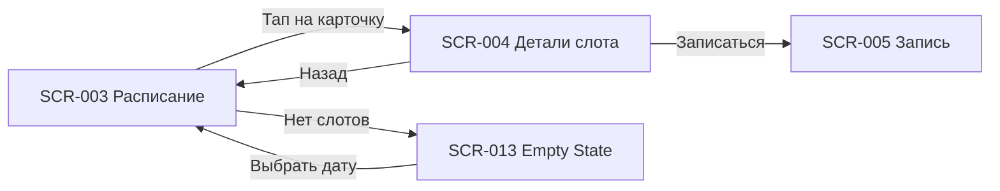

# 02. Расписание — индекс экранов

**Домен:** 02. Расписание  
**Приложение:** Скалодром «Вертикаль»  
**Релиз:** 1.0.0

---

## Экраны домена

| ID | Название | Файл ТЗ | Приоритет | Зона авторизации | Статус |
|----|----------|---------|-----------|------------------|--------|
| SCR-003 | Schedule Screen | [SCR-003_Schedule-Screen.md](SCR-003_Schedule-Screen.md) | High | НЗ (просмотр) | Актуален |
| SCR-004 | Slot Detail Screen | [SCR-004_Slot-Detail-Screen.md](SCR-004_Slot-Detail-Screen.md) | High | НЗ (просмотр) | Актуален |
| SCR-013 | Empty State Screen | [SCR-013_Empty-State-Screen.md](SCR-013_Empty-State-Screen.md) | High | НЗ (просмотр) | Актуален |

> **Примечание:** SCR-013 относится к домену «Расписание» и отображается при отсутствии слотов на выбранную дату (inline empty state на SCR-003 или отдельный переход).

---

## Связанные логики

| Логика | Экраны | Описание |
|--------|--------|----------|
| [LOGIC-003](../09_Logics/LOGIC-003_Загрузка-расписания-слотов.md) | SCR-003 | Загрузка и кэширование списка слотов |
| [LOGIC-004](../09_Logics/LOGIC-004_Отображение-доступности-слота.md) | SCR-003, SCR-004 | Вычисление состояний доступности и UI кнопки записи |

---

## Навигация домена

---

## Связанные требования

- [FR-001 … FR-009](../../2-requirements/functional-requirements.md) — просмотр расписания и доступность слотов
- [FR-005](../../2-requirements/functional-requirements.md) — empty state
- [DB-003, DB-004, DB-013](../../3-design-brief/design-briefs.md) — постановки на дизайн
