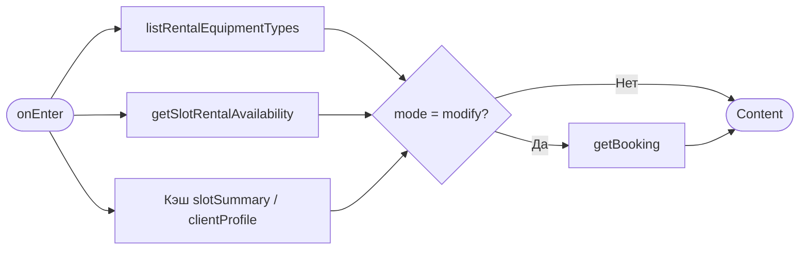
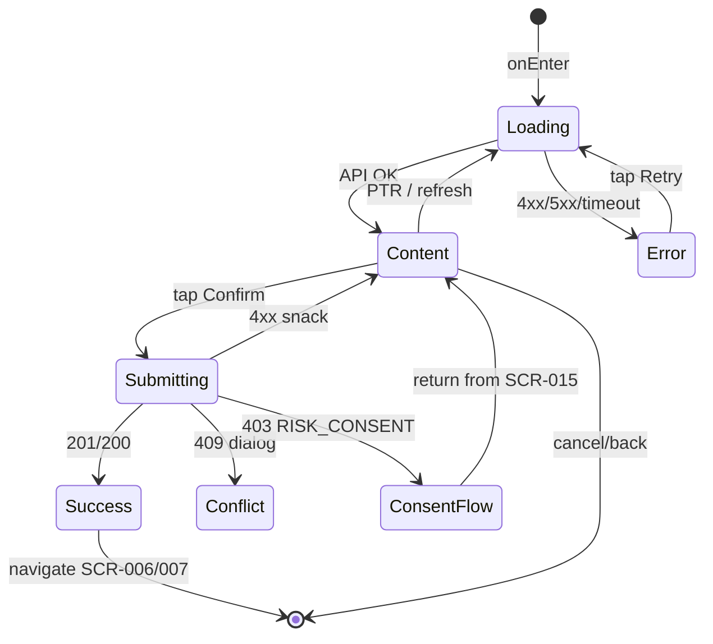

# Экран оформления записи на тренировку

**ID:** SCR-005  
**Тип:** Экран  
**Домен:** 03. Запись  
**Приоритет:** Critical  
**Статус:** Актуален  
**Функциональные блоки:** FB-003-001, FB-003-002, FB-003-003  
**Зона авторизации:** АЗ  
**Дизайн-макет:** [Figma — SCR-005 Booking](https://figma.com/file/vertical-scr-005) — версия 1.0

---

## Содержание

- [История изменений](#история-изменений)
- [Обзор](#обзор)
- [Навигация](#навигация)
- [Входные данные](#входные-данные)
- [Применяемые логики](#применяемые-логики)
- [Инициализация](#инициализация)
- [Используемые запросы](#используемые-запросы)
- [Макет экрана](#макет-экрана)
- [Элементы экрана](#элементы-экрана)
- [Состояния экрана](#состояния-экрана)
- [Действия пользователя](#действия-пользователя)
- [Связанные требования](#связанные-требования)
- [Критерии приёмки](#критерии-приёмки)

---

## История изменений

| Релиз | ТЗ | Описание изменений |
|-------|-----|-------------------|
| 1.0.0 | [SCR-005 Booking Screen](SCR-005_Booking-Screen.md) | Первоначальная версия ТЗ |

---

## Обзор

Экран оформления записи на выбранный слот тренировки. Пользователь выбирает снаряжение (своё и/или прокат по позициям), видит разбивку стоимости в реальном времени, подтверждает согласие на риск (при первой записи) и отправляет запрос на бронирование.

Экран поддерживает два режима:
- **Создание записи** — переход с SCR-004 или SCR-009;
- **Изменение проката** — переход с SCR-007 (отправляется `updateBookingRental` вместо `createBooking`).

### User Story

> Как клиент скалодрома, я хочу выбрать снаряжение и подтвердить запись на тренировку,
> чтобы забронировать место с понятной итоговой стоимостью.

### Бизнес-ценность

- Конверсия из просмотра слота в подтверждённую запись
- Прозрачная стоимость до подтверждения (тренировка + прокат)
- Юридически корректное получение согласия на риск при первой записи
- Гибкий выбор: своё снаряжение, прокат или комбинация

---

## Навигация

### Входящая (откуда открывается)

| Источник | Триггер | Условие | Передаваемые параметры |
|----------|---------|---------|------------------------|
| [SCR-004 Детали слота](../02_Schedule/SCR-004_Slot-Detail-Screen.md) | Тап «Записаться» | Слот доступен для записи | `slotId`, `mode=create` |
| [SCR-015 Согласие на риск](SCR-015_Consent-Screen.md) | Возврат после подтверждения | Согласие сохранено | `slotId`, `mode=create`, `riskConsentAccepted=true` |
| [SCR-009 Альтернативный слот](../04_My_Bookings/SCR-009_Alternative-Slot-Offer-Screen.md) | Тап «Записаться на этот слот» | Альтернативный слот найден | `slotId`, `mode=create`, `sourceBookingId` (опционально) |
| [SCR-007 Детали записи](../04_My_Bookings/SCR-007_Booking-Detail-Screen.md) | Тап «Изменить прокат» | `booking_status=booked` | `slotId`, `bookingId`, `mode=modify` |

### Исходящая (куда ведёт)

| Назначение | Триггер | Передаваемые параметры |
|------------|---------|------------------------|
| [SCR-015 Согласие на риск](SCR-015_Consent-Screen.md) | Тап «Подтвердить запись» | `slotId`, черновик выбора снаряжения |
| [SCR-006 Мои записи](../04_My_Bookings/SCR-006_My-Bookings-Screen.md) | Успешное создание записи | — |
| [SCR-007 Детали записи](../04_My_Bookings/SCR-007_Booking-Detail-Screen.md) | Успешное изменение проката | `bookingId` |
| [SCR-004 Детали слота](../02_Schedule/SCR-004_Slot-Detail-Screen.md) | Тап «Отмена» / системная «Назад» | `slotId` |

---

## Входные данные

| Название | Тип | Возможные значения | Описание |
|----------|-----|-------------------|----------|
| `slotId` | Параметр навигации | UUID | ID слота для записи |
| `bookingId` | Параметр навигации | UUID | ID записи (только при `mode=modify`) |
| `mode` | Параметр навигации | `create`, `modify` | Режим экрана |
| `riskConsentAccepted` | Параметр навигации / Кэш | `true`, `false` | Флаг возврата после SCR-015 |
| `slotSummary` | Кэш (SCR-004) | `TrainingSlotSummary` | Данные слота из предыдущего экрана |
| `clientProfile` | Кэш / Remote | `Client` | Профиль клиента (`risk_consent_accepted`) |
| `equipmentDraft` | Локальное состояние | Объект выбора | Черновик выбора снаряжения при возврате с SCR-015 |

---

## Применяемые логики

| Логика | Элемент/Триггер | Описание |
|--------|-----------------|----------|
| [LOGIC-005 Создание записи](../09_Logics/LOGIC-005_Создание-записи-на-тренировку.md) | Кнопка «Подтвердить запись» | Валидация и отправка `createBooking` |
| [LOGIC-006 Согласие на риск](../09_Logics/LOGIC-006_Подтверждение-согласия-на-риск.md) | Кнопка «Подтвердить запись» / чекбокс согласия | Проверка `risk_consent_accepted`, переход на SCR-015 |
| [LOGIC-007 Выбор проката и расчёт стоимости](../09_Logics/LOGIC-007_Выбор-проката-и-расчёт-стоимости.md) | Переключатель снаряжения, чекбоксы проката | Расчёт `training_amount + rental_amount = total` |

---

## Инициализация

> При открытии экрана выполняются параллельные запросы справочника и прокатного фонда. Данные слота берутся из кэша (SCR-004) с опциональным обновлением. Профиль клиента — из кэша с фоновым `getCurrentClient`.

### Диаграмма загрузки



### Запросы при открытии

| № | Запрос | Критичный | Зависит от | Условие |
|---|--------|-----------|------------|---------|
| 1 | [listRentalEquipmentTypes](#listrentalequipmenttypes) | Да | — | Всегда |
| 2 | [getSlotRentalAvailability](#getslotrentalavailability) | Да | `slotId` | Всегда |
| 3 | [getBooking](#getbooking) | Да | `bookingId` | `mode = modify` |

> Полное описание запросов см. в секции [Используемые запросы](#используемые-запросы).

---

## Используемые запросы

### listRentalEquipmentTypes

**Тип:** REST  
**Метод:** GET  
**Спецификация:** [openapi.yaml](../../api/openapi.yaml) → `listRentalEquipmentTypes`

**Триггер:** Инициализация

**Параметры:**

| Параметр | Тип | Обязательность | Источник | Описание |
|----------|-----|----------------|----------|----------|
| — | — | — | — | Без параметров |

**Обработка ответа:**

| Результат | Условие | UI-реакция |
|-----------|---------|------------|
| Загрузка | — | Скелетон блока проката |
| Успех | `items` не пуст | Отобразить чекбоксы по `code`: shoes, harness, helmet, chalk |
| Успех | `items` пуст | Скрыть блок проката, доступно только «Своё снаряжение» |
| HTTP 4xx/5xx | — | Error state с кнопкой «Обновить» |
| Сеть | Нет соединения | Error state с кнопкой «Обновить» |

---

### getSlotRentalAvailability

**Тип:** REST  
**Метод:** GET  
**Спецификация:** [openapi.yaml](../../api/openapi.yaml) → `getSlotRentalAvailability`

**Триггер:** Инициализация

**Параметры:**

| Параметр | Тип | Обязательность | Источник | Описание |
|----------|-----|----------------|----------|----------|
| `slotId` | string (UUID) | Да | Навигация | ID слота |

**Обработка ответа:**

| Результат | Условие | UI-реакция |
|-----------|---------|------------|
| Загрузка | — | Скелетон чекбоксов проката |
| Успех | `items[].available_quantity > 0` | Чекбокс активен, показать «осталось N» |
| Успех | `available_quantity = 0` | Чекбокс disabled, подпись «Нет в наличии» |
| HTTP 404 | — | Error state «Слот не найден» |
| HTTP 401 | — | Редирект на авторизацию |
| HTTP 5xx / Сеть | — | Error state с кнопкой «Обновить» |

---

### getBooking

**Тип:** REST  
**Метод:** GET  
**Спецификация:** [openapi.yaml](../../api/openapi.yaml) → `getBooking`

**Триггер:** Инициализация (только `mode=modify`)

**Параметры:**

| Параметр | Тип | Обязательность | Источник | Описание |
|----------|-----|----------------|----------|----------|
| `bookingId` | string (UUID) | Да | Навигация | ID записи |

**Обработка ответа:**

| Результат | Условие | UI-реакция |
|-----------|---------|------------|
| Загрузка | — | Полноэкранный скелетон |
| Успех | `booking_status = booked` | Предзаполнить выбор снаряжения из `uses_own_equipment`, `rental_lines` |
| Успех | `booking_status != booked` | Снек «Изменение недоступно», возврат на SCR-007 |
| HTTP 404 | — | Error state |
| HTTP 401 | — | Редирект на авторизацию |

---

### createBooking

**Тип:** REST  
**Метод:** POST  
**Спецификация:** [openapi.yaml](../../api/openapi.yaml) → `createBooking`

**Триггер:** Тап «Подтвердить запись» при `mode=create` и пройденной валидации

**Параметры (body):**

| Параметр | Тип | Обязательность | Источник | Описание |
|----------|-----|----------------|----------|----------|
| `slot_id` | string (UUID) | Да | `slotId` | ID слота |
| `uses_own_equipment` | boolean | Да | UI переключатель | Использует своё снаряжение |
| `rental_lines` | array | Нет | Чекбоксы проката | `[{ equipment_type_id, quantity: 1 }]` |

**Обработка ответа:**

| Результат | Условие | UI-реакция |
|-----------|---------|------------|
| Загрузка | — | Лоадер на кнопке, блокировка UI |
| Успех | HTTP 201 | Снек «Запись подтверждена», переход на SCR-006 |
| HTTP 403 | `code = RISK_CONSENT_REQUIRED` | Переход на SCR-015 |
| HTTP 403 | `code = INSTRUCTOR_CLEARANCE_REQUIRED` | Диалог с текстом `message`, возврат на SCR-004 |
| HTTP 409 | `BookingConflictResponse` | Диалог с `message`, обновить слот из `slot`, вернуть на SCR-004 (FR-014) |
| HTTP 422 | `code = NO_FREE_SPOTS` | Диалог «Нет свободных мест», обновить данные слота |
| HTTP 422 | `code = BOOKING_CUTOFF_EXCEEDED` | Диалог «Запись закрыта», возврат на SCR-003 |
| HTTP 400 | — | Снек с текстом из `message` |
| HTTP 5xx | — | Снек «Произошла ошибка. Попробуйте позже» |
| Сеть | Нет соединения | Снек «Нет соединения. Проверьте подключение» |

---

### updateBookingRental

**Тип:** REST  
**Метод:** PATCH  
**Спецификация:** [openapi.yaml](../../api/openapi.yaml) → `updateBookingRental`

**Триггер:** Тап «Сохранить изменения» при `mode=modify`

**Параметры:**

| Параметр | Тип | Обязательность | Источник | Описание |
|----------|-----|----------------|----------|----------|
| `bookingId` | string (UUID) | Да | Навигация | Path-параметр |
| `uses_own_equipment` | boolean | Да | UI | Свое снаряжение |
| `rental_lines` | array | Нет | UI | Выбранные позиции проката |

**Обработка ответа:**

| Результат | Условие | UI-реакция |
|-----------|---------|------------|
| Загрузка | — | Лоадер на кнопке |
| Успех | HTTP 200 | Снек «Прокат обновлён», переход на SCR-007 с `bookingId` |
| HTTP 422 | `code = RENTAL_UNAVAILABLE` | Снек с `message`, обновить `getSlotRentalAvailability` |
| HTTP 403 | — | Снек «Изменение недоступно» |
| HTTP 404 | — | Error state |
| HTTP 5xx / Сеть | — | Снек с ошибкой, возможность повтора |

---

### updateCurrentClient

**Тип:** REST  
**Метод:** PATCH  
**Спецификация:** [openapi.yaml](../../api/openapi.yaml) → `updateCurrentClient`

**Триггер:** Не вызывается напрямую с SCR-005 — выполняется на SCR-015. После успеха пользователь возвращается на SCR-005 с `riskConsentAccepted=true`.

**Параметры (body):**

| Параметр | Тип | Обязательность | Источник | Описание |
|----------|-----|----------------|----------|----------|
| `risk_consent_accepted` | boolean | Да | SCR-015 | `true` |

**Обработка ответа:**

| Результат | Условие | UI-реакция |
|-----------|---------|------------|
| Успех | HTTP 200 | Обновить кэш `clientProfile`, продолжить создание записи |
| HTTP 400/401 | — | Снек с ошибкой на SCR-015 |

---

## Макет экрана

### Структура

```
┌─────────────────────────────────────┐
│ [←] Оформление записи               │  ← Header
├─────────────────────────────────────┤
│ ┌─ Информация о слоте ─────────────┐│
│ │ Пн, 15 июл · 18:00              ││
│ │ Болдеринг · Иванов И.И.         ││
│ └─────────────────────────────────┘│
│                                     │
│ ┌─ Снаряжение ────────────────────┐│
│ │ [Своё ●] [Прокат ○]             ││  ← Segmented control
│ │ ☐ Скальные туфли      300 ₽     ││
│ │ ☐ Страховочная система 200 ₽    ││
│ │ ☐ Каска               150 ₽     ││
│ │ ☐ Магнезия             50 ₽     ││
│ └─────────────────────────────────┘│
│                                     │
│ ┌─ Стоимость ─────────────────────┐│
│ │ Тренировка              800 ₽   ││
│ │ Прокат                  450 ₽   ││
│ │ ─────────────────────────────   ││
│ │ Итого                 1 250 ₽   ││
│ └─────────────────────────────────┘│
│                                     │
│ ☐ Согласие на риск (первая запись) │  ← Условно
├─────────────────────────────────────┤
│ [Подтвердить запись]                │  ← Fixed Bottom
│ Отмена                              │
└─────────────────────────────────────┘
```

### Компоненты

| Компонент | Описание | Обязательность |
|-----------|----------|----------------|
| Header | Заголовок, кнопка «Назад» | Да |
| Карточка слота | Дата, время, зона, инструктор | Да |
| Segmented control | «Своё снаряжение» / «Прокат» | Да |
| Чекбоксы проката | 4 позиции с иконками и ценой | Да (при выборе проката) |
| Блок стоимости | Разбивка + итого | Да |
| Чекбокс согласия | Только при первой записи без `risk_consent_accepted` | Условно |
| Primary CTA | «Подтвердить запись» / «Сохранить изменения» | Да |
| Secondary CTA | «Отмена» (text) | Да |

---

## Элементы экрана

### 1. Header

| Элемент | Описание | Источник данных | Валидация | Действие |
|---------|----------|-----------------|-----------|----------|
| Кнопка «Назад» | Иконка стрелки влево | — | — | Возврат на SCR-004 с подтверждением при несохранённых изменениях |
| Заголовок | «Оформление записи» / «Изменение проката» | `mode` | — | — |

**Логика:**
- При `mode=modify` заголовок: «Изменение проката»

---

### 2. Информация о слоте

| Элемент | Описание | Источник данных | Валидация | Действие |
|---------|----------|-----------------|-----------|----------|
| Дата и время | «Пн, 15 июл · 18:00–19:30» | `slot.starts_at`, `duration_minutes` | — | — |
| Зона/формат | Иконка + название зоны | `slot.zone.name`, `slot.zone.code` | — | — |
| Инструктор | ФИО инструктора | `slot.instructor.full_name` | — | — |
| Адрес | Адрес скалодрома | `slot.address` | — | — |

**Логика:**
- Формат даты: локализованный, краткий день недели + дата
- Длительность: `duration_minutes` → «~1,5 ч»

---

### 3. Выбор снаряжения

| Элемент | Описание | Источник данных | Валидация | Действие |
|---------|----------|-----------------|-----------|----------|
| Переключатель «Своё снаряжение» | Segmented option | Локальное состояние | — | Установить `uses_own_equipment=true` |
| Переключатель «Прокат» | Segmented option | Локальное состояние | — | Показать чекбоксы проката |
| Чекбокс «Скальные туфли» | Позиция проката | `equipment_type` code=`shoes` | — | Toggle выбора |
| Чекбокс «Страховочная система» | Позиция проката | code=`harness` | — | Toggle выбора |
| Чекбокс «Каска» | Позиция проката | code=`helmet` | — | Toggle выбора |
| Чекбокс «Магнезия» | Позиция проката | code=`chalk` | — | Toggle выбора |
| Подпись наличия | «Осталось N» / «Нет в наличии» | `available_quantity` | — | — |
| Цена позиции | Сумма за позицию | `equipment_type.default_price` | — | — |

**Логика:**
- [LOGIC-007](../09_Logics/LOGIC-007_Выбор-проката-и-расчёт-стоимости.md) — комбинация «своё + прокат» разрешена: переключатель «Своё» не снимает выбранные чекбоксы проката
- Чекбокс disabled, если `available_quantity = 0`
- При `mode=modify` предзаполнить из `rental_lines` записи

**Условия доступности:**
- Блок чекбоксов виден, если выбран хотя бы один из: сегмент «Прокат» или отмечен любой чекбокс
- Минимум одно из: `uses_own_equipment=true` ИЛИ `rental_lines.length > 0`. Иначе кнопка подтверждения заблокирована

---

### 4. Разбивка стоимости

| Элемент | Описание | Источник данных | Валидация | Действие |
|---------|----------|-----------------|-----------|----------|
| Строка «Тренировка» | Стоимость слота | `slot.training_price` | — | — |
| Строки проката | По каждой выбранной позиции | `default_price × quantity` | — | — |
| Строка «Скидка» | Скидка постоянного клиента | `client.loyalty_discount` | — | Скрыта, если скидки нет |
| Строка «Итого» | Сумма | Расчёт LOGIC-007 | — | — |

**Логика:**
- [LOGIC-007](../09_Logics/LOGIC-007_Выбор-проката-и-расчёт-стоимости.md) — пересчёт мгновенно при изменении чекбоксов
- «Итого» — акцентный цвет, жирный шрифт

---

### 5. Согласие на риск (первая запись)

| Элемент | Описание | Источник данных | Валидация | Действие |
|---------|----------|-----------------|-----------|----------|
| Чекбокс согласия | «Я ознакомлен(а) с рисками…» | Локальное состояние | Обязателен при первой записи. Ошибка: «Необходимо принять согласие на риск» | — |
| Ссылка «Подробнее» | Открывает SCR-015 | — | — | Переход на [SCR-015](SCR-015_Consent-Screen.md) |

**Логика:**
- [LOGIC-006](../09_Logics/LOGIC-006_Подтверждение-согласия-на-риск.md) — блок скрыт, если `client.risk_consent_accepted = true`
- При первой записи без согласия: тап «Подтвердить» → SCR-015 (если чекбокс не отмечен) или `createBooking` (если отмечен локально, но PATCH ещё не выполнен — сначала SCR-015)

**Условия доступности:**
- Блок виден, если: `mode=create` И `client.risk_consent_accepted = false`

---

### 6. Действия

| Элемент | Описание | Источник данных | Валидация | Действие |
|---------|----------|-----------------|-----------|----------|
| Кнопка «Подтвердить запись» | Primary button | — | См. условия доступности | [createBooking](#createbooking) или [updateBookingRental](#updatebookingrental) |
| Кнопка «Отмена» | Text button | — | — | Возврат на SCR-004 |

**Момент валидации:** При отправке формы

**Логика:**
- [LOGIC-005](../09_Logics/LOGIC-005_Создание-записи-на-тренировку.md) — последовательность: валидация → проверка согласия → API-запрос
- [LOGIC-006](../09_Logics/LOGIC-006_Подтверждение-согласия-на-риск.md) — при отсутствии согласия перенаправление на SCR-015

**Условия доступности:**
- Кнопка активна, если: выбрано снаряжение (своё и/или прокат) И (согласие не требуется ИЛИ чекбокс отмечен) И нет активного запроса
- Текст кнопки при `mode=modify`: «Сохранить изменения»

---

## Состояния экрана

### Таблица состояний

| Состояние | Условие | Отображение |
|-----------|---------|-------------|
| Loading | Ожидание API (init) | Скелетон-шиммер всех блоков |
| Content | API 200 + данные слота | Стандартный контент |
| Submitting | Отправка create/update | Лоадер на CTA, блокировка формы |
| Success | HTTP 201/200 | Снек + навигация |
| Conflict | HTTP 409 | Диалог с актуальным состоянием слота |
| Error | API 4xx/5xx при init | Error state с кнопкой «Обновить» |

### Диаграмма переходов



---

## Действия пользователя

| Действие | Элемент | Триггер | Результат |
|----------|---------|---------|-----------|
| Выбор своего снаряжения | Segmented «Своё» | Tap | `uses_own_equipment=true`, пересчёт стоимости |
| Выбор проката | Segmented «Прокат» / чекбоксы | Tap | Обновление `rental_lines`, пересчёт |
| Подтверждение записи | CTA | Tap | createBooking → SCR-006 или SCR-015 |
| Сохранение проката | CTA (modify) | Tap | updateBookingRental → SCR-007 |
| Отмена | «Отмена» / «Назад» | Tap | SCR-004 |
| Обновление | Error state | Tap «Обновить» | Повтор init-запросов |

---

## Связанные требования

### Функциональные (FR)

| ID | Название | Приоритет |
|----|----------|-----------|
| FR-010 | Выбор снаряжения при записи | Высокий (MVP) |
| FR-011 | Отображение разбивки стоимости | Высокий (MVP) |
| FR-012 | Подтверждение согласия на риск | Высокий (MVP) |
| FR-013 | Создание записи через API | Высокий (MVP) |
| FR-014 | Обработка отказа бронирования | Высокий (MVP) |

---

## Критерии приёмки

### Позитивные сценарии

| ID | Критерий | Приоритет |
|----|----------|-----------|
| AC-001 | **Дано** слот доступен и клиент авторизован, **Когда** пользователь выбирает «Своё снаряжение» и нажимает «Подтвердить запись», **Тогда** создаётся запись и открывается SCR-006 | P0 |
| AC-002 | **Дано** выбраны туфли и магнезия в прокате, **Когда** пользователь подтверждает запись, **Тогда** в `rental_lines` передаются 2 позиции, итого = training_price + сумма проката | P0 |
| AC-003 | **Дано** `risk_consent_accepted=false`, **Когда** пользователь нажимает «Подтвердить запись», **Тогда** открывается SCR-015 | P0 |
| AC-004 | **Дано** `mode=modify` и активная запись, **Когда** пользователь меняет прокат и сохраняет, **Тогда** вызывается `updateBookingRental` и открывается SCR-007 с обновлённой стоимостью | P0 |
| AC-005 | **Дано** комбинация «своё + прокат», **Когда** отмечены «Своё» и чекбокс «Каска», **Тогда** запрос содержит `uses_own_equipment=true` и `rental_lines` с каской | P1 |

### Негативные сценарии

| ID | Критерий | Приоритет |
|----|----------|-----------|
| AC-N01 | **Дано** нет выбранного снаряжения, **Когда** пользователь нажимает CTA, **Тогда** кнопка неактивна / показана ошибка валидации | P0 |
| AC-N02 | **Дано** бэкенд вернул 409 BookingConflictResponse, **Когда** пользователь подтверждает запись, **Тогда** отображается диалог с `message` и актуальные места из `slot` (FR-014) | P0 |
| AC-N03 | **Дано** позиция проката недоступна (`available_quantity=0`), **Когда** экран загружен, **Тогда** чекбокс disabled с подписью «Нет в наличии» | P0 |
| AC-N04 | **Дано** ошибка сети при createBooking, **Когда** запрос завершился, **Тогда** снек «Нет соединения», форма разблокирована | P0 |
| AC-N05 | **Дано** HTTP 422 RENTAL_UNAVAILABLE при modify, **Когда** сохранение проката, **Тогда** снек с `message`, обновление наличия | P1 |

### Граничные условия (Edge Cases)

| ID | Критерий | Приоритет |
|----|----------|-----------|
| AC-E01 | **Дано** возврат с SCR-015, **Когда** экран восстанавливается, **Тогда** черновик выбора снаряжения сохранён | P0 |
| AC-E02 | **Дано** все позиции проката недоступны, **Когда** пользователь выбирает только «Своё», **Тогда** запись возможна без проката | P1 |
| AC-E03 | **Дано** HTTP 403 INSTRUCTOR_CLEARANCE_REQUIRED, **Когда** createBooking, **Тогда** диалог с пояснением и возврат на SCR-004 | P1 |

---
