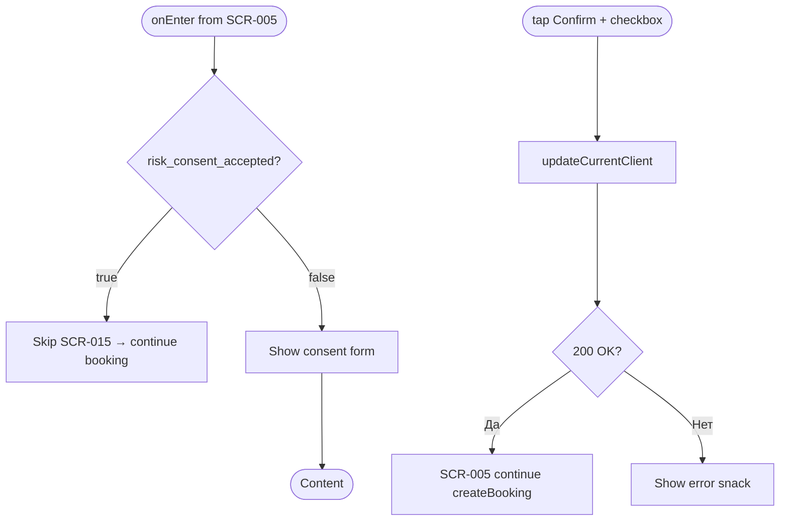
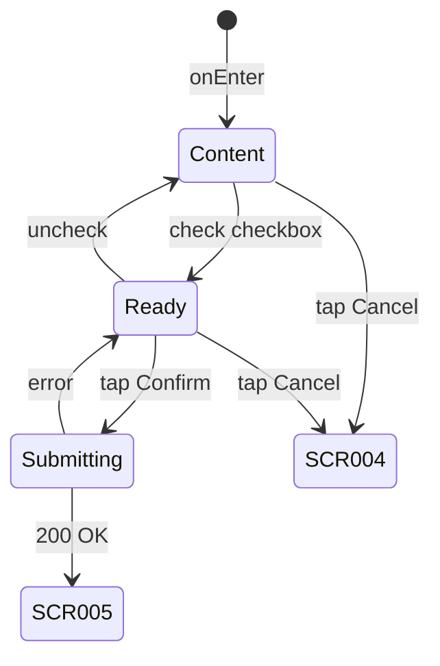

# Экран подтверждения согласия на риск

**ID:** SCR-015  
**Тип:** Экран  
**Домен:** 03. Запись  
**Приоритет:** High  
**Статус:** Актуален  
**Функциональные блоки:** FB-BOOK-002  
**Зона авторизации:** АЗ  
**Дизайн-макет:** [DB-015](../../3-design-brief/design-briefs.md#db-015-consent-screen) — версия 1.0

---

## Содержание

- [История изменений](#история-изменений)
- [Обзор](#обзор)
- [Навигация](#навигация)
- [Входные данные](#входные-данные)
- [Применяемые логики](#применяемые-логики)
- [Инициализация](#инициализация)
- [Используемые запросы](#используемые-запросы)
- [Макет экрана](#макет-экрана)
- [Элементы экрана](#элементы-экрана)
- [Состояния экрана](#состояния-экрана)
- [Действия пользователя](#действия-пользователя)
- [Связанные требования](#связанные-требования)
- [Критерии приёмки](#критерии-приёмки)

---

## История изменений

| Релиз | ТЗ | Описание изменений |
|-------|-----|-------------------|
| 1.0.0 | [SCR-015_Consent-Screen.md](SCR-015_Consent-Screen.md) | Первоначальная документация экрана согласия на риск |

---

## Обзор

Экран запрашивает подтверждение согласия на риск при **первой записи** клиента (`risk_consent_accepted = false`). Отображается после нажатия «Подтвердить запись» на SCR-005 до фактического создания бронирования. Согласие сохраняется в профиле через API и не запрашивается повторно.

### User Story

> Как новый клиент, я хочу ознакомиться с рисками скалолазания и подтвердить согласие,
> чтобы безопасно записаться на первую тренировку.

### Бизнес-ценность

- Юридическая фиксация informed consent (FR-012, BR-031)
- Однократный UX-friction только при первой записи
- Связь с профилем клиента через `risk_consent_accepted`

---

## Навигация

### Входящая (откуда открывается)

| Источник | Триггер | Условие | Передаваемые параметры |
|----------|---------|---------|------------------------|
| [SCR-005 Booking Screen](SCR-005_Booking-Screen.md) | Тап «Подтвердить запись» | `risk_consent_accepted = false` | `slotId`, `rentalSelection`, `bookingDraft` |

### Исходящая (куда ведёт)

| Назначение | Триггер | Передаваемые параметры |
|------------|---------|------------------------|
| [SCR-005 Booking Screen](SCR-005_Booking-Screen.md) | Успешное PATCH + продолжение booking flow | `slotId`, `rentalSelection`, `consentAccepted: true` |
| [SCR-004 Slot Detail Screen](../02_Schedule/SCR-004_Slot-Detail-Screen.md) | Кнопка «Отмена» | — |

---

## Входные данные

| Название | Тип | Возможные значения | Описание |
|----------|-----|-------------------|----------|
| `slotId` | Navigation | UUID | Слот для записи (возврат на SCR-005) |
| `rentalSelection` | Navigation | Object | Выбор проката с SCR-005 |
| `bookingDraft` | Состояние | Object | Черновик записи для продолжения после consent |
| `consentChecked` | Состояние | `true`, `false` | Состояние чекбокса |
| `riskConsentAccepted` | Кэш / API | `true`, `false` | Флаг из профиля клиента |

---

## Применяемые логики

| Логика | Элемент/Триггер | Описание |
|--------|-----------------|----------|
| [LOGIC-006](../09_Logics/LOGIC-006_Согласие-на-риск.md) | onEnter / Confirm | Проверка необходимости consent, PATCH профиля, возврат в booking flow |

---

## Инициализация

### Диаграмма загрузки



### Запросы при открытии

| № | Запрос | Критичный | Зависит от | Условие |
|---|--------|-----------|------------|---------|
| — | — | — | — | При открытии запросы не выполняются; данные из navigation params |

---

## Используемые запросы

### updateCurrentClient

**Тип:** REST  
**Метод:** PATCH  
**Спецификация:** [openapi.yaml](../../api/openapi.yaml) → `updateCurrentClient`  
**Endpoint:** `PATCH /clients/me`

**Триггер:** Тап «Подтвердить» при отмеченном чекбоксе

**Параметры (body):**

| Параметр | Тип | Обязательность | Источник | Описание |
|----------|-----|----------------|----------|----------|
| `risk_consent_accepted` | boolean | Да | Checkbox | `true` — подтверждение согласия (BR-031) |

**Обработка ответа:**

| Результат | Условие | UI-реакция |
|-----------|---------|------------|
| Загрузка | — | Лоадер на «Подтвердить», блокировка UI |
| Успех | HTTP 200, `risk_consent_accepted: true` | [LOGIC-006](../09_Logics/LOGIC-006_Согласие-на-риск.md) → возврат на SCR-005 с продолжением бронирования |
| HTTP 400 | — | Снек с текстом из `message` |
| HTTP 401 | — | Редирект SCR-002 |
| HTTP 4xx/5xx | — | Снек «Произошла ошибка. Попробуйте позже» |
| Сеть | Нет соединения | Снек «Нет соединения. Проверьте подключение» |

---

## Макет экрана

### Структура

```
┌─────────────────────────────────────┐
│ [←] Согласие на риск                 │  ← Header
├─────────────────────────────────────┤
│                                     │
│  Скалолазание связано с повышенным  │
│  риском травм. Я подтверждаю, что    │
│  ознакомлен(а) с правилами           │
│  безопасности и добровольно          │
│  принимаю на себя все риски...       │
│                                     │
│  [Полный текст соглашения →]         │  ← optional link
│                                     │
│  ☐ Я подтверждаю, что ознакомлен(а)  │
│    и принимаю риски                  │
│                                     │
├─────────────────────────────────────┤
│  [Подтвердить]        [Отмена]       │  ← Fixed Bottom
└─────────────────────────────────────┘
```

### Компоненты

| Компонент | Описание | Обязательность |
|-----------|----------|----------------|
| Consent Text | Текст соглашения о рисках | Да |
| Consent Checkbox | Подтверждение ознакомления | Да |
| Confirm Button | Primary, disabled до checkbox | Да |
| Cancel Button | Secondary / text | Да |

---

## Элементы экрана

### 1. Текст соглашения

| Элемент | Описание | Источник данных | Валидация | Действие |
|---------|----------|-----------------|-----------|----------|
| Заголовок экрана | «Согласие на риск» | — | — | — |
| Текст соглашения | Краткая версия соглашения (min 14px) | Static / CMS | — | Scroll |
| Ссылка «Полный текст» | Открытие полной версии | Static URL / modal | — | Open full text (optional) |

**Пример текста (MVP):**
«Скалолазание связано с повышенным риском травм. Я подтверждаю, что ознакомлен(а) с правилами безопасности и добровольно принимаю на себя все риски, связанные с посещением скалодрома.»

### 2. Чекбокс и кнопки

| Элемент | Описание | Источник данных | Валидация | Действие |
|---------|----------|-----------------|-----------|----------|
| Чекбокс | «Я подтверждаю, что ознакомлен(а) и принимаю риски» | `consentChecked` | Обязателен для отправки | Toggle `consentChecked` |
| «Подтвердить» | Primary button | — | Checkbox = true | [updateCurrentClient](#updatecurrentclient) |
| «Отмена» | Secondary button | — | — | [SCR-004](../02_Schedule/SCR-004_Slot-Detail-Screen.md) |

**Логика:**
- Чекбокс + «Подтвердить»: [LOGIC-006](../09_Logics/LOGIC-006_Согласие-на-риск.md) — PATCH `{ risk_consent_accepted: true }`, обновление локального профиля, возврат на SCR-005 для createBooking
- «Отмена»: отмена flow записи без сохранения consent → SCR-004

**Момент валидации:** При отправке формы

**Условия доступности:**
- «Подтвердить» активна, если: `consentChecked = true` AND запрос не выполняется
- «Подтвердить» неактивна, если: чекбокс не отмечен

---

## Состояния экрана

### Таблица состояний

| Состояние | Условие | Отображение |
|-----------|---------|-------------|
| Content | onEnter, consent required | Текст + unchecked checkbox + disabled Confirm |
| Ready to submit | Checkbox checked | Confirm active |
| Submitting | PATCH in progress | Loader on Confirm |
| Error | PATCH failed | Snackbar, form preserved |

### Диаграмма переходов



---

## Действия пользователя

| Действие | Элемент | Триггер | Результат |
|----------|---------|---------|-----------|
| Принять риски | Checkbox | Tap | `consentChecked = true` |
| Подтвердить | «Подтвердить» | Tap | PATCH /clients/me → SCR-005 booking |
| Отменить | «Отмена» | Tap | SCR-004 без записи |
| Читать полный текст | Ссылка | Tap | Modal / WebView (optional) |

---

## Связанные требования

### Функциональные (FR)

| ID | Название | Приоритет |
|----|----------|-----------|
| FR-012 | Подтверждение согласия на риск | Высокий (MVP) |

### Use Cases / User Stories

| ID | Описание |
|----|----------|
| UC-002 | Запись на тренировку |
| US-007 | Подтверждение согласия на риск |

### Бизнес-правила

| ID | Описание |
|----|----------|
| BR-031 | При первой записи — подтверждение согласия на риск |

---

## Критерии приёмки

### Позитивные сценарии

| ID | Критерий | Приоритет |
|----|----------|-----------|
| AC-001 | **Дано** `risk_consent_accepted = false`, **Когда** пользователь на SCR-005 нажимает «Подтвердить запись», **Тогда** открывается SCR-015 | P0 |
| AC-002 | **Дано** SCR-015, чекбокс отмечен, **Когда** нажата «Подтвердить», **Тогда** PATCH /clients/me с `risk_consent_accepted: true` | P0 |
| AC-003 | **Дано** успешный PATCH, **Когда** consent сохранён, **Тогда** возврат на SCR-005 и продолжение создания записи | P0 |
| AC-004 | **Дано** `risk_consent_accepted = true`, **Когда** запись на SCR-005, **Тогда** SCR-015 не показывается | P0 |

### Негативные сценарии

| ID | Критерий | Приоритет |
|----|----------|-----------|
| AC-N01 | **Дано** чекбокс не отмечен, **Когда** tap «Подтвердить», **Тогда** кнопка неактивна, PATCH не отправляется | P0 |
| AC-N02 | **Дано** ошибка PATCH, **Когда** сохранение consent, **Тогда** снек об ошибке, пользователь остаётся на SCR-015 | P0 |
| AC-N03 | **Дано** SCR-015, **Когда** «Отмена», **Тогда** переход SCR-004, запись не создана, consent не сохранён | P1 |

### Граничные условия (Edge Cases)

| ID | Критерий | Приоритет |
|----|----------|-----------|
| AC-E01 | **Дано** PATCH успешен, но createBooking на SCR-005 fails, **Когда** повторная запись, **Тогда** SCR-015 не показывается (consent уже true) | P1 |
| AC-E02 | **Дано** потеря сети при PATCH, **Когда** восстановление, **Тогда** пользователь может повторить «Подтвердить» | P2 |

---
