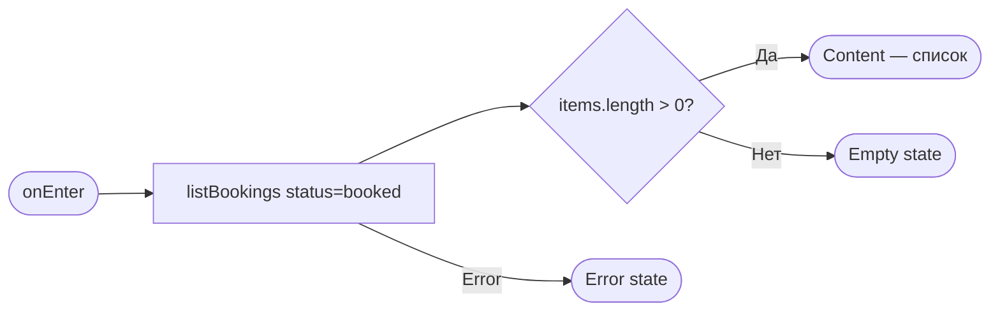
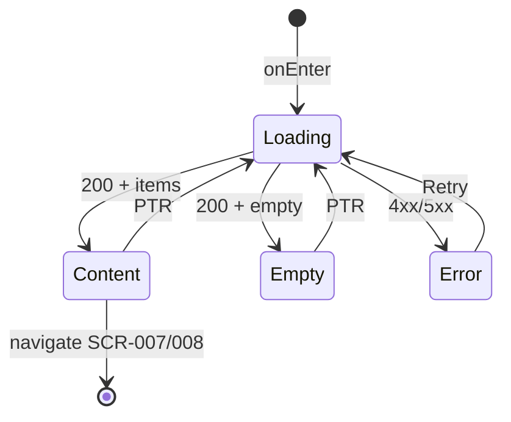

# Экран списка моих записей

**ID:** SCR-006  
**Тип:** Экран  
**Домен:** 04. Мои записи  
**Приоритет:** Critical  
**Статус:** Актуален  
**Функциональные блоки:** FB-004-001, FB-004-002  
**Зона авторизации:** АЗ  
**Дизайн-макет:** [Figma — SCR-006 My Bookings](https://figma.com/file/vertical-scr-006) — версия 1.0

---

## Содержание

- [История изменений](#история-изменений)
- [Обзор](#обзор)
- [Навигация](#навигация)
- [Входные данные](#входные-данные)
- [Применяемые логики](#применяемые-логики)
- [Инициализация](#инициализация)
- [Используемые запросы](#используемые-запросы)
- [Макет экрана](#макет-экрана)
- [Элементы экрана](#элементы-экрана)
- [Состояния экрана](#состояния-экрана)
- [Действия пользователя](#действия-пользователя)
- [Связанные требования](#связанные-требования)
- [Критерии приёмки](#критерии-приёмки)

---

## История изменений

| Релиз | ТЗ | Описание изменений |
|-------|-----|-------------------|
| 1.0.0 | [SCR-006 My Bookings Screen](SCR-006_My-Bookings-Screen.md) | Первоначальная версия ТЗ |

---

## Обзор

Экран отображает список активных записей клиента (`booking_status=booked`), сгруппированных по дате. Для каждой записи показываются ключевые данные слота, статус оплаты и действия (отмена, переход к деталям). При отсутствии записей отображается empty state с переходом к расписанию.

### User Story

> Как клиент скалодрома, я хочу видеть все свои предстоящие тренировки в одном месте,
> чтобы управлять записями и контролировать оплату.

### Бизнес-ценность

- Центральная точка управления записями после бронирования
- Быстрый доступ к отмене и деталям
- Визуальная индикация статуса оплаты снижает неявки

---

## Навигация

### Входящая (откуда открывается)

| Источник | Триггер | Условие | Передаваемые параметры |
|----------|---------|---------|------------------------|
| Tab Bar | Тап «Мои записи» | Авторизован | — |
| [SCR-005 Оформление записи](../03_Booking/SCR-005_Booking-Screen.md) | Успешная запись | — | — |
| [SCR-008 Подтверждение отмены](SCR-008_Cancellation-Confirmation-Screen.md) | Успешная отмена | — | — |
| [SCR-009 Альтернативный слот](SCR-009_Alternative-Slot-Offer-Screen.md) | Тап «Позже» | — | — |
| [SCR-014 Push-уведомление](../06_Notifications/SCR-014_Push-Notification-View.md) | Push «Посмотреть в моих записях» | `type=booking_confirmed` | — |
| Deep link | `/bookings` | Авторизован | — |

### Исходящая (куда ведёт)

| Назначение | Триггер | Передаваемые параметры |
|------------|---------|------------------------|
| [SCR-007 Детали записи](SCR-007_Booking-Detail-Screen.md) | Тап на карточку | `bookingId` |
| [SCR-008 Подтверждение отмены](SCR-008_Cancellation-Confirmation-Screen.md) | Тап «Отменить» | `bookingId` |
| [SCR-003 Расписание](../02_Schedule/SCR-003_Schedule-Screen.md) | Empty state / FAB «Записаться» | — |

---

## Входные данные

| Название | Тип | Возможные значения | Описание |
|----------|-----|-------------------|----------|
| `bookingsCache` | Кэш | `BookingSummary[]` | Локальный кэш списка (опционально) |
| `refreshOnEnter` | Параметр навигации | `true`, `false` | Принудительное обновление после SCR-005/008 |

---

## Применяемые логики

| Логика | Элемент/Триггер | Описание |
|--------|-----------------|----------|
| [LOGIC-008 Отмена записи](../09_Logics/LOGIC-008_Отмена-записи-с-учётом-политики.md) | Кнопка «Отменить» | Проверка `cancellation_policy.can_cancel` и `warning_level` |

---

## Инициализация

### Диаграмма загрузки



### Запросы при открытии

| № | Запрос | Критичный | Зависит от | Условие |
|---|--------|-----------|------------|---------|
| 1 | [listBookings](#listbookings) | Да | — | Всегда |

---

## Используемые запросы

### listBookings

**Тип:** REST  
**Метод:** GET  
**Спецификация:** [openapi.yaml](../../api/openapi.yaml) → `listBookings`

**Триггер:** Инициализация, pull-to-refresh, возврат с SCR-008

**Параметры:**

| Параметр | Тип | Обязательность | Источник | Описание |
|----------|-----|----------------|----------|----------|
| `status` | string | Нет (default: `booked`) | Константа | Фильтр активных записей |

**Обработка ответа:**

| Результат | Условие | UI-реакция |
|-----------|---------|------------|
| Загрузка | — | Скелетон карточек (3 шт.) |
| Успех | `items.length > 0` | Список карточек, группировка по дате |
| Успех | `items.length = 0` | Empty state |
| HTTP 401 | — | Редирект на авторизацию |
| HTTP 4xx/5xx | — | Error state с кнопкой «Обновить» |
| Сеть | Нет соединения | Error state; при наличии кэша — показать кэш + баннер «Данные могут быть устаревшими» |

---

## Макет экрана

### Структура

```
┌─────────────────────────────────────┐
│ Мои записи                          │  ← Header
├─────────────────────────────────────┤
│ ── Сегодня ──────────────────────── │
│ ┌─────────────────────────────────┐ │
│ │ 18:00 · Болдеринг               │ │
│ │ Иванов И.И.        [Не оплачено] │ │
│ │ [Отменить]                      │ │
│ └─────────────────────────────────┘ │
│ ── Завтра ───────────────────────── │
│ ┌─────────────────────────────────┐ │
│ │ 10:00 · Трассы с верёвкой       │ │
│ │ Петров П.П.           [Оплачено]│ │
│ └─────────────────────────────────┘ │
├─────────────────────────────────────┤
│        [Записаться на тренировку]   │  ← Empty / optional FAB
└─────────────────────────────────────┘
```

### Компоненты

| Компонент | Описание | Обязательность |
|-----------|----------|----------------|
| Header | Заголовок «Мои записи» | Да |
| Sticky date headers | Группировка: Сегодня, Завтра, дата | Да |
| Карточка записи | Компактная информация + бейдж оплаты | Да |
| Empty state | Иллюстрация + CTA | При пустом списке |
| Pull-to-refresh | Обновление списка | Да |

---

## Элементы экрана

### 1. Header

| Элемент | Описание | Источник данных | Валидация | Действие |
|---------|----------|-----------------|-----------|----------|
| Заголовок | «Мои записи» | — | — | — |

---

### 2. Группировка по дате

| Элемент | Описание | Источник данных | Валидация | Действие |
|---------|----------|-----------------|-----------|----------|
| Заголовок группы | «Сегодня», «Завтра», «Пн, 15 июл» | `slot.starts_at` | — | — |

**Логика:**
- Сортировка: ближайшие записи первыми (`starts_at` ASC)
- Группировка по календарной дате `starts_at` (локальная TZ)

---

### 3. Карточка записи

| Элемент | Описание | Источник данных | Валидация | Действие |
|---------|----------|-----------------|-----------|----------|
| Время | «18:00» | `slot.starts_at` | — | — |
| Зона/формат | Иконка + название | `slot.zone` | — | — |
| Инструктор | ФИО | `slot.instructor.full_name` | — | — |
| Бейдж оплаты | Не оплачено / Оплачено / Возврат | `payment.payment_status` | — | — |
| Баннер «Отменено скалодромом» | Оранжевый баннер | `booking_status=cancelled_by_gym` | — | Не показывается при `status=booked` фильтре |
| Кнопка «Отменить» | Text/danger | `cancellation_policy` | — | SCR-008 или блокировка |
| Область карточки | Tap target | — | — | SCR-007 |

**Логика:**
- [LOGIC-008](../09_Logics/LOGIC-008_Отмена-записи-с-учётом-политики.md) — видимость и поведение кнопки «Отменить»
- Маппинг `payment_status`: `unpaid` → «Не оплачено» (серый), `paid` → «Оплачено» (зелёный), `refund` → «Возврат» (синий)

**Условия доступности:**
- Кнопка «Отменить» видна, если: `cancellation_policy.can_cancel = true`
- Кнопка «Отменить» скрыта/disabled, если: `warning_level = forbidden` (< 1 ч до начала, FR-019)
- При `warning_level = late_cancellation` кнопка активна, предупреждение показывается на SCR-008

---

### 4. Empty state

| Элемент | Описание | Источник данных | Валидация | Действие |
|---------|----------|-----------------|-----------|----------|
| Иллюстрация | Скалолаз / календарь | Статический asset | — | — |
| Заголовок | «У вас пока нет записей» | — | — | — |
| Подзаголовок | «Запишитесь на тренировку, чтобы начать» | — | — | — |
| Кнопка «Записаться на тренировку» | Primary | — | — | SCR-003 |

---

## Состояния экрана

### Таблица состояний

| Состояние | Условие | Отображение |
|-----------|---------|-------------|
| Loading | Ожидание listBookings | Скелетон карточек |
| Content | `items.length > 0` | Список с группировкой |
| Empty | `items.length = 0` | Empty state |
| Error | API 4xx/5xx | Error state + «Обновить» |
| Stale cache | Сеть недоступна + кэш | Кэш + предупреждающий баннер |

### Диаграмма переходов



---

## Действия пользователя

| Действие | Элемент | Триггер | Результат |
|----------|---------|---------|-----------|
| Просмотр деталей | Карточка | Tap | SCR-007 (`bookingId`) |
| Отмена записи | «Отменить» | Tap | SCR-008 (`bookingId`) |
| Новая запись | Empty CTA | Tap | SCR-003 |
| Обновление списка | Pull-to-refresh | Swipe down | listBookings |

---

## Связанные требования

### Функциональные (FR)

| ID | Название | Приоритет |
|----|----------|-----------|
| FR-016 | Просмотр своих записей | Высокий (MVP) |
| FR-017 | Отмена записи более чем за 2 часа | Высокий (MVP) |
| FR-018 | Отмена записи за 1–2 часа с предупреждением | Высокий (MVP) |
| FR-019 | Запрет отмены менее чем за 1 час | Высокий (MVP) |
| FR-023 | Отображение статуса оплаты | Высокий (MVP) |

---

## Критерии приёмки

### Позитивные сценарии

| ID | Критерий | Приоритет |
|----|----------|-----------|
| AC-001 | **Дано** у клиента 2 активные записи, **Когда** открывается экран, **Тогда** отображаются 2 карточки, сгруппированные по дате | P0 |
| AC-002 | **Дано** запись с `payment_status=unpaid`, **Когда** карточка отображается, **Тогда** бейдж «Не оплачено» | P0 |
| AC-003 | **Дано** `cancellation_policy.can_cancel=true` и `warning_level=none`, **Когда** пользователь нажимает «Отменить», **Тогда** открывается SCR-008 | P0 |
| AC-004 | **Дано** успешная запись на SCR-005, **Когда** переход на SCR-006, **Тогда** новая запись видна в списке | P0 |

### Негативные сценарии

| ID | Критерий | Приоритет |
|----|----------|-----------|
| AC-N01 | **Дано** `warning_level=forbidden`, **Когда** карточка отображается, **Тогда** кнопка «Отменить» скрыта (FR-019) | P0 |
| AC-N02 | **Дано** пустой список, **Когда** экран загружен, **Тогда** empty state с CTA на SCR-003 | P0 |
| AC-N03 | **Дано** ошибка сети без кэша, **Когда** открытие экрана, **Тогда** error state с «Обновить» | P0 |

### Граничные условия (Edge Cases)

| ID | Критерий | Приоритет |
|----|----------|-----------|
| AC-E01 | **Дано** несколько записей в один день, **Когда** список отображается, **Тогда** все записи под одним заголовком даты, отсортированы по времени | P1 |
| AC-E02 | **Дано** возврат после отмены на SCR-008, **Когда** SCR-006 открыт, **Тогда** список обновлён, отменённая запись отсутствует | P0 |

---
