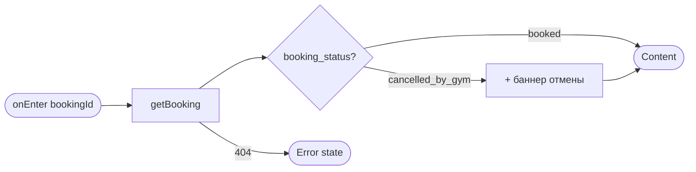
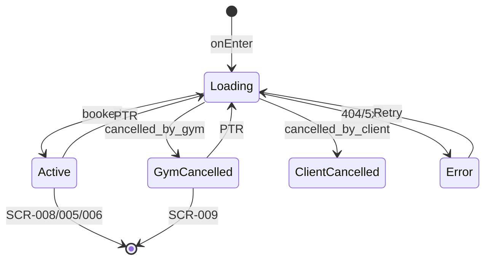

# Экран деталей записи

**ID:** SCR-007  
**Тип:** Экран  
**Домен:** 04. Мои записи  
**Приоритет:** Critical  
**Статус:** Актуален  
**Функциональные блоки:** FB-004-003, FB-004-004, FB-004-005  
**Зона авторизации:** АЗ  
**Дизайн-макет:** [Figma — SCR-007 Booking Detail](https://figma.com/file/vertical-scr-007) — версия 1.0

---

## Содержание

- [История изменений](#история-изменений)
- [Обзор](#обзор)
- [Навигация](#навигация)
- [Входные данные](#входные-данные)
- [Применяемые логики](#применяемые-логики)
- [Инициализация](#инициализация)
- [Используемые запросы](#используемые-запросы)
- [Макет экрана](#макет-экрана)
- [Элементы экрана](#элементы-экрана)
- [Состояния экрана](#состояния-экрана)
- [Действия пользователя](#действия-пользователя)
- [Связанные требования](#связанные-требования)
- [Критерии приёмки](#критерии-приёмки)

---

## История изменений

| Релиз | ТЗ | Описание изменений |
|-------|-----|-------------------|
| 1.0.0 | [SCR-007 Booking Detail Screen](SCR-007_Booking-Detail-Screen.md) | Первоначальная версия ТЗ |

---

## Обзор

Экран детальной информации о конкретной записи: данные слота, выбранный прокат, разбивка стоимости, статус оплаты и инструкции для офлайн-оплаты. Предоставляет действия: отмена записи, изменение проката, поиск альтернативы при отмене скалодромом.

### User Story

> Как клиент скалодрома, я хочу видеть полную информацию о своей записи,
> чтобы знать где и когда тренировка, сколько платить и что можно изменить.

### Бизнес-ценность

- Снижение обращений в поддержку по вопросам оплаты и адреса
- Self-service изменение проката без звонка администратору
- Быстрый переход к альтернативе при отмене скалодромом

---

## Навигация

### Входящая (откуда открывается)

| Источник | Триггер | Условие | Передаваемые параметры |
|----------|---------|---------|------------------------|
| [SCR-006 Мои записи](SCR-006_My-Bookings-Screen.md) | Тап на карточку | — | `bookingId` |
| [SCR-005 Оформление записи](../03_Booking/SCR-005_Booking-Screen.md) | Успешное изменение проката | — | `bookingId` |
| [SCR-008 Подтверждение отмены](SCR-008_Cancellation-Confirmation-Screen.md) | Тап «Отмена» (отказ) | — | `bookingId` |
| [SCR-014 Push-уведомление](../06_Notifications/SCR-014_Push-Notification-View.md) | Push «Посмотреть детали» | `type=reminder` | `bookingId` |
| Deep link | `/bookings/{bookingId}` | Авторизован | `bookingId` |

### Исходящая (куда ведёт)

| Назначение | Триггер | Передаваемые параметры |
|------------|---------|------------------------|
| [SCR-008 Подтверждение отмены](SCR-008_Cancellation-Confirmation-Screen.md) | «Отменить запись» | `bookingId` |
| [SCR-005 Оформление записи](../03_Booking/SCR-005_Booking-Screen.md) | «Изменить прокат» | `bookingId`, `slotId`, `mode=modify` |
| [SCR-009 Альтернативный слот](SCR-009_Alternative-Slot-Offer-Screen.md) | «Найти альтернативу» | `bookingId`, `cancelledSlotId` |
| [SCR-006 Мои записи](SCR-006_My-Bookings-Screen.md) | «Назад» | — |

---

## Входные данные

| Название | Тип | Возможные значения | Описание |
|----------|-----|-------------------|----------|
| `bookingId` | Параметр навигации | UUID | ID записи |
| `bookingCache` | Кэш (SCR-006) | `BookingSummary` | Частичные данные для skeleton prefill |

---

## Применяемые логики

| Логика | Элемент/Триггер | Описание |
|--------|-----------------|----------|
| [LOGIC-007 Выбор проката и расчёт стоимости](../09_Logics/LOGIC-007_Выбор-проката-и-расчёт-стоимости.md) | Блок стоимости | Отображение training + rental + total |
| [LOGIC-008 Отмена записи](../09_Logics/LOGIC-008_Отмена-записи-с-учётом-политики.md) | «Отменить запись» | Проверка `cancellation_policy` |
| [LOGIC-010 Изменение проката](../09_Logics/LOGIC-010_Изменение-проката-в-записи.md) | «Изменить прокат» | Доступность изменения при `booked` |

---

## Инициализация

### Диаграмма загрузки



### Запросы при открытии

| № | Запрос | Критичный | Зависит от | Условие |
|---|--------|-----------|------------|---------|
| 1 | [getBooking](#getbooking) | Да | `bookingId` | Всегда |

---

## Используемые запросы

### getBooking

**Тип:** REST  
**Метод:** GET  
**Спецификация:** [openapi.yaml](../../api/openapi.yaml) → `getBooking`

**Триггер:** Инициализация, pull-to-refresh, возврат с SCR-005

**Параметры:**

| Параметр | Тип | Обязательность | Источник | Описание |
|----------|-----|----------------|----------|----------|
| `bookingId` | string (UUID) | Да | Навигация | Path-параметр |

**Обработка ответа:**

| Результат | Условие | UI-реакция |
|-----------|---------|------------|
| Загрузка | — | Скелетон всех блоков |
| Успех | `booking_status=booked` | Полный контент, действия активны |
| Успех | `booking_status=cancelled_by_gym` | Баннер отмены + причина + CTA «Найти альтернативу» |
| Успех | `booking_status=cancelled_by_client` | Информационный статус «Отменена вами» |
| HTTP 404 | — | Error state «Запись не найдена» |
| HTTP 401 | — | Редирект на авторизацию |
| HTTP 5xx / Сеть | — | Error state с «Обновить» |

---

### updateBookingRental

**Тип:** REST  
**Метод:** PATCH  
**Спецификация:** [openapi.yaml](../../api/openapi.yaml) → `updateBookingRental`

**Триггер:** Не вызывается напрямую на SCR-007 — выполняется на SCR-005 в режиме `modify`. После успеха пользователь возвращается на SCR-007.

**Обработка ответа:** см. [SCR-005](../03_Booking/SCR-005_Booking-Screen.md#updatebookingrental)

---

## Макет экрана

### Структура

```
┌─────────────────────────────────────┐
│ [←] Детали записи                   │
├─────────────────────────────────────┤
│ ⚠ Баннер: отменено скалодромом      │  ← Условно
├─────────────────────────────────────┤
│ Пн, 15 июл · 18:00–19:30            │
│ Болдеринг · Иванов И.И.             │
│ ул. Скалолазная, 1                  │
│                                     │
│ ── Прокат ───────────────────────── │
│ ✓ Скальные туфли                    │
│ ✓ Свое снаряжение                   │
│ [Изменить прокат]                   │
│                                     │
│ ── Стоимость ────────────────────── │
│ Тренировка               800 ₽      │
│ Прокат                   300 ₽      │
│ Итого                  1 100 ₽      │
│                                     │
│ ── Оплата ───────────────────────── │
│ [Не оплачено]                       │
│ Оплата наличными или переводом      │
│ на месте                            │
├─────────────────────────────────────┤
│ [Найти альтернативу]                │  ← При cancelled_by_gym
│ [Отменить запись]                   │
└─────────────────────────────────────┘
```

### Компоненты

| Компонент | Описание | Обязательность |
|-----------|----------|----------------|
| Баннер отмены скалодромом | Причина + извинения | При `cancelled_by_gym` |
| Блок слота | Дата, зона, инструктор, адрес | Да |
| Блок проката | Список позиций + «Изменить» | Да |
| Блок стоимости | Разбивка из `payment` | Да |
| Блок оплаты | Статус + офлайн-инструкция | Да |
| Danger CTA | «Отменить запись» | При `booked` + can_cancel |

---

## Элементы экрана

### 1. Баннер отмены скалодромом

| Элемент | Описание | Источник данных | Валидация | Действие |
|---------|----------|-----------------|-----------|----------|
| Баннер | Оранжевый/красный alert | — | — | — |
| Причина | Заголовок причины | `cancellation_reason.title` | — | — |
| Извинения | Текст извинений | `cancellation_reason.apology_text` | — | — |
| CTA «Найти альтернативу» | Primary | — | — | SCR-009 |

**Логика:**
- Виден только при `booking_status = cancelled_by_gym` (FR-021)

**Условия доступности:**
- Блок скрыт, если: `booking_status != cancelled_by_gym`

---

### 2. Информация о слоте

| Элемент | Описание | Источник данных | Валидация | Действие |
|---------|----------|-----------------|-----------|----------|
| Дата и время | Полный формат | `slot.starts_at`, `duration_minutes` | — | — |
| Зона/формат | Иконка + текст | `slot.zone` | — | — |
| Инструктор | ФИО | `slot.instructor.full_name` | — | — |
| Адрес | Полный адрес | `slot.address` | — | — |
| «Показать на карте» | Ссылка (опционально) | `slot.venue` | — | Открыть картографическое приложение |

---

### 3. Прокат

| Элемент | Описание | Источник данных | Валидация | Действие |
|---------|----------|-----------------|-----------|----------|
| Маркер «Своё снаряжение» | Иконка ✓ | `uses_own_equipment=true` | — | — |
| Список позиций | Названия проката | `rental_lines[].equipment_type.name` | — | — |
| Кнопка «Изменить прокат» | Secondary | — | — | SCR-005 (`mode=modify`) |

**Логика:**
- [LOGIC-010](../09_Logics/LOGIC-010_Изменение-проката-в-записи.md) — кнопка доступна только при `booking_status=booked`

**Условия доступности:**
- «Изменить прокат» скрыта, если: `booking_status != booked`

---

### 4. Стоимость

| Элемент | Описание | Источник данных | Валидация | Действие |
|---------|----------|-----------------|-----------|----------|
| Тренировка | Сумма | `payment.training_amount` | — | — |
| Прокат | Сумма | `payment.rental_amount` | — | — |
| Скидка | Сумма | `payment.discount_amount` | — | Скрыта, если null |
| Итого | Сумма | `payment.total_amount` | — | — |

**Логика:**
- [LOGIC-007](../09_Logics/LOGIC-007_Выбор-проката-и-расчёт-стоимости.md) — отображение без локального пересчёта (данные с сервера)

---

### 5. Оплата

| Элемент | Описание | Источник данных | Валидация | Действие |
|---------|----------|-----------------|-----------|----------|
| Бейдж статуса | Не оплачено / Оплачено / Возврат | `payment.payment_status` | — | — |
| Инструкция | «Оплата наличными или переводом на месте» | Статический текст | — | — |

**Логика:**
- FR-023: маппинг статусов на UI-бейджи

---

### 6. Действия

| Элемент | Описание | Источник данных | Валидация | Действие |
|---------|----------|-----------------|-----------|----------|
| «Отменить запись» | Danger button | `cancellation_policy` | — | SCR-008 |
| «Назад» | Header back | — | — | SCR-006 |

**Логика:**
- [LOGIC-008](../09_Logics/LOGIC-008_Отмена-записи-с-учётом-политики.md)

**Условия доступности:**
- «Отменить запись» видна, если: `booking_status=booked` И `cancellation_policy.can_cancel=true`
- «Отменить запись» скрыта, если: `warning_level=forbidden`

---

## Состояния экрана

### Таблица состояний

| Состояние | Условие | Отображение |
|-----------|---------|-------------|
| Loading | getBooking in progress | Skeleton |
| Content (active) | `booked` | Полный контент + действия |
| Content (gym cancelled) | `cancelled_by_gym` | Баннер + альтернатива |
| Content (client cancelled) | `cancelled_by_client` | Read-only информация |
| Error | 404/5xx | Error state |

### Диаграмма переходов



---

## Действия пользователя

| Действие | Элемент | Триггер | Результат |
|----------|---------|---------|-----------|
| Отмена | «Отменить запись» | Tap | SCR-008 |
| Изменение проката | «Изменить прокат» | Tap | SCR-005 modify |
| Альтернатива | «Найти альтернативу» | Tap | SCR-009 |
| Назад | Header | Tap | SCR-006 |
| Обновление | PTR | Swipe | getBooking |

---

## Связанные требования

### Функциональные (FR)

| ID | Название | Приоритет |
|----|----------|-----------|
| FR-016 | Просмотр своих записей | Высокий (MVP) |
| FR-017 | Отмена записи более чем за 2 часа | Высокий (MVP) |
| FR-018 | Отмена записи за 1–2 часа с предупреждением | Высокий (MVP) |
| FR-019 | Запрет отмены менее чем за 1 час | Высокий (MVP) |
| FR-021 | Отображение причины отмены скалодромом | Высокий (MVP) |
| FR-023 | Отображение статуса оплаты | Высокий (MVP) |
| FR-028 | Изменение проката после записи | Средний (MVP) |

---

## Критерии приёмки

### Позитивные сценарии

| ID | Критерий | Приоритет |
|----|----------|-----------|
| AC-001 | **Дано** активная запись, **Когда** открывается SCR-007, **Тогда** отображаются слот, прокат, стоимость и статус оплаты | P0 |
| AC-002 | **Дано** `cancelled_by_gym`, **Когда** экран загружен, **Тогда** баннер с `cancellation_reason.title` и кнопка «Найти альтернативу» | P0 |
| AC-003 | **Дано** `booked` и наличие проката в фонде, **Когда** пользователь нажимает «Изменить прокат», **Тогда** открывается SCR-005 с `mode=modify` | P0 |
| AC-004 | **Дано** `payment_status=paid`, **Когда** блок оплаты отображается, **Тогда** бейдж «Оплачено» | P0 |

### Негативные сценарии

| ID | Критерий | Приоритет |
|----|----------|-----------|
| AC-N01 | **Дано** `warning_level=forbidden`, **Когда** SCR-007 открыт, **Тогда** кнопка «Отменить запись» скрыта | P0 |
| AC-N02 | **Дано** неверный `bookingId`, **Когда** getBooking, **Тогда** error state 404 | P0 |
| AC-N03 | **Дано** `cancelled_by_client`, **Когда** экран открыт, **Тогда** «Изменить прокат» и «Отменить» недоступны | P1 |

### Граничные условия (Edge Cases)

| ID | Критерий | Приоритет |
|----|----------|-----------|
| AC-E01 | **Дано** возврат с SCR-005 после modify, **Когда** SCR-007 обновляется, **Тогда** `payment.rental_amount` и список проката актуальны | P0 |
| AC-E02 | **Дано** `uses_own_equipment=true` без rental_lines, **Когда** блок проката отображается, **Тогда** только маркер «Своё снаряжение» | P1 |

---
