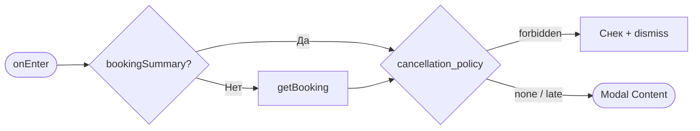
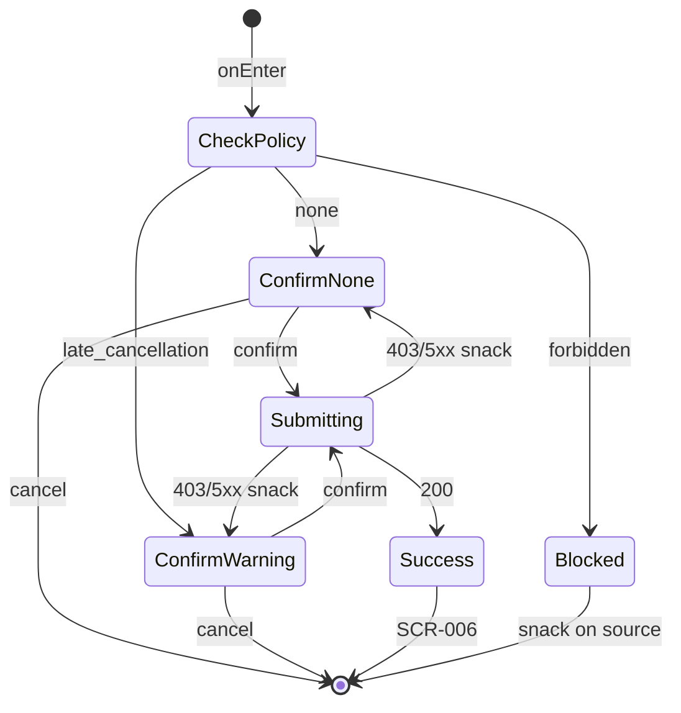

# Экран подтверждения отмены записи

**ID:** SCR-008  
**Тип:** Экран (модальный overlay)  
**Домен:** 04. Мои записи  
**Приоритет:** High  
**Статус:** Актуален  
**Функциональные блоки:** FB-004-006  
**Зона авторизации:** АЗ  
**Дизайн-макет:** [Figma — SCR-008 Cancellation](https://figma.com/file/vertical-scr-008) — версия 1.0

---

## Содержание

- [История изменений](#история-изменений)
- [Обзор](#обзор)
- [Навигация](#навигация)
- [Входные данные](#входные-данные)
- [Применяемые логики](#применяемые-логики)
- [Инициализация](#инициализация)
- [Используемые запросы](#используемые-запросы)
- [Макет экрана](#макет-экрана)
- [Элементы экрана](#элементы-экрана)
- [Состояния экрана](#состояния-экрана)
- [Действия пользователя](#действия-пользователя)
- [Связанные требования](#связанные-требования)
- [Критерии приёмки](#критерии-приёмки)

---

## История изменений

| Релиз | ТЗ | Описание изменений |
|-------|-----|-------------------|
| 1.0.0 | [SCR-008 Cancellation Confirmation](SCR-008_Cancellation-Confirmation-Screen.md) | Первоначальная версия ТЗ |

---

## Обзор

Модальный экран (или full-screen modal) подтверждения отмены записи клиентом. Отображает краткую информацию о записи и вариативный текст предупреждения в зависимости от времени до начала тренировки (`cancellation_policy.warning_level`). При подтверждении вызывает `cancelBooking`.

### User Story

> Как клиент скалодрома, я хочу осознанно подтвердить отмену записи,
> чтобы избежать случайных отмен и понимать последствия поздней отмены.

### Бизнес-ценность

- Защита от случайных отмен
- Информирование о репутационных последствиях поздней отмены (1–2 ч)
- Соблюдение BR-010–BR-012

---

## Навигация

### Входящая (откуда открывается)

| Источник | Триггер | Условие | Передаваемые параметры |
|----------|---------|---------|------------------------|
| [SCR-006 Мои записи](SCR-006_My-Bookings-Screen.md) | Тап «Отменить» | `cancellation_policy.can_cancel=true` | `bookingId`, `bookingSummary` |
| [SCR-007 Детали записи](SCR-007_Booking-Detail-Screen.md) | Тап «Отменить запись» | `can_cancel=true` | `bookingId`, `bookingSummary` |

### Исходящая (куда ведёт)

| Назначение | Триггер | Передаваемые параметры |
|------------|---------|------------------------|
| [SCR-006 Мои записи](SCR-006_My-Bookings-Screen.md) | Успешная отмена | — |
| [SCR-007 Детали записи](SCR-007_Booking-Detail-Screen.md) | Тап «Отмена» / dismiss | `bookingId` |

---

## Входные данные

| Название | Тип | Возможные значения | Описание |
|----------|-----|-------------------|----------|
| `bookingId` | Параметр навигации | UUID | ID отменяемой записи |
| `bookingSummary` | Кэш / getBooking | `BookingSummary` | Данные для UI и `cancellation_policy` |
| `warning_level` | Из API | `none`, `late_cancellation`, `forbidden` | Уровень предупреждения |

---

## Применяемые логики

| Логика | Элемент/Триггер | Описание |
|--------|-----------------|----------|
| [LOGIC-008 Отмена записи](../09_Logics/LOGIC-008_Отмена-записи-с-учётом-политики.md) | Весь экран | Определение варианта UI и вызов cancelBooking |

---

## Инициализация

> Если `bookingSummary` не передан, выполняется `getBooking`. При `warning_level=forbidden` экран не открывается — показывается снек на источнике.

### Диаграмма загрузки



### Запросы при открытии

| № | Запрос | Критичный | Зависит от | Условие |
|---|--------|-----------|------------|---------|
| 1 | [getBooking](#getbooking) | Да | `bookingId` | `bookingSummary` не передан |

---

## Используемые запросы

### getBooking

**Тип:** REST  
**Метод:** GET  
**Спецификация:** [openapi.yaml](../../api/openapi.yaml) → `getBooking`

**Триггер:** Инициализация (если нет кэша)

**Параметры:**

| Параметр | Тип | Обязательность | Источник | Описание |
|----------|-----|----------------|----------|----------|
| `bookingId` | string (UUID) | Да | Навигация | Path-параметр |

**Обработка ответа:**

| Результат | Условие | UI-реакция |
|-----------|---------|------------|
| Успех | `warning_level != forbidden` | Показать modal |
| Успех | `warning_level = forbidden` | Dismiss + снек «Отмена запрещена менее чем за 1 час» |
| HTTP 404 | — | Dismiss + error |

---

### cancelBooking

**Тип:** REST  
**Метод:** DELETE  
**Спецификация:** [openapi.yaml](../../api/openapi.yaml) → `cancelBooking`

**Триггер:** Тап «Подтвердить отмену»

**Параметры:**

| Параметр | Тип | Обязательность | Источник | Описание |
|----------|-----|----------------|----------|----------|
| `bookingId` | string (UUID) | Да | Навигация | Path-параметр |

**Обработка ответа:**

| Результат | Условие | UI-реакция |
|-----------|---------|------------|
| Загрузка | — | Лоадер на кнопке, блокировка повторных тапов |
| Успех | HTTP 200 | Снек «Запись отменена», переход на SCR-006 |
| HTTP 403 | `code = CANCELLATION_FORBIDDEN` | Снек с `message`, dismiss modal |
| HTTP 409 | Запись уже отменена | Снек «Запись уже отменена», переход на SCR-006 |
| HTTP 404 | — | Снек «Запись не найдена», dismiss |
| HTTP 5xx | — | Снек «Произошла ошибка. Попробуйте позже» |
| Сеть | Нет соединения | Снек «Нет соединения» |

---

## Макет экрана

### Структура (modal)

```
┌─────────────────────────────────────┐
│░░░░░░░░░░░░░░░░░░░░░░░░░░░░░░░░░░░░░│  ← Dimmed background
│░░┌───────────────────────────────┐░░│
│░░│      Отмена записи            │░░│
│░░│                               │░░│
│░░│  Пн, 15 июл · 18:00           │░░│
│░░│  Болдеринг                    │░░│
│░░│                               │░░│
│░░│  ⚠ [Вариант предупреждения]   │░░│
│░░│                               │░░│
│░░│  [Подтвердить отмену]         │░░│  ← Danger
│░░│  Отмена                       │░░│  ← Text
│░░└───────────────────────────────┘░░│
└─────────────────────────────────────┘
```

### Компоненты

| Компонент | Описание | Обязательность |
|-----------|----------|----------------|
| Overlay | Затемнение фона 50% | Да |
| Modal card | Центрированная карточка | Да |
| Info block | Дата, время, зона | Да |
| Warning block | Вариативный текст | Да |
| Danger CTA | «Подтвердить отмену» | Да |
| Cancel CTA | «Отмена» | Да |

---

## Элементы экрана

### 1. Заголовок

| Элемент | Описание | Источник данных | Валидация | Действие |
|---------|----------|-----------------|-----------|----------|
| Заголовок | «Отмена записи» | — | — | — |

---

### 2. Информация о записи

| Элемент | Описание | Источник данных | Валидация | Действие |
|---------|----------|-----------------|-----------|----------|
| Дата и время | Краткий формат | `slot.starts_at` | — | — |
| Зона/формат | Название зоны | `slot.zone.name` | — | — |

---

### 3. Блок предупреждения

| Элемент | Описание | Источник данных | Валидация | Действие |
|---------|----------|-----------------|-----------|----------|
| Текст (вариант A) | «Вы уверены, что хотите отменить запись?» | `warning_level=none` | — | — |
| Текст (вариант B) | «⚠️ Внимание! Отмена за 1–2 часа до начала может повлиять на вашу репутацию. Вы уверены?» | `warning_level=late_cancellation` | — | — |
| Иконка предупреждения | Оранжевая | `late_cancellation` | — | — |
| Текст (вариант C) | «Отмена запрещена менее чем за 1 час до начала тренировки» | `warning_level=forbidden` | — | Экран не открывается |

**Логика:**
- [LOGIC-008](../09_Logics/LOGIC-008_Отмена-записи-с-учётом-политики.md) — маппинг `cancellation_policy.warning_level`:
  - `none` — > 2 ч (FR-017)
  - `late_cancellation` — 1–2 ч (FR-018)
  - `forbidden` — < 1 ч (FR-019), modal блокируется на входе

---

### 4. Действия

| Элемент | Описание | Источник данных | Валидация | Действие |
|---------|----------|-----------------|-----------|----------|
| «Подтвердить отмену» | Danger button | — | — | [cancelBooking](#cancelbooking) |
| «Отмена» | Text button | — | — | Dismiss → SCR-007 или SCR-006 |

**Условия доступности:**
- «Подтвердить отмену» disabled во время запроса
- Double-tap protection: повторный тап игнорируется при loading

---

## Состояния экрана

### Таблица состояний

| Состояние | Условие | Отображение |
|-----------|---------|-------------|
| Confirm (none) | `warning_level=none` | Нейтральный текст |
| Confirm (warning) | `warning_level=late_cancellation` | Оранжевый акцент + иконка |
| Submitting | cancelBooking in progress | Лоадер на CTA |
| Success | HTTP 200 | Dismiss + SCR-006 |
| Blocked | `forbidden` | Modal не показывается |

### Диаграмма переходов



---

## Действия пользователя

| Действие | Элемент | Триггер | Результат |
|----------|---------|---------|-----------|
| Подтверждение | «Подтвердить отмену» | Tap | cancelBooking → SCR-006 |
| Отказ | «Отмена» | Tap | Dismiss, возврат на источник |
| Dismiss | Tap вне modal / back | Tap | Dismiss (если не submitting) |

---

## Связанные требования

### Функциональные (FR)

| ID | Название | Приоритет |
|----|----------|-----------|
| FR-017 | Отмена записи более чем за 2 часа | Высокий (MVP) |
| FR-018 | Отмена записи за 1–2 часа с предупреждением | Высокий (MVP) |
| FR-019 | Запрет отмены менее чем за 1 час | Высокий (MVP) |

---

## Критерии приёмки

### Позитивные сценарии

| ID | Критерий | Приоритет |
|----|----------|-----------|
| AC-001 | **Дано** `warning_level=none`, **Когда** modal открыт, **Тогда** текст «Вы уверены…» без иконки предупреждения | P0 |
| AC-002 | **Дано** `warning_level=late_cancellation`, **Когда** modal открыт, **Тогда** оранжевое предупреждение о репутации | P0 |
| AC-003 | **Дано** пользователь подтверждает отмену, **Когда** cancelBooking 200, **Тогда** переход на SCR-006, запись удалена из списка | P0 |

### Негативные сценарии

| ID | Критерий | Приоритет |
|----|----------|-----------|
| AC-N01 | **Дано** `warning_level=forbidden`, **Когда** пользователь пытается отменить, **Тогда** SCR-008 не открывается, показан снек | P0 |
| AC-N02 | **Дано** cancelBooking 403 CANCELLATION_FORBIDDEN, **Когда** подтверждение, **Тогда** снек с `message`, modal закрыт | P0 |
| AC-N03 | **Дано** cancelBooking 409, **Когда** подтверждение, **Тогда** снек «Запись уже отменена», переход SCR-006 | P1 |
| AC-N04 | **Дано** двойной тап на CTA, **Когда** запрос выполняется, **Тогда** отправлен только один DELETE | P1 |

### Граничные условия (Edge Cases)

| ID | Критерий | Приоритет |
|----|----------|-----------|
| AC-E01 | **Дано** время до начала изменилось между SCR-006 и SCR-008, **Когда** cancelBooking 403, **Тогда** пользователь информирован, список обновлён | P1 |
| AC-E02 | **Дано** tap «Отмена», **Когда** modal dismiss, **Тогда** возврат на SCR-007 без изменений записи | P0 |

---
