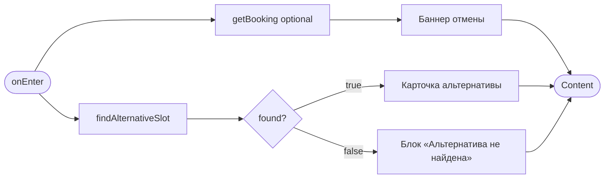
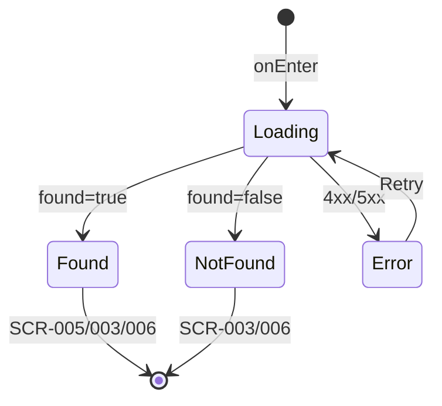

# Экран предложения альтернативного слота

**ID:** SCR-009  
**Тип:** Экран  
**Домен:** 04. Мои записи  
**Приоритет:** High  
**Статус:** Актуален  
**Функциональные блоки:** FB-004-007  
**Зона авторизации:** АЗ  
**Дизайн-макет:** [Figma — SCR-009 Alternative Slot](https://figma.com/file/vertical-scr-009) — версия 1.0

---

## Содержание

- [История изменений](#история-изменений)
- [Обзор](#обзор)
- [Навигация](#навигация)
- [Входные данные](#входные-данные)
- [Применяемые логики](#применяемые-логики)
- [Инициализация](#инициализация)
- [Используемые запросы](#используемые-запросы)
- [Макет экрана](#макет-экрана)
- [Элементы экрана](#элементы-экрана)
- [Состояния экрана](#состояния-экрана)
- [Действия пользователя](#действия-пользователя)
- [Связанные требования](#связанные-требования)
- [Критерии приёмки](#критерии-приёмки)

---

## История изменений

| Релиз | ТЗ | Описание изменений |
|-------|-----|-------------------|
| 1.0.0 | [SCR-009 Alternative Slot Offer](SCR-009_Alternative-Slot-Offer-Screen.md) | Первоначальная версия ТЗ |

---

## Обзор

Экран отображается при отмене тренировки скалодромом. Показывает баннер об отмене исходного слота и карточку рекомендованного альтернативного слота (если найден через `findAlternativeSlot`). Пользователь может записаться на предложенный слот, выбрать другой вручную или отложить решение.

### User Story

> Как клиент скалодрома, я хочу быстро получить замену отменённой тренировки,
> чтобы не потерять возможность заниматься.

### Бизнес-ценность

- Удержание клиента после негативного события (отмена скалодромом)
- Автоматический подбор ближайшего подходящего слота (BR-020)
- Снижение нагрузки на администраторов

---

## Навигация

### Входящая (откуда открывается)

| Источник | Триггер | Условие | Передаваемые параметры |
|----------|---------|---------|------------------------|
| [SCR-007 Детали записи](SCR-007_Booking-Detail-Screen.md) | «Найти альтернативу» | `booking_status=cancelled_by_gym` | `bookingId`, `cancelledSlotId` |
| [SCR-014 Push-уведомление](../06_Notifications/SCR-014_Push-Notification-View.md) | «Посмотреть альтернативы» | `type=gym_cancellation` | `bookingId`, `cancelledSlotId` |
| Deep link | `/alternatives/{bookingId}` | Авторизован | `bookingId`, `cancelledSlotId` |

### Исходящая (куда ведёт)

| Назначение | Триггер | Передаваемые параметры |
|------------|---------|------------------------|
| [SCR-005 Оформление записи](../03_Booking/SCR-005_Booking-Screen.md) | «Записаться на этот слот» | `slotId` (alternative), `mode=create`, `sourceBookingId` |
| [SCR-003 Расписание](../02_Schedule/SCR-003_Schedule-Screen.md) | «Выбрать другой слот» | — |
| [SCR-006 Мои записи](SCR-006_My-Bookings-Screen.md) | «Позже» | — |

---

## Входные данные

| Название | Тип | Возможные значения | Описание |
|----------|-----|-------------------|----------|
| `bookingId` | Параметр навигации | UUID | ID отменённой записи |
| `cancelledSlotId` | Параметр навигации | UUID | ID отменённого слота |
| `cancelledBooking` | Кэш / getBooking | `BookingDetail` | Данные отменённого слота для баннера |

---

## Применяемые логики

| Логика | Элемент/Триггер | Описание |
|--------|-----------------|----------|
| [LOGIC-009 Альтернативный слот](../09_Logics/LOGIC-009_Предложение-альтернативного-слота.md) | Инициализация, CTA | Поиск и отображение альтернативы |

---

## Инициализация

### Диаграмма загрузки



### Запросы при opening

| № | Запрос | Критичный | Зависит от | Условие |
|---|--------|-----------|------------|---------|
| 1 | [findAlternativeSlot](#findalternativeslot) | Да | `cancelledSlotId`, `bookingId` | Всегда |
| 2 | [getBooking](#getbooking) | Нет | `bookingId` | Если нет `cancelledBooking` в кэше |

---

## Используемые запросы

### findAlternativeSlot

**Тип:** REST  
**Метод:** GET  
**Спецификация:** [openapi.yaml](../../api/openapi.yaml) → `findAlternativeSlot`

**Триггер:** Инициализация

**Параметры:**

| Параметр | Тип | Обязательность | Источник | Описание |
|----------|-----|----------------|----------|----------|
| `cancelled_slot_id` | string (UUID) | Да | `cancelledSlotId` | Query-параметр |
| `booking_id` | string (UUID) | Нет | `bookingId` | Для учёта параметров проката |

**Обработка ответа:**

| Результат | Условие | UI-реакция |
|-----------|---------|------------|
| Загрузка | — | Скелетон карточки альтернативы |
| Успех | `found=true` | Карточка `alternative_slot` + CTA «Записаться на этот слот» |
| Успех | `found=false` | Текст «Подходящий слот не найден» + акцент на «Выбрать другой слот» |
| HTTP 404 | — | Error state «Запись или слот не найдены» |
| HTTP 401 | — | Редирект на авторизацию |
| HTTP 5xx / Сеть | — | Error state с «Обновить» |

---

### getBooking

**Тип:** REST  
**Метод:** GET  
**Спецификация:** [openapi.yaml](../../api/openapi.yaml) → `getBooking`

**Триггер:** Инициализация (если нет кэша для баннера)

**Параметры:**

| Параметр | Тип | Обязательность | Источник | Описание |
|----------|-----|----------------|----------|----------|
| `bookingId` | string (UUID) | Да | Навигация | Path-параметр |

**Обработка ответа:**

| Результат | Условие | UI-реакция |
|-----------|---------|------------|
| Успех | — | Заполнить баннер: дата/время отменённого слота, `cancellation_reason` |
| HTTP 404 | — | Error state |

---

## Макет экрана

### Структура

```
┌─────────────────────────────────────┐
│ [←] Альтернативная тренировка       │
├─────────────────────────────────────┤
│ ┌─ Баннер отмены ─────────────────┐ │
│ │ 🔔 Ваша тренировка отменена     │ │
│ │ Пн, 15 июл · 18:00 · Болдеринг  │ │
│ │ Причина: Инструктор недоступен  │ │
│ └─────────────────────────────────┘ │
│                                     │
│ ┌─ Рекомендуем ───────────────────┐ │
│ │ [Ближайший]                     │ │
│ │ Ср, 17 июл · 18:00              │ │
│ │ Болдеринг · Петров П.П.         │ │
│ │ Осталось 5 из 10                │ │
│ │ Прокат от 300 ₽                 │ │
│ └─────────────────────────────────┘ │
├─────────────────────────────────────┤
│ [Записаться на этот слот]           │  ← Primary
│ [Выбрать другой слот]               │  ← Secondary
│ Позже                               │  ← Text
└─────────────────────────────────────┘
```

### Компоненты

| Компонент | Описание | Обязательность |
|-----------|----------|----------------|
| Баннер отмены | Информация об отменённом слоте | Да |
| Карточка альтернативы | Выделенная карточка слота | При `found=true` |
| Empty alternative | Сообщение + CTA на расписание | При `found=false` |
| Action buttons | 3 уровня CTA | Да |

---

## Элементы экрана

### 1. Header

| Элемент | Описание | Источник данных | Валидация | Действие |
|---------|----------|-----------------|-----------|----------|
| Заголовок | «Альтернативная тренировка» | — | — | — |
| «Назад» | Иконка | — | — | SCR-006 или SCR-007 |

---

### 2. Баннер отмены

| Элемент | Описание | Источник данных | Валидация | Действие |
|---------|----------|-----------------|-----------|----------|
| Заголовок баннера | «Ваша тренировка отменена» | Статический текст | — | — |
| Дата и время | Отменённый слот | `cancelledBooking.slot.starts_at` | — | — |
| Зона | Формат тренировки | `cancelledBooking.slot.zone.name` | — | — |
| Причина | Текст причины | `cancellation_reason.title` | — | — |
| Извинения | Краткий текст | `cancellation_reason.apology_text` | — | — |

**Логика:**
- FR-021: причина из фиксированного списка на бэкенде
- Дружелюбный тон, без агрессивных цветов в баннере

---

### 3. Карточка альтернативного слота

| Элемент | Описание | Источник данных | Валидация | Действие |
|---------|----------|-----------------|-----------|----------|
| Бейдж | «Рекомендуем» / «Ближайший» | Статический | — | — |
| Дата и время | Альтернативный слот | `alternative_slot.starts_at` | — | — |
| Зона/формат | Название | `alternative_slot.zone` | — | — |
| Инструктор | ФИО | `alternative_slot.instructor.full_name` | — | — |
| Свободные места | «Осталось X из Y» | `free_spots`, `capacity` | — | — |
| Прокатный тариф | «Прокат от N ₽» | `alternative_slot.rental_tariff` | — | — |

**Логика:**
- [LOGIC-009](../09_Logics/LOGIC-009_Предложение-альтернативного-слота.md) — карточка скрыта при `found=false`
- BR-018: повторная запись на отменённый слот запрещена (контроль на бэкенде)

**Условия доступности:**
- Блок виден, если: `found = true`

---

### 4. Состояние «Альтернатива не найдена»

| Элемент | Описание | Источник данных | Валидация | Действие |
|---------|----------|-----------------|-----------|----------|
| Текст | «К сожалению, подходящий слот не найден. Выберите тренировку в расписании.» | — | — | — |

**Условия доступности:**
- Блок виден, если: `found = false`

---

### 5. Действия

| Элемент | Описание | Источник данных | Валидация | Действие |
|---------|----------|-----------------|-----------|----------|
| «Записаться на этот слот» | Primary | — | — | SCR-005 (`slotId=alternative_slot.id`) |
| «Выбрать другой слот» | Secondary | — | — | SCR-003 |
| «Позже» | Text | — | — | SCR-006 |

**Условия доступности:**
- «Записаться на этот слот» видна, если: `found = true` И `alternative_slot.availability.can_book = true`
- «Записаться на этот слот» скрыта, если: `found = false`

---

## Состояния экрана

### Таблица состояний

| Состояние | Условие | Отображение |
|-----------|---------|-------------|
| Loading | findAlternativeSlot in progress | Skeleton баннер + карточка |
| Content (found) | `found=true` | Баннер + карточка + все CTA |
| Content (not found) | `found=false` | Баннер + сообщение + «Выбрать другой» / «Позже» |
| Error | 404/5xx | Error state |

### Диаграмма переходов



---

## Действия пользователя

| Действие | Элемент | Триггер | Результат |
|----------|---------|---------|-----------|
| Запись на альтернативу | Primary CTA | Tap | SCR-005 с `alternative_slot.id` |
| Ручной выбор | «Выбрать другой слот» | Tap | SCR-003 |
| Отложить | «Позже» | Tap | SCR-006 |
| Обновление | Error / PTR | Tap/Swipe | findAlternativeSlot |

---

## Связанные требования

### Функциональные (FR)

| ID | Название | Приоритет |
|----|----------|-----------|
| FR-020 | Push-уведомление при отмене скалодромом | Высокий (MVP) |
| FR-021 | Отображение причины отмены скалодромом | Высокий (MVP) |
| FR-022 | Предложение альтернативного слота | Средний (MVP) |

---

## Критерии приёмки

### Позитивные сценарии

| ID | Критерий | Приоритет |
|----|----------|-----------|
| AC-001 | **Дано** отмена скалодромом и `found=true`, **Когда** SCR-009 открыт, **Тогда** баннер отмены и карточка альтернативы с данными `alternative_slot` | P0 |
| AC-002 | **Дано** альтернативный слот найден, **Когда** пользователь нажимает «Записаться на этот слот», **Тогда** открывается SCR-005 с `slotId` альтернативы | P0 |
| AC-003 | **Дано** `found=false`, **Когда** экран загружен, **Тогда** сообщение об отсутствии альтернативы и активна кнопка «Выбрать другой слот» | P0 |
| AC-004 | **Дано** пользователь нажимает «Позже», **Когда** действие выполнено, **Тогда** переход на SCR-006 | P1 |

### Негативные сценарии

| ID | Критерий | Приоритет |
|----|----------|-----------|
| AC-N01 | **Дано** findAlternativeSlot 404, **Когда** экран открыт, **Тогда** error state | P0 |
| AC-N02 | **Дано** alternative_slot.can_book=false, **Когда** карточка отображается, **Тогда** CTA «Записаться» disabled с пояснением | P1 |
| AC-N03 | **Дано** ошибка сети, **Когда** инициализация, **Тогда** error state с «Обновить» | P0 |

### Граничные условия (Edge Cases)

| ID | Критерий | Приоритет |
|----|----------|-----------|
| AC-E01 | **Дано** переход из push с `bookingId`, **Когда** SCR-009 открыт без кэша, **Тогда** getBooking загружает данные баннера | P1 |
| AC-E02 | **Дано** `rebooking_forbidden=true` для отменённого слота, **Когда** пользователь идёт на SCR-003, **Тогда** отменённый слот недоступен для записи (BR-018) | P2 |

---
