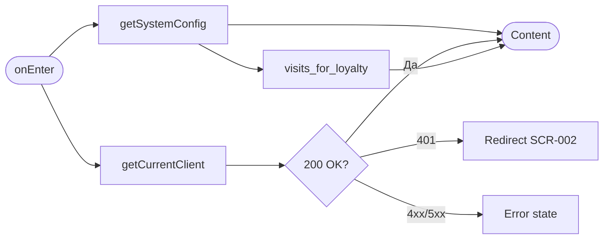
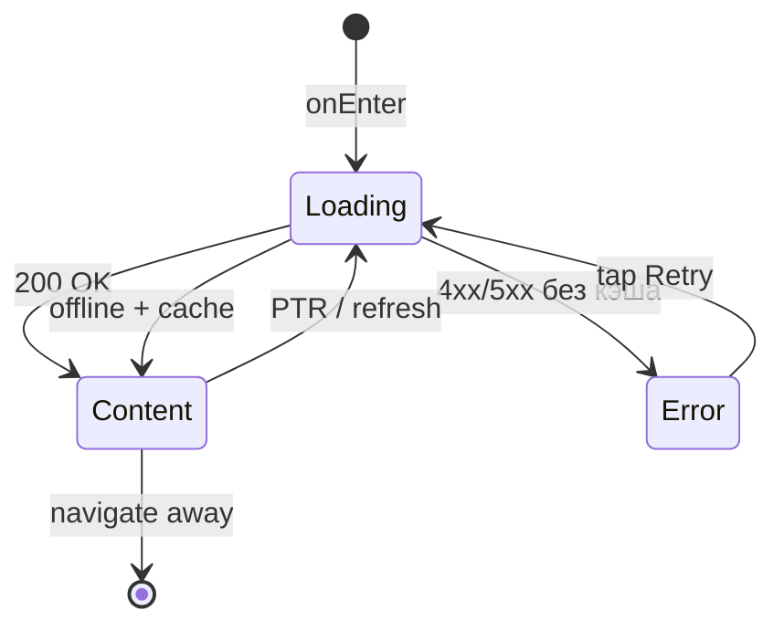

# Экран профиля пользователя

**ID:** SCR-010  
**Тип:** Экран  
**Домен:** 05. Профиль  
**Приоритет:** High  
**Статус:** Актуален  
**Функциональные блоки:** FB-PROF-001, FB-PROF-002  
**Зона авторизации:** АЗ  
**Дизайн-макет:** [DB-010](../../3-design-brief/design-briefs.md#db-010-profile-screen) — версия 1.0

---

## Содержание

- [История изменений](#история-изменений)
- [Обзор](#обзор)
- [Навигация](#навигация)
- [Входные данные](#входные-данные)
- [Применяемые логики](#применяемые-логики)
- [Инициализация](#инициализация)
- [Используемые запросы](#используемые-запросы)
- [Макет экрана](#макет-экрана)
- [Элементы экрана](#элементы-экрана)
- [Состояния экрана](#состояния-экрана)
- [Действия пользователя](#действия-пользователя)
- [Связанные требования](#связанные-требования)
- [Критерии приёмки](#критерии-приёмки)

---

## История изменений

| Релиз | ТЗ | Описание изменений |
|-------|-----|-------------------|
| 1.0.0 | [SCR-010_Profile-Screen.md](SCR-010_Profile-Screen.md) | Первоначальная документация экрана профиля |

---

## Обзор

Экран отображает персональные данные авторизованного клиента, прогресс программы лояльности «постоянный клиент» и предоставляет доступ к настройкам уведомлений и выходу из аккаунта. Является корневым экраном вкладки «Профиль» в нижней навигации.

### User Story

> Как зарегистрированный клиент, я хочу видеть свой профиль и прогресс до статуса постоянного клиента,
> чтобы понимать свои привилегии и управлять настройками приложения.

### Бизнес-ценность

- Повышает вовлечённость через визуализацию прогресса лояльности (BR-032)
- Централизует доступ к настройкам push-уведомлений (FR-032)
- Подтверждает корректность регистрационных данных клиента (FR-026)

---

## Навигация

### Входящая (откуда открывается)

| Источник | Триггер | Условие | Передаваемые параметры |
|----------|---------|---------|------------------------|
| [SCR-003 Schedule Screen](../02_Schedule/SCR-003_Schedule-Screen.md) | Тап на вкладку «Профиль» | Пользователь авторизован | — |
| [SCR-006 My Bookings Screen](../04_Запись/SCR-006_My-Bookings-Screen.md) | Тап на вкладку «Профиль» | Пользователь авторизован | — |
| [SCR-011 Notification Settings Screen](SCR-011_Notification-Settings-Screen.md) | Кнопка «Назад» | После просмотра настроек | — |

### Исходящая (куда ведёт)

| Назначение | Триггер | Передаваемые параметры |
|------------|---------|------------------------|
| [SCR-011 Notification Settings Screen](SCR-011_Notification-Settings-Screen.md) | Тап «Настройки уведомлений» | — |
| [SCR-002 Registration Screen](../01_Authentication/SCR-002_Registration-Screen.md) | Тап «Выйти» + подтверждение | — |

---

## Входные данные

| Название | Тип | Возможные значения | Описание |
|----------|-----|-------------------|----------|
| `authToken` | Защищённое хранилище | JWT-токен | Токен авторизации для API-запросов |
| `cachedClient` | Кэш | Объект `Client` | Кэшированный профиль для мгновенного отображения (опционально) |
| `visitsForLoyalty` | Кэш / Remote Config | `10`, `15`, … | Порог N посещений; из ответа `GET /config` |

---

## Применяемые логики

> На экране не используются переиспользуемые логики из раздела [09_Logics](../09_Logics/_INDEX.md). Расчёт прогресса лояльности выполняется локально на основе данных API.

---

## Инициализация

> При открытии экрана выполняются два параллельных запроса. Кэш профиля может отображаться до получения актуальных данных.

### Диаграмма загрузки



### Запросы при открытии

| № | Запрос | Критичный | Зависит от | Условие |
|---|--------|-----------|------------|---------|
| 1 | [getCurrentClient](#getcurrentclient) | Да | — | Всегда |
| 2 | [getSystemConfig](#getsystemconfig) | Нет | — | Всегда (если `visitsForLoyalty` не в кэше) |

> Полное описание запросов см. в секции [Используемые запросы](#используемые-запросы).

---

## Используемые запросы

> Все API-запросы экрана с полным описанием параметров и обработки ответов.

### getCurrentClient

**Тип:** REST  
**Метод:** GET  
**Спецификация:** [openapi.yaml](../../api/openapi.yaml) → `getCurrentClient`  
**Endpoint:** `GET /clients/me`

**Триггер:** Инициализация, Pull-to-refresh

**Параметры:**

| Параметр | Тип | Обязательность | Источник | Описание |
|----------|-----|----------------|----------|----------|
| `Authorization` | string | Да | Защищённое хранилище | Bearer JWT |

**Обработка ответа:**

| Результат | Условие | UI-реакция |
|-----------|---------|------------|
| Загрузка | — | Скелетон header + блока лояльности |
| Успех | `200` + `Client` | Отобразить профиль и прогресс лояльности |
| HTTP 401 | — | Очистить токен → переход на [SCR-002](../01_Authentication/SCR-002_Registration-Screen.md) |
| HTTP 4xx/5xx | — | Error state с кнопкой «Обновить» |
| Сеть | Нет соединения | Error state с кнопкой «Обновить»; при наличии кэша — показать кэш + баннер «Данные могут быть устаревшими» |

**Используемые поля ответа:**

| Поле | Элемент UI |
|------|------------|
| `full_name` | ФИО |
| `phone` | Телефон |
| `birth_date` | Дата рождения |
| `completed_visits_count` | Счётчик «X из N» |
| `is_loyal_client` | Видимость бейджа «Постоянный клиент» |
| `loyalty_discount` | Текст привилегий (если не null) |

---

### getSystemConfig

**Тип:** REST  
**Метод:** GET  
**Спецификация:** [openapi.yaml](../../api/openapi.yaml) → `getSystemConfig`  
**Endpoint:** `GET /config`

**Триггер:** Инициализация (параллельно с профилем)

**Параметры:**

| Параметр | Тип | Обязательность | Источник | Описание |
|----------|-----|----------------|----------|----------|
| — | — | — | — | Запрос без авторизации |

**Обработка ответа:**

| Результат | Условие | UI-реакция |
|-----------|---------|------------|
| Загрузка | — | Прогресс-бар со значением по умолчанию N=10 (fallback) |
| Успех | `visits_for_loyalty` | Обновить N в прогресс-баре и тексте «До статуса осталось …» |
| HTTP 4xx/5xx | — | Использовать закэшированное или fallback значение N=10 |
| Сеть | Нет соединения | Использовать закэшированное или fallback значение N=10 |

---

## Макет экрана

### Структура

```
┌─────────────────────────────────────┐
│           Профиль                   │  ← Header (без кнопки «Назад»)
├─────────────────────────────────────┤
│         [Avatar]                    │
│         ФИО                         │
│         +7 XXX XXX-XX-XX            │  ← Profile Header
├─────────────────────────────────────┤
│  Дата рождения: DD.MM.YYYY          │
├─────────────────────────────────────┤
│  [🏅 Постоянный клиент]             │  ← Loyalty (если is_loyal_client)
│  ████████░░  7 из 10 посещений      │
│  До статуса осталось 3 посещения     │
├─────────────────────────────────────┤
│  > Настройки уведомлений            │  ← Actions list
│  > Выйти                            │
└─────────────────────────────────────┘
│  [Расписание] [Записи] [Профиль]    │  ← Bottom Tab Bar
└─────────────────────────────────────┘
```

### Компоненты

| Компонент | Описание | Обязательность |
|-----------|----------|----------------|
| Profile Header | Аватар, ФИО, телефон | Да |
| Info Row | Дата рождения | Да |
| Loyalty Block | Бейдж, прогресс-бар, текст прогресса | Да |
| Settings Row | Переход к настройкам уведомлений | Да |
| Logout Row | Выход из аккаунта | Да |
| Bottom Tab Bar | Навигация приложения | Да |

---

## Элементы экрана

### 1. Header профиля

| Элемент | Описание | Источник данных | Валидация | Действие |
|---------|----------|-----------------|-----------|----------|
| Аватар | Круглая заглушка с инициалами или placeholder-изображение | Первые буквы `full_name` | — | — |
| ФИО | Полное имя клиента | `full_name` из getCurrentClient | — | — |
| Телефон | Номер в формате +7 XXX XXX-XX-XX | `phone` из getCurrentClient | — | — |

**Логика:**
- Аватар: если фото не предусмотрено API — генерировать инициалы из `full_name` (первые буквы фамилии и имени)

### 2. Блок персональных данных

| Элемент | Описание | Источник данных | Валидация | Действие |
|---------|----------|-----------------|-----------|----------|
| Строка «Дата рождения» | Label + значение DD.MM.YYYY | `birth_date` из getCurrentClient | — | — |

### 3. Блок лояльности

| Элемент | Описание | Источник данных | Валидация | Действие |
|---------|----------|-----------------|-----------|----------|
| Бейдж «Постоянный клиент» | Яркий бейдж со статусом | `is_loyal_client = true` | — | — |
| Прогресс-бар | Заполнение X/N | `completed_visits_count`, `visits_for_loyalty` | — | — |
| Текст прогресса | «X из N посещений» | Расчёт: `completed_visits_count` / N | — | — |
| Текст до статуса | «До статуса осталось K посещений» | K = max(0, N − X) | — | — |
| Описание привилегий | «Скидка X% на прокат» | `loyalty_discount` | — | — |

**Логика:**
- Бейдж отображается только при `is_loyal_client = true` (FR-027, BR-032)
- При `is_loyal_client = false`: скрыть бейдж, показать прогресс-бар и текст «До статуса осталось K посещений»
- При `is_loyal_client = true`: прогресс-бар заполнен на 100%, текст «Вы — постоянный клиент!»
- N берётся из `visits_for_loyalty` (getSystemConfig)

**Условия доступности:**
- Блок лояльности скрыт при ошибке getCurrentClient без кэша
- Описание привилегий скрыто, если `loyalty_discount = null`

### 4. Действия

| Элемент | Описание | Источник данных | Валидация | Действие |
|---------|----------|-----------------|-----------|----------|
| «Настройки уведомлений» | Строка списка с chevron | — | — | Открыть [SCR-011](SCR-011_Notification-Settings-Screen.md) |
| «Выйти» | Строка списка, красный текст | — | — | Диалог подтверждения → выход |

**Логика:**
- «Выйти»: показать alert «Вы уверены, что хотите выйти?» → при подтверждении удалить JWT из хранилища → переход на [SCR-002](../01_Authentication/SCR-002_Registration-Screen.md)

**Условия доступности:**
- «Выйти» всегда активна для авторизованного пользователя

---

## Состояния экрана

### Таблица состояний

| Состояние | Условие | Отображение |
|-----------|---------|-------------|
| Loading | Ожидание getCurrentClient | Скелетон header + loyalty block |
| Content | API 200 + Client | Стандартный контент |
| Content (cached) | Ошибка сети + есть кэш | Кэшированные данные + баннер offline |
| Error | API 4xx/5xx без кэша | Error state «Не удалось загрузить профиль» + «Обновить» |

### Диаграмма переходов



---

## Действия пользователя

| Действие | Элемент | Триггер | Результат |
|----------|---------|---------|-----------|
| Обновить профиль | Экран | Pull-to-refresh | Повтор getCurrentClient + getSystemConfig |
| Открыть настройки | «Настройки уведомлений» | Tap | Переход на [SCR-011](SCR-011_Notification-Settings-Screen.md) |
| Выйти | «Выйти» | Tap → Confirm | Очистка сессии → [SCR-002](../01_Authentication/SCR-002_Registration-Screen.md) |
| Переключить вкладку | Bottom Tab | Tap | Переход на соответствующий экран |

---

## Связанные требования

### Функциональные (FR)

| ID | Название | Приоритет |
|----|----------|-----------|
| FR-026 | Регистрация по телефону | Высокий (MVP) |
| FR-027 | Отображение бейджа постоянного клиента | Средний (MVP) |

### Use Cases / User Stories

| ID | Описание |
|----|----------|
| UC-006 | Регистрация пользователя |
| UC-007 | Получение статуса постоянного клиента |
| US-017 | Регистрация в приложении |
| US-018 | Получение статуса постоянного клиента |

### Бизнес-правила

| ID | Описание |
|----|----------|
| BR-030 | Обязательные поля регистрации: ФИО, телефон, дата рождения |
| BR-032 | После N посещений — бейдж «постоянный клиент» + скидка/бонус |

---

## Критерии приёмки

### Позитивные сценарии

| ID | Критерий | Приоритет |
|----|----------|-----------|
| AC-001 | **Дано** авторизованный клиент, **Когда** открывается SCR-010, **Тогда** отображаются ФИО, телефон, дата рождения из `GET /clients/me` | P0 |
| AC-002 | **Дано** `completed_visits_count = 7`, `visits_for_loyalty = 10`, **Когда** экран загружен, **Тогда** прогресс-бар показывает 7/10 и текст «До статуса осталось 3 посещения» | P0 |
| AC-003 | **Дано** `is_loyal_client = true`, **Когда** экран загружен, **Тогда** отображается бейдж «Постоянный клиент» и прогресс 100% | P0 |
| AC-004 | **Дано** экран профиля, **Когда** пользователь тапает «Настройки уведомлений», **Тогда** открывается SCR-011 | P0 |
| AC-005 | **Дано** экран профиля, **Когда** пользователь подтверждает «Выйти», **Тогда** токен удалён и открыт SCR-002 | P1 |

### Негативные сценарии

| ID | Критерий | Приоритет |
|----|----------|-----------|
| AC-N01 | **Дано** ошибка сети без кэша, **Когда** открытие экрана, **Тогда** отображается error state с кнопкой «Обновить» | P0 |
| AC-N02 | **Дано** HTTP 401, **Когда** запрос профиля, **Тогда** выполняется редирект на SCR-002 | P0 |

### Граничные условия (Edge Cases)

| ID | Критерий | Приоритет |
|----|----------|-----------|
| AC-E01 | **Дано** `completed_visits_count >= visits_for_loyalty`, но `is_loyal_client = false` (рассинхрон), **Когда** экран загружен, **Тогда** прогресс-бар показывает 100%, бейдж скрыт до обновления с сервера | P2 |
| AC-E02 | **Дано** `GET /config` недоступен, **Когда** экран загружен, **Тогда** используется fallback N=10 для прогресс-бара | P2 |

---
