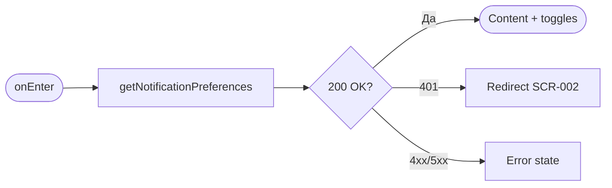
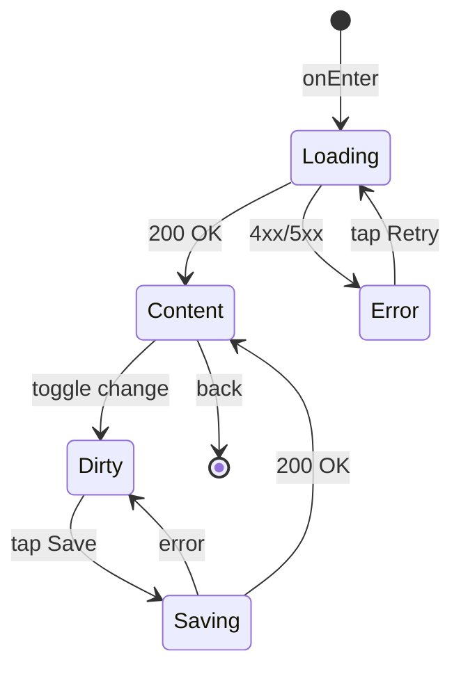

# Экран настроек уведомлений

**ID:** SCR-011  
**Тип:** Экран  
**Домен:** 05. Профиль  
**Приоритет:** Medium  
**Статус:** Актуален  
**Функциональные блоки:** FB-NOTIF-001  
**Зона авторизации:** АЗ  
**Дизайн-макет:** [DB-011](../../3-design-brief/design-briefs.md#db-011-notification-settings-screen) — версия 1.0

---

## Содержание

- [История изменений](#история-изменений)
- [Обзор](#обзор)
- [Навигация](#навигация)
- [Входные данные](#входные-данные)
- [Применяемые логики](#применяемые-логики)
- [Инициализация](#инициализация)
- [Используемые запросы](#используемые-запросы)
- [Макет экрана](#макет-экрана)
- [Элементы экрана](#элементы-экрана)
- [Состояния экрана](#состояния-экрана)
- [Действия пользователя](#действия-пользователя)
- [Связанные требования](#связанные-требования)
- [Критерии приёмки](#критерии-приёмки)

---

## История изменений

| Релиз | ТЗ | Описание изменений |
|-------|-----|-------------------|
| 1.0.0 | [SCR-011_Notification-Settings-Screen.md](SCR-011_Notification-Settings-Screen.md) | Первоначальная документация экрана настроек уведомлений |

---

## Обзор

Экран позволяет клиенту управлять отключаемыми типами push-уведомлений. Обязательные уведомления (напоминания и отмена скалодромом) отображаются как заблокированные переключатели и не могут быть изменены (BR-028).

### User Story

> Как зарегистрированный клиент, я хочу настраивать, какие push-уведомления получать,
> чтобы контролировать информационный шум, сохраняя важные напоминания.

### Бизнес-ценность

- Снижает отписки от push за счёт гибких настроек (FR-032)
- Сохраняет доставку критичных уведомлений (BR-028)
- Подготавливает UI для Post-MVP типа «Приглашение к оценке»

---

## Навигация

### Входящая (откуда открывается)

| Источник | Триггер | Условие | Передаваемые параметры |
|----------|---------|---------|------------------------|
| [SCR-010 Profile Screen](SCR-010_Profile-Screen.md) | Тап «Настройки уведомлений» | Пользователь авторизован | — |

### Исходящая (куда ведёт)

| Назначение | Триггер | Передаваемые параметры |
|------------|---------|------------------------|
| [SCR-010 Profile Screen](SCR-010_Profile-Screen.md) | Кнопка «Назад» / системный back | — |
| [SCR-010 Profile Screen](SCR-010_Profile-Screen.md) | Успешное сохранение (опционально auto-back) | — |

---

## Входные данные

| Название | Тип | Возможные значения | Описание |
|----------|-----|-------------------|----------|
| `authToken` | Защищённое хранилище | JWT-токен | Токен авторизации |
| `localPreferences` | Состояние экрана | Объект toggles | Локальная копия настроек до сохранения |
| `hasUnsavedChanges` | Состояние | `true`, `false` | Флаг несохранённых изменений |

---

## Применяемые логики

| Логика | Элемент/Триггер | Описание |
|--------|-----------------|----------|
| [LOGIC-011](../09_Logics/LOGIC-011_Настройки-уведомлений.md) | Загрузка / Сохранение | Загрузка настроек, валидация заблокированных полей, PATCH только отключаемых типов |

---

## Инициализация

### Диаграмма загрузки



### Запросы при открытии

| № | Запрос | Критичный | Зависит от | Условие |
|---|--------|-----------|------------|---------|
| 1 | [getNotificationPreferences](#getnotificationpreferences) | Да | — | Всегда |

---

## Используемые запросы

### getNotificationPreferences

**Тип:** REST  
**Метод:** GET  
**Спецификация:** [openapi.yaml](../../api/openapi.yaml) → `getNotificationPreferences`  
**Endpoint:** `GET /clients/me/notification-preferences`

**Триггер:** Инициализация

**Параметры:**

| Параметр | Тип | Обязательность | Источник | Описание |
|----------|-----|----------------|----------|----------|
| `Authorization` | string | Да | Защищённое хранилище | Bearer JWT |

**Обработка ответа:**

| Результат | Условие | UI-реакция |
|-----------|---------|------------|
| Загрузка | — | Скелетон списка переключателей |
| Успех | `200` | Установить состояние всех toggles |
| HTTP 401 | — | Редирект на SCR-002 |
| HTTP 4xx/5xx | — | Error state с «Обновить» |
| Сеть | Нет соединения | Error state с «Обновить» |

---

### updateNotificationPreferences

**Тип:** REST  
**Метод:** PATCH  
**Спецификация:** [openapi.yaml](../../api/openapi.yaml) → `updateNotificationPreferences`  
**Endpoint:** `PATCH /clients/me/notification-preferences`

**Триггер:** Тап на кнопку «Сохранить»

**Параметры (body):**

| Параметр | Тип | Обязательность | Источник | Описание |
|----------|-----|----------------|----------|----------|
| `booking_confirmation_enabled` | boolean | Нет | Toggle «Подтверждение записи» | Отключаемое (BR-029) |
| `rating_invitation_enabled` | boolean | Нет | Toggle «Приглашение к оценке» | Отключаемое, Post-MVP (BR-029) |

> Поля `reminders_enabled` и `gym_cancellation_enabled` **не отправляются** — они read-only на сервере.

**Обработка ответа:**

| Результат | Условие | UI-реакция |
|-----------|---------|------------|
| Загрузка | — | Лоадер на кнопке «Сохранить», блокировка toggles |
| Успех | `200` | Снек «Настройки сохранены» → `hasUnsavedChanges = false` |
| HTTP 400 | — | Снек с текстом из `message` |
| HTTP 401 | — | Редирект на SCR-002 |
| HTTP 4xx/5xx | — | Снек «Произошла ошибка. Попробуйте позже» |
| Сеть | Нет соединения | Снек «Нет соединения. Проверьте подключение» |

---

## Макет экрана

### Структура

```
┌─────────────────────────────────────┐
│ [←] Настройки уведомлений           │  ← Header
├─────────────────────────────────────┤
│ Подтверждение записи          [ON]  │
│ Уведомление после успешной записи   │
├─────────────────────────────────────┤
│ Приглашение к оценке          [ON]  │  ← Post-MVP label
│ Предложение оценить инструктора     │
├─────────────────────────────────────┤
│ Напоминания о тренировке    [🔒ON]  │
│ За сутки и за N часов до начала     │
├─────────────────────────────────────┤
│ Отмена скалодромом          [🔒ON]  │
│ Срочное уведомление об отмене       │
├─────────────────────────────────────┤
│         [Сохранить]                 │  ← Fixed Bottom
└─────────────────────────────────────┘
```

### Компоненты

| Компонент | Описание | Обязательность |
|-----------|----------|----------------|
| Settings Toggle Row | Переключатель + заголовок + описание | Да |
| Locked Toggle | Disabled switch + иконка замка | Да (2 шт.) |
| Save Button | Primary, fixed bottom | Да |

---

## Элементы экрана

### 1. Переключатели уведомлений

| Элемент | Описание | Источник данных | Валидация | Действие |
|---------|----------|-----------------|-----------|----------|
| Toggle «Подтверждение записи» | Отключаемый switch | `booking_confirmation_enabled` | — | Изменить локальное состояние |
| Описание | «Уведомление после успешной записи» | — | — | — |
| Toggle «Приглашение к оценке» | Отключаемый switch (Post-MVP) | `rating_invitation_enabled` | — | Изменить локальное состояние |
| Описание | «Предложение оценить инструктора» | — | — | — |
| Toggle «Напоминания о тренировке» | Заблокированный switch ON | `reminders_enabled` (always true) | — | — |
| Описание | «За сутки и за несколько часов до тренировки» | — | — | — |
| Иконка замка | Пометка «Не отключается» | — | — | — |
| Toggle «Отмена скалодромом» | Заблокированный switch ON | `gym_cancellation_enabled` (always true) | — | — |
| Описание | «Срочное уведомление об отмене тренировки» | — | — | — |

**Логика:**
- Все toggles: [LOGIC-011](../09_Logics/LOGIC-011_Настройки-уведомлений.md) — загрузка, блокировка обязательных типов, сохранение только изменённых отключаемых полей
- При изменении отключаемого toggle → `hasUnsavedChanges = true`

**Условия доступности:**
- Toggle «Приглашение к оценке»: видим в MVP-сборке, но помечен badge «Скоро» или скрыт feature-flag до Post-MVP (решение на уровне сборки)
- Заблокированные toggles: `enabled = false`, визуально ON, tap показывает tooltip «Это уведомление нельзя отключить»

### 2. Кнопка сохранения

| Элемент | Описание | Источник данных | Валидация | Действие |
|---------|----------|-----------------|-----------|----------|
| Кнопка «Сохранить» | Primary button, fixed bottom | — | — | [updateNotificationPreferences](#updatenotificationpreferences) |

**Логика:**
- Кнопка «Сохранить»: [LOGIC-011](../09_Logics/LOGIC-011_Настройки-уведомлений.md) — отправка PATCH с изменёнными полями

**Условия доступности:**
- Кнопка «Сохранить» активна, если: `hasUnsavedChanges = true`
- Кнопка «Сохранить» неактивна, если: настройки не изменены или идёт запрос

### 3. Header

| Элемент | Описание | Источник данных | Валидация | Действие |
|---------|----------|-----------------|-----------|----------|
| Кнопка «Назад» | Navigation back | — | — | Вернуться на [SCR-010](SCR-010_Profile-Screen.md) |
| Заголовок | «Настройки уведомлений» | — | — | — |

**Логика:**
- «Назад» при `hasUnsavedChanges = true`: показать диалог «Сохранить изменения?» (Сохранить / Не сохранять / Отмена)

---

## Состояния экрана

### Таблица состояний

| Состояние | Условие | Отображение |
|-----------|---------|-------------|
| Loading | Ожидание GET | Скелетон переключателей |
| Content | API 200 | Список toggles + кнопка «Сохранить» (disabled) |
| Dirty | Локальные изменения | Toggles изменены, «Сохранить» active |
| Saving | PATCH in progress | Loader на кнопке, UI заблокирован |
| Error | GET 4xx/5xx | Error state с «Обновить» |

### Диаграмма переходов



---

## Действия пользователя

| Действие | Элемент | Триггер | Результат |
|----------|---------|---------|-----------|
| Переключить настройку | Отключаемый toggle | Tap | Локальное изменение, активация «Сохранить» |
| Сохранить | «Сохранить» | Tap | PATCH → снек успеха |
| Вернуться | «Назад» | Tap | SCR-010 (с диалогом при несохранённых изменениях) |
| Tooltip | Заблокированный toggle | Tap | «Это уведомление нельзя отключить» |

---

## Связанные требования

### Функциональные (FR)

| ID | Название | Приоритет |
|----|----------|-----------|
| FR-032 | Управление настройками уведомлений | Средний (MVP) |

### Use Cases / User Stories

| ID | Описание |
|----|----------|
| UC-011 | Управление настройками уведомлений |
| US-021 | Управление уведомлениями |

### Бизнес-правила

| ID | Описание |
|----|----------|
| BR-026 | Push в MVP: подтверждение, напоминания, отмена |
| BR-028 | Обязательные: напоминания, отмена скалодромом |
| BR-029 | Отключаемые: подтверждение записи, приглашение к оценке |

---

## Критерии приёмки

### Позитивные сценарии

| ID | Критерий | Приоритет |
|----|----------|-----------|
| AC-001 | **Дано** авторизованный клиент, **Когда** открывается SCR-011, **Тогда** загружаются текущие настройки из `GET /clients/me/notification-preferences` | P0 |
| AC-002 | **Дано** toggle «Подтверждение записи» выключен локально, **Когда** нажата «Сохранить», **Тогда** отправляется PATCH с `booking_confirmation_enabled: false` | P0 |
| AC-003 | **Дано** успешный PATCH, **Когда** сохранение завершено, **Тогда** показывается снек «Настройки сохранены» | P0 |
| AC-004 | **Дано** экран настроек, **Когда** пользователь тапает заблокированный toggle «Напоминания», **Тогда** переключатель не меняется и показывается пояснение | P0 |

### Негативные сценарии

| ID | Критерий | Приоритет |
|----|----------|-----------|
| AC-N01 | **Дано** ошибка сети при сохранении, **Когда** нажата «Сохранить», **Тогда** снек «Нет соединения» и настройки не сброшены | P0 |
| AC-N02 | **Дано** несохранённые изменения, **Когда** нажата «Назад», **Тогда** показывается диалог подтверждения | P1 |

### Граничные условия (Edge Cases)

| ID | Критерий | Приоритет |
|----|----------|-----------|
| AC-E01 | **Дано** сервер вернул `reminders_enabled: false`, **Когда** экран отображён, **Тогда** toggle «Напоминания» всё равно показан как ON и заблокирован (UI следует BR-028) | P1 |
| AC-E02 | **Дано** пользователь не менял toggles, **Когда** экран открыт, **Тогда** кнопка «Сохранить» неактивна | P1 |

---
