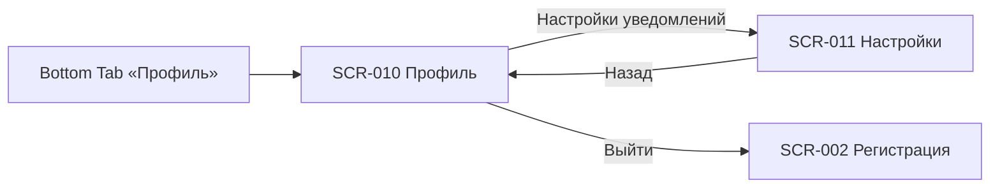

# 05. Профиль — индекс экранов

**Домен:** 05. Профиль  
**Приложение:** Скалодром «Вертикаль»  
**Релиз:** 1.0.0

---

## Экраны домена

| ID | Название | Файл ТЗ | Приоритет | Зона авторизации | Статус |
|----|----------|---------|-----------|------------------|--------|
| SCR-010 | Profile Screen | [SCR-010_Profile-Screen.md](SCR-010_Profile-Screen.md) | High | АЗ | Актуален |
| SCR-011 | Notification Settings Screen | [SCR-011_Notification-Settings-Screen.md](SCR-011_Notification-Settings-Screen.md) | Medium | АЗ | Актуален |

---

## Связанные логики

| Логика | Экраны | Описание |
|--------|--------|----------|
| [LOGIC-011](../09_Logics/LOGIC-011_Настройки-уведомлений.md) | SCR-011 | Загрузка, изменение и сохранение настроек push-уведомлений |

---

## Навигация домена

---

## Связанные требования

- [FR-026, FR-027](../../2-requirements/functional-requirements.md) — профиль и статус постоянного клиента
- [FR-032](../../2-requirements/functional-requirements.md) — управление настройками уведомлений
- [DB-010, DB-011](../../3-design-brief/design-briefs.md) — постановки на дизайн
