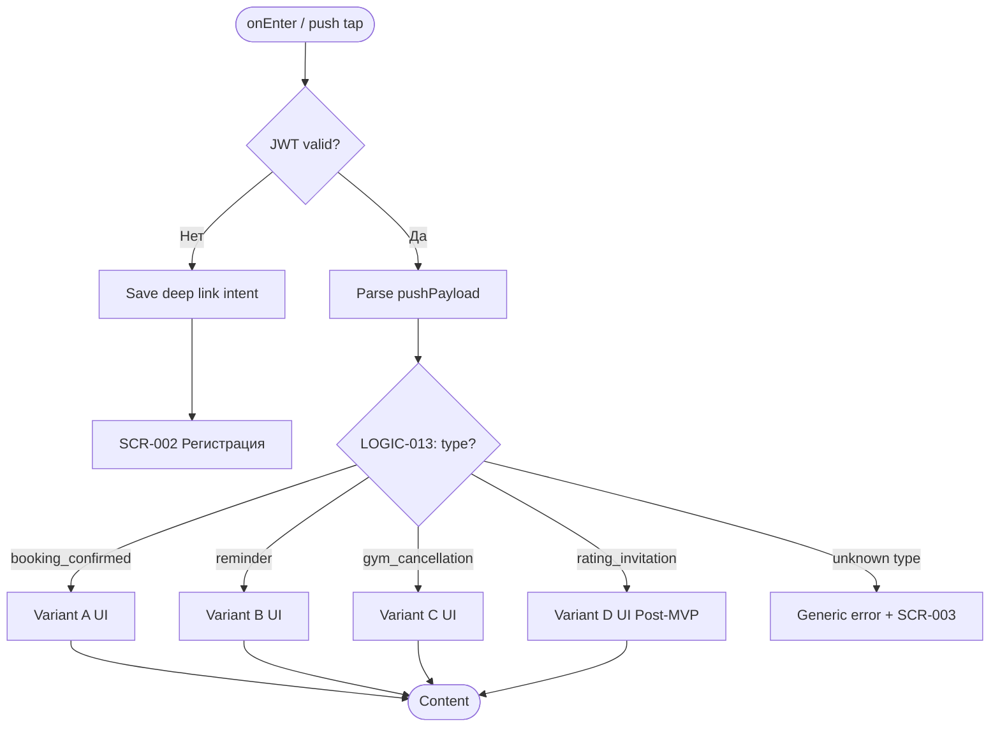
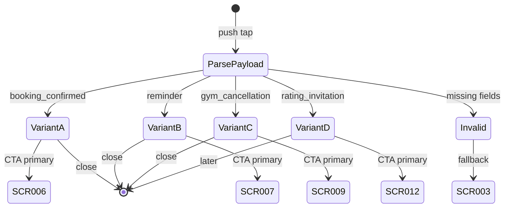

# Экран просмотра push-уведомления

**ID:** SCR-014  
**Тип:** Экран  
**Домен:** 06. Уведомления  
**Приоритет:** High  
**Статус:** Актуален  
**Функциональные блоки:** FB-PUSH-001  
**Зона авторизации:** АЗ  
**Дизайн-макет:** [DB-014](../../3-design-brief/design-briefs.md#db-014-push-notification-view) — версия 1.0

---

## Содержание

- [История изменений](#история-изменений)
- [Обзор](#обзор)
- [Навигация](#навигация)
- [Входные данные](#входные-данные)
- [Применяемые логики](#применяемые-логики)
- [Инициализация](#инициализация)
- [Используемые запросы](#используемые-запросы)
- [Макет экрана](#макет-экрана)
- [Элементы экрана](#элементы-экрана)
- [Состояния экрана](#состояния-экрана)
- [Действия пользователя](#действия-пользователя)
- [Связанные требования](#связанные-требования)
- [Критерии приёмки](#критерии-приёмки)

---

## История изменений

| Релиз | ТЗ | Описание изменений |
|-------|-----|-------------------|
| 1.0.0 | [SCR-014_Push-Notification-View.md](SCR-014_Push-Notification-View.md) | Первоначальная документация; варианты A–C (MVP), вариант D — Post-MVP |

---

## Обзор

SCR-014 — контекстный landing-экран, открываемый при тапе на push-уведомление или переходе по deep link. Экран **не выполняет собственных API-запросов**: контент формируется из payload уведомления. На основе поля `type` применяется [LOGIC-013](../09_Logics/LOGIC-013_Deep-link-push-routing.md) для выбора шаблона UI и целевого экрана при действии пользователя.

### User Story

> Как клиент с активной записью, я хочу быстро перейти к деталям тренировки из push-уведомления,
> чтобы не искать информацию вручную в приложении.

### Бизнес-ценность

- Повышает конверсию открытий push в целевые действия (FR-015, FR-020, FR-024, FR-025)
- Обеспечивает единую точку маршрутизации deep link (LOGIC-013)
- Даёт контекст при срочных отменах скалодромом (BR-017)

---

## Навигация

### Входящая (откуда открывается)

| Источник | Триггер | Условие | Передаваемые параметры |
|----------|---------|---------|------------------------|
| Push-уведомление | Тап на уведомление | `type = booking_confirmed` | `booking_id`, `slot_*` |
| Push-уведомление | Тап на уведомление | `type = reminder` | `booking_id`, `slot_*` |
| Push-уведомление | Тап на уведомление | `type = gym_cancellation` | `booking_id`, `cancellation_reason` |
| Push-уведомление | Тап на уведомление | `type = rating_invitation` (Post-MVP) | `booking_id`, `instructor_*` |
| Deep link | `vertical://notification/{type}?...` | Пользователь авторизован | payload query params |
| Cold start | Tap push при закрытом приложении | Есть валидный JWT | payload |

### Исходящая (куда ведёт)

| Назначение | Триггер | Передаваемые параметры |
|------------|---------|------------------------|
| [SCR-006 My Bookings Screen](../04_Запись/SCR-006_My-Bookings-Screen.md) | Вариант A: «Посмотреть в моих записях» | — |
| [SCR-007 Booking Detail Screen](../04_Запись/SCR-007_Booking-Detail-Screen.md) | Вариант B: «Посмотреть детали» | `bookingId` |
| [SCR-009 Alternative Slot Offer Screen](../04_Запись/SCR-009_Alternative-Slot-Offer-Screen.md) | Вариант C: «Посмотреть альтернативы» | `bookingId`, `alternativeSlotId` (если есть) |
| [SCR-012 Rating Screen](../07_Rating/SCR-012_Rating-Screen.md) | Вариант D: «Оценить» (Post-MVP) | `bookingId` |
| Предыдущий экран / Tab | «Закрыть» / «Позже» | — |

---

## Входные данные

| Название | Тип | Возможные значения | Описание |
|----------|-----|-------------------|----------|
| `pushPayload` | Push / Deep Link | JSON object | Полный payload уведомления |
| `type` | Remote | `booking_confirmed`, `reminder`, `gym_cancellation`, `rating_invitation` | Тип уведомления — ключ маршрутизации |
| `bookingId` | Remote | UUID | ID записи для перехода на SCR-007/012/009 |
| `slotDateTime` | Remote | ISO 8601 | Дата и время слота |
| `zoneFormat` | Remote | string | Зона/формат тренировки |
| `instructorName` | Remote | string | ФИО инструктора |
| `address` | Remote | string | Адрес скалодрома (вариант B) |
| `cancellationReason` | Remote | enum string | Причина отмены (вариант C) |
| `alternativeSlotId` | Remote | UUID, nullable | ID альтернативного слота (вариант C) |

### Структура payload (контракт клиента)

```json
{
  "type": "booking_confirmed | reminder | gym_cancellation | rating_invitation",
  "booking_id": "uuid",
  "slot": {
    "starts_at": "2026-07-04T18:00:00+03:00",
    "zone_format": "Болдеринг с инструктажем",
    "address": "г. Москва, ул. Примерная, 1",
    "instructor_name": "Иванов И.И."
  },
  "cancellation_reason": "instructor_unavailable",
  "alternative_slot_id": "uuid | null"
}
```

---

## Применяемые логики

| Логика | Элемент/Триггер | Описание |
|--------|-----------------|----------|
| [LOGIC-013](../09_Logics/LOGIC-013_Deep-link-push-routing.md) | onEnter / Primary CTA | Парсинг payload, выбор варианта A–D, навигация на SCR-006/007/009/012 |

---

## Инициализация

> **Примечание:** При открытии экрана API-запросы не отправляются. Данные берутся из payload push/deep link. При cold start сначала выполняется проверка авторизации (JWT); при отсутствии токена — сохранение deep link intent → SCR-002.

### Диаграмма загрузки



### Запросы при открытии

| № | Запрос | Критичный | Зависит от | Условие |
|---|--------|-----------|------------|---------|
| — | — | — | — | API-запросы не выполняются |

---

## Используемые запросы

> Прямых API-запросов нет. Целевые экраны (SCR-006, SCR-007, SCR-009, SCR-012) загружают данные самостоятельно при переходе.

**Справочно — регистрация push-токена (не на SCR-014):**

| Operation | Endpoint | Когда |
|-----------|----------|-------|
| `registerPushToken` | `PUT /devices/push-token` | После авторизации (LOGIC-012) |

---

## Макет экрана

### Структура (общий шаблон)

```
┌─────────────────────────────────────┐
│ [×]                          Close  │  ← Header (optional)
├─────────────────────────────────────┤
│           [Icon]                    │
│           {Title}                   │
│                                     │
│   Дата и время: DD.MM HH:MM         │
│   Зона: {zone_format}               │
│   Инструктор: {name}                │
│   {Additional fields by variant}    │
│                                     │
├─────────────────────────────────────┤
│      [Primary Action Button]        │
│      [Secondary Action Button]      │
└─────────────────────────────────────┘
```

### Компоненты

| Компонент | Описание | Обязательность |
|-----------|----------|----------------|
| Variant Icon | Иконка типа уведомления | Да |
| Title | Заголовок варианта | Да |
| Slot Info Block | Дата, зона, инструктор | Да |
| Primary CTA | Основное действие | Да |
| Secondary CTA | Закрыть / Позже | Да |

---

## Элементы экрана

### Вариант A: Подтверждение записи (`type = booking_confirmed`)

| Элемент | Описание | Источник данных | Валидация | Действие |
|---------|----------|-----------------|-----------|----------|
| Иконка | Зелёная галочка | — | — | — |
| Заголовок | «Запись подтверждена» | — | — | — |
| Дата и время | DD.MM.YYYY, HH:MM | `slot.starts_at` | — | — |
| Зона/формат | Текст зоны | `slot.zone_format` | — | — |
| Инструктор | ФИО | `slot.instructor_name` | — | — |
| «Посмотреть в моих записях» | Primary | — | — | [LOGIC-013](../09_Logics/LOGIC-013_Deep-link-push-routing.md) → [SCR-006](../04_Запись/SCR-006_My-Bookings-Screen.md) |
| «Закрыть» | Secondary | — | — | Dismiss → предыдущий экран или SCR-003 |

### Вариант B: Напоминание (`type = reminder`)

| Элемент | Описание | Источник данных | Валидация | Действие |
|---------|----------|-----------------|-----------|----------|
| Иконка | Колокольчик / часы | — | — | — |
| Заголовок | «Напоминание о тренировке» | — | — | — |
| Дата и время | DD.MM.YYYY, HH:MM | `slot.starts_at` | — | — |
| Зона/формат | Текст зоны | `slot.zone_format` | — | — |
| Адрес | Полный адрес | `slot.address` | — | — |
| Инструктор | ФИО | `slot.instructor_name` | — | — |
| «Посмотреть детали» | Primary | — | — | [LOGIC-013](../09_Logics/LOGIC-013_Deep-link-push-routing.md) → [SCR-007](../04_Запись/SCR-007_Booking-Detail-Screen.md) с `bookingId` |
| «Закрыть» | Secondary | — | — | Dismiss |

### Вариант C: Отмена скалодромом (`type = gym_cancellation`)

| Элемент | Описание | Источник данных | Валидация | Действие |
|---------|----------|-----------------|-----------|----------|
| Иконка | Предупреждение (оранжевая) | — | — | — |
| Заголовок | «Тренировка отменена» | — | — | — |
| Дата и время | Отменённого слота | `slot.starts_at` | — | — |
| Причина отмены | Локализованный текст | `cancellation_reason` | — | — |
| Извинения | «Приносим извинения за неудобства» | — | — | — |
| «Посмотреть альтернативы» | Primary | — | — | [LOGIC-013](../09_Logics/LOGIC-013_Deep-link-push-routing.md) → [SCR-009](../04_Запись/SCR-009_Alternative-Slot-Offer-Screen.md) с `bookingId`, `alternativeSlotId` |
| «Закрыть» | Secondary | — | — | Dismiss |

### Вариант D: Приглашение к оценке (`type = rating_invitation`, Post-MVP)

| Элемент | Описание | Источник данных | Валидация | Действие |
|---------|----------|-----------------|-----------|----------|
| Иконка | Звезда | — | — | — |
| Заголовок | «Оцените инструктора» | — | — | — |
| Информация о тренировке | Дата, зона, инструктор | `slot.*` | — | — |
| «Оценить» | Primary | — | — | [LOGIC-013](../09_Logics/LOGIC-013_Deep-link-push-routing.md) → [SCR-012](../07_Rating/SCR-012_Rating-Screen.md) с `bookingId` |
| «Позже» | Secondary | — | — | Dismiss → SCR-006 или предыдущий экран |

**Логика (все варианты):**
- [LOGIC-013](../09_Logics/LOGIC-013_Deep-link-push-routing.md) — определение шаблона, валидация обязательных полей payload, маршрутизация primary CTA

**Условия доступности:**
- Вариант D не включается в сборку 1.0.0 (feature flag Post-MVP)
- При неполном payload (отсутствует `booking_id`) — показать error state «Уведомление недоступно» + кнопка «На главную» → SCR-003

---

## Состояния экрана

### Таблица состояний

| Состояние | Условие | Отображение |
|-----------|---------|-------------|
| Content (A) | `type = booking_confirmed` | Вариант A |
| Content (B) | `type = reminder` | Вариант B |
| Content (C) | `type = gym_cancellation` | Вариант C |
| Content (D) | `type = rating_invitation` | Вариант D (Post-MVP) |
| Invalid Payload | Отсутствуют обязательные поля | «Не удалось открыть уведомление» + SCR-003 |
| Unauthenticated | Нет JWT | Redirect SCR-002 с сохранением intent |

### Диаграмма переходов



---

## Действия пользователя

| Действие | Элемент | Триггер | Результат |
|----------|---------|---------|-----------|
| Открыть записи | «Посмотреть в моих записях» (A) | Tap | SCR-006 |
| Открыть детали | «Посмотреть детали» (B) | Tap | SCR-007(`bookingId`) |
| Найти альтернативу | «Посмотреть альтернативы» (C) | Tap | SCR-009(`bookingId`) |
| Оценить | «Оценить» (D) | Tap | SCR-012(`bookingId`) |
| Закрыть | «Закрыть» / «Позже» | Tap | Dismiss notification center entry, pop stack |

---

## Связанные требования

### Функциональные (FR)

| ID | Название | Приоритет |
|----|----------|-----------|
| FR-015 | Push-уведомление о подтверждении записи | Высокий (MVP) |
| FR-020 | Push-уведомление при отмене скалодромом | Высокий (MVP) |
| FR-024 | Push-напоминание за сутки | Высокий (MVP) |
| FR-025 | Push-напоминание за N часов | Высокий (MVP) |
| FR-031 | Push-приглашение к оценке | Низкий (Post-MVP) |

### Use Cases / User Stories

| ID | Описание |
|----|----------|
| UC-004 | Отмена тренировки скалодромом |
| UC-005 | Получение push-напоминаний |
| UC-009 | Оценка инструктора (Post-MVP) |
| US-008 | Получение подтверждения записи |
| US-012 | Уведомление об отмене скалодромом |
| US-016 | Напоминание о тренировке |

### Бизнес-правила

| ID | Описание |
|----|----------|
| BR-017 | Обязательный push при отмене скалодромом |
| BR-026 | Типы push в MVP |
| BR-027 | Напоминания за сутки и за N часов |

---

## Критерии приёмки

### Позитивные сценарии

| ID | Критерий | Приоритет |
|----|----------|-----------|
| AC-001 | **Дано** push `type=booking_confirmed` с валидным payload, **Когда** пользователь тапает уведомление, **Тогда** открывается SCR-014 вариант A | P0 |
| AC-002 | **Дано** вариант A, **Когда** нажата «Посмотреть в моих записях», **Тогда** открывается SCR-006 | P0 |
| AC-003 | **Дано** push `type=reminder`, **Когда** нажата «Посмотреть детали», **Тогда** открывается SCR-007 с корректным `bookingId` | P0 |
| AC-004 | **Дано** push `type=gym_cancellation`, **Когда** нажата «Посмотреть альтернативы», **Тогда** открывается SCR-009 | P0 |
| AC-005 | **Дано** Post-MVP сборка, push `type=rating_invitation`, **Когда** нажата «Оценить», **Тогда** открывается SCR-012 | P1 |

### Негативные сценарии

| ID | Критерий | Приоритет |
|----|----------|-----------|
| AC-N01 | **Дано** payload без `booking_id`, **Когда** открытие SCR-014, **Тогда** error state и переход на SCR-003 | P0 |
| AC-N02 | **Дано** пользователь не авторизован, **Когда** tap push, **Тогда** сохранение intent и переход SCR-002 | P0 |

### Граничные условия (Edge Cases)

| ID | Критерий | Приоритет |
|----|----------|-----------|
| AC-E01 | **Дано** cold start из push, **Когда** JWT валиден, **Тогда** SCR-014 открывается после splash без потери payload | P1 |
| AC-E02 | **Дано** неизвестный `type`, **Когда** парсинг payload, **Тогда** fallback на SCR-003 | P2 |

---
