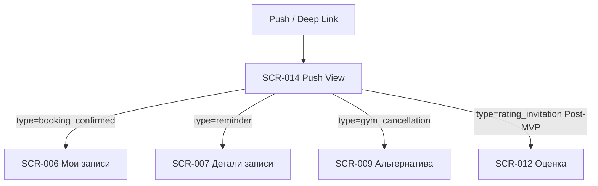

# 06. Уведомления — индекс экранов

**Домен:** 06. Уведомления  
**Приложение:** Скалодром «Вертикаль»  
**Релиз:** 1.0.0

---

## Экраны домена

| ID | Название | Файл ТЗ | Приоритет | Зона авторизации | Статус |
|----|----------|---------|-----------|------------------|--------|
| SCR-014 | Push Notification View | [SCR-014_Push-Notification-View.md](SCR-014_Push-Notification-View.md) | High | АЗ | Актуален |

> **Примечание:** SCR-014 не является самостоятельным пунктом нижней навигации. Экран открывается при тапе на push-уведомление или переходе по deep link из payload уведомления.

---

## Связанные логики

| Логика | Экраны | Описание |
|--------|--------|----------|
| [LOGIC-013](../09_Logics/LOGIC-013_Deep-link-push-routing.md) | SCR-014 | Маршрутизация по типу push/deep link на целевые экраны |

---

## Навигация домена

---

## Связанные требования

- [FR-015, FR-020, FR-024, FR-025, FR-031](../../2-requirements/functional-requirements.md) — push-уведомления и приглашение к оценке
- [DB-014](../../3-design-brief/design-briefs.md) — постановка на дизайн
