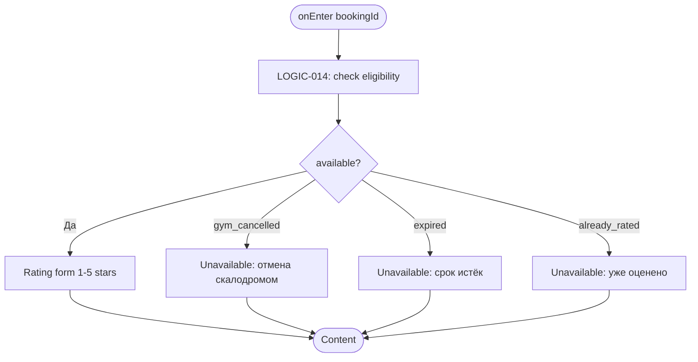
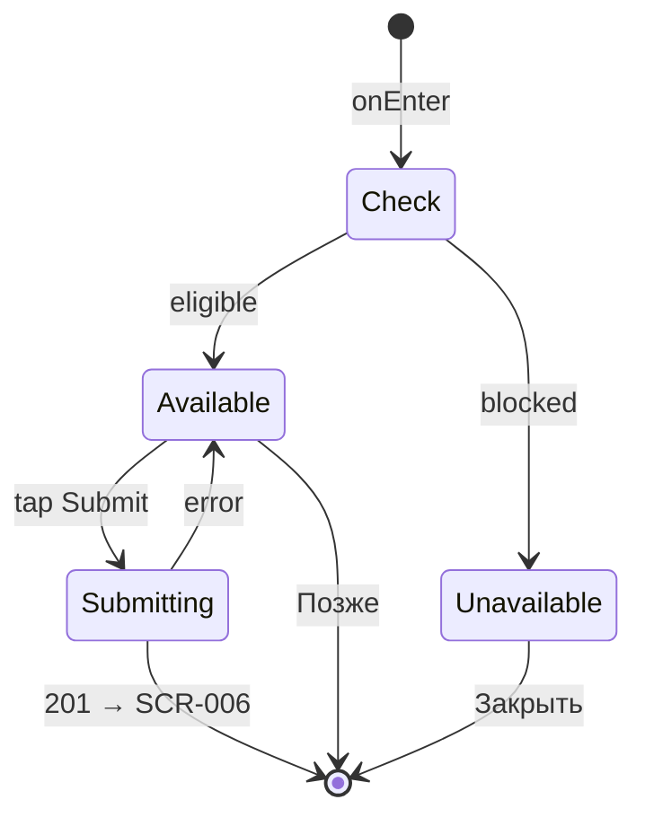

# Экран оценки инструктора

**ID:** SCR-012  
**Тип:** Экран  
**Домен:** 07. Оценка  
**Приоритет:** Low  
**Статус:** Черновик  
**Функциональные блоки:** FB-RATE-001  
**Зона авторизации:** АЗ  
**Дизайн-макет:** [DB-012](../../3-design-brief/design-briefs.md#db-012-rating-screen-post-mvp) — версия 0.1

---

## Содержание

- [История изменений](#история-изменений)
- [Обзор](#обзор)
- [Навигация](#навигация)
- [Входные данные](#входные-данные)
- [Применяемые логики](#применяемые-логики)
- [Инициализация](#инициализация)
- [Используемые запросы](#используемые-запросы)
- [Макет экрана](#макет-экрана)
- [Элементы экрана](#элементы-экрана)
- [Состояния экрана](#состояния-экрана)
- [Действия пользователя](#действия-пользователя)
- [Связанные требования](#связанные-требования)
- [Критерии приёмки](#критерии-приёмки)

---

## История изменений

| Релиз | ТЗ | Описание изменений |
|-------|-----|-------------------|
| — | [SCR-012_Rating-Screen.md](SCR-012_Rating-Screen.md) | Черновик Post-MVP; не входит в релиз 1.0.0 |

---

## Обзор

Экран позволяет клиенту оценить инструктора по 5-звёздочной шкале после завершённой тренировки. Доступен в окне 1–2 суток после занятия (BR-033). Недоступен при отмене скалодромом (BR-034, FR-030). **Post-MVP** — не реализуется в релизе 1.0.0.

### User Story

> Как клиент, завершивший тренировку, я хочу быстро оценить инструктора,
> чтобы поделиться обратной связью и помочь другим клиентам.

### Бизнес-ценность

- Формирует рейтинг инструкторов для отображения в расписании (FR-029, BR-035)
- Закрывает цикл обратной связи после push-приглашения (FR-031)
- Исключает некорректные оценки при отменах (FR-030)

---

## Навигация

### Входящая (откуда открывается)

| Источник | Триггер | Условие | Передаваемые параметры |
|----------|---------|---------|------------------------|
| [SCR-014 Push Notification View](../06_Notifications/SCR-014_Push-Notification-View.md) | Тап «Оценить» (вариант D) | Post-MVP | `bookingId` |
| Deep link | `vertical://rating/{bookingId}` | Post-MVP, авторизован | `bookingId` |
| [SCR-006 My Bookings Screen](../04_Запись/SCR-006_My-Bookings-Screen.md) | Карточка «Оценить» (Post-MVP) | Запись eligible | `bookingId` |

### Исходящая (куда ведёт)

| Назначение | Триггер | Передаваемые параметры |
|------------|---------|------------------------|
| [SCR-006 My Bookings Screen](../04_Запись/SCR-006_My-Bookings-Screen.md) | Успешная отправка оценки | — |
| [SCR-006 My Bookings Screen](../04_Запись/SCR-006_My-Bookings-Screen.md) | Кнопка «Позже» | — |

---

## Входные данные

| Название | Тип | Возможные значения | Описание |
|----------|-----|-------------------|----------|
| `bookingId` | Navigation param | UUID | ID завершённой записи для оценки |
| `selectedStars` | Состояние | `1` … `5`, `null` | Выбранная оценка до отправки |
| `bookingSummary` | Кэш / Deep link | Объект slot info | Дата, зона, инструктор (для header) |
| `ratingAvailability` | Состояние | `available`, `gym_cancelled`, `expired`, `already_rated` | Результат LOGIC-014 |

---

## Применяемые логики

| Логика | Элемент/Триггер | Описание |
|--------|-----------------|----------|
| [LOGIC-014](../09_Logics/LOGIC-014_Оценка-инструктора.md) | onEnter / Submit | Проверка окна оценки, блокировки, отправка POST /ratings |

---

## Инициализация

### Диаграмма загрузки



### Запросы при открытии

| № | Запрос | Критичный | Зависит от | Условие |
|---|--------|-----------|------------|---------|
| — | Локальная проверка LOGIC-014 | Да | `bookingId` | Всегда |
| 1 | [createInstructorRating](#createinstructorrating) | Да | № — | Только при tap «Отправить оценку» |

> Детали записи для header могут передаваться из SCR-014 payload или загружаться на SCR-006 до перехода.

---

## Используемые запросы

### createInstructorRating

**Тип:** REST  
**Метод:** POST  
**Спецификация:** [openapi.yaml](../../api/openapi.yaml) → `createInstructorRating`  
**Endpoint:** `POST /ratings`

**Триггер:** Тап «Отправить оценку»

**Параметры (body):**

| Параметр | Тип | Обязательность | Источник | Описание |
|----------|-----|----------------|----------|----------|
| `booking_id` | string (uuid) | Да | Navigation `bookingId` | Завершённая запись |
| `stars` | integer (1–5) | Да | `selectedStars` | Оценка без текста (BR-033) |

**Обработка ответа:**

| Результат | Условие | UI-реакция |
|-----------|---------|------------|
| Загрузка | — | Лоадер на кнопке, блокировка звёзд |
| Успех | HTTP 201 | Снек «Спасибо за оценку!» → [SCR-006](../04_Запись/SCR-006_My-Bookings-Screen.md) |
| HTTP 403 | `RATING_NOT_ALLOWED_GYM_CANCELLED` | Показать state «Оценка недоступна — тренировка отменена скалодромом» |
| HTTP 403 | `RATING_WINDOW_EXPIRED` | Показать state «Срок оценки истёк» |
| HTTP 409 | — | Показать state «Вы уже оценили этого инструктора» |
| HTTP 400 | — | Снек с `message` |
| HTTP 401 | — | Редирект SCR-002 |
| HTTP 5xx | — | Снек «Произошла ошибка. Попробуйте позже» |
| Сеть | Нет соединения | Снек «Нет соединения. Проверьте подключение» |

---

## Макет экрана

### Структура (доступная оценка)

```
┌─────────────────────────────────────┐
│ [×]                          Close  │
├─────────────────────────────────────┤
│   DD.MM.YYYY, HH:MM                 │
│   Болдеринг с инструктажем          │
│   [Photo] Иванов Иван               │
├─────────────────────────────────────┤
│      Оцените инструктора            │
│                                     │
│      ★  ★  ★  ★  ★                  │  ← 48–64px, interactive
│                                     │
├─────────────────────────────────────┤
│      [Отправить оценку]             │
│           Позже                     │
└─────────────────────────────────────┘
```

### Структура (недоступная оценка)

```
┌─────────────────────────────────────┐
│ [×]                          Close  │
├─────────────────────────────────────┤
│           [Icon ⚠]                  │
│   Оценка недоступна                 │
│   {reason text}                     │
├─────────────────────────────────────┤
│           [Закрыть]                 │
└─────────────────────────────────────┘
```

### Компоненты

| Компонент | Описание | Обязательность |
|-----------|----------|----------------|
| Booking Info | Дата, зона, инструктор | Да (available state) |
| Star Rating | 5 интерактивных звёзд | Да (available state) |
| Submit Button | Primary | Да (available state) |
| Later Link | Text button | Да |
| Unavailable Message | Причина блокировки | Да (blocked states) |

---

## Элементы экрана

### 1. Информация о тренировке

| Элемент | Описание | Источник данных | Валидация | Действие |
|---------|----------|-----------------|-----------|----------|
| Дата и время | DD.MM.YYYY, HH:MM | `bookingSummary.starts_at` | — | — |
| Зона/формат | Текст зоны | `bookingSummary.zone_format` | — | — |
| Фото инструктора | Avatar или placeholder | `bookingSummary.instructor_photo` | — | — |
| ФИО инструктора | Полное имя | `bookingSummary.instructor_name` | — | — |

**Условия доступности:**
- Блок скрыт в unavailable states (показывается только icon + message)

### 2. Звёздный рейтинг

| Элемент | Описание | Источник данных | Валидация | Действие |
|---------|----------|-----------------|-----------|----------|
| Звезда 1–5 | Интерактивные иконки | `selectedStars` | — | Установить `selectedStars` = 1…5 |
| Заголовок | «Оцените инструктора» | — | — | — |

**Логика:**
- [LOGIC-014](../09_Logics/LOGIC-014_Оценка-инструктора.md) — tap подсвечивает звёзды от 1 до выбранной, анимация выбора

**Условия доступности:**
- Звёзды активны только при `ratingAvailability = available`
- При отправке запроса — disabled

### 3. Кнопки действий

| Элемент | Описание | Источник данных | Валидация | Действие |
|---------|----------|-----------------|-----------|----------|
| «Отправить оценку» | Primary button | — | `selectedStars` обязателен | [createInstructorRating](#createinstructorrating) |
| «Позже» | Text button | — | — | [SCR-006](../04_Запись/SCR-006_My-Bookings-Screen.md) |
| «Закрыть» | Primary (unavailable) | — | — | [SCR-006](../04_Запись/SCR-006_My-Bookings-Screen.md) |

**Логика:**
- «Отправить оценку»: [LOGIC-014](../09_Logics/LOGIC-014_Оценка-инструктора.md) — POST только при `selectedStars` ∈ [1,5]

**Условия доступности:**
- «Отправить оценку» активна, если: `selectedStars != null` AND `ratingAvailability = available`

### 4. Сообщения недоступности

| Состояние | Текст |
|-----------|-------|
| `gym_cancelled` | «Оценка недоступна, так как тренировка была отменена скалодромом» |
| `expired` | «Срок оценки истёк (1–2 суток после тренировки)» |
| `already_rated` | «Вы уже оценили этого инструктора» + отображение сохранённых звёзд (read-only) |

---

## Состояния экрана

### Таблица состояний

| Состояние | Условие | Отображение |
|-----------|---------|-------------|
| Available | LOGIC-014: eligible | Форма оценки |
| Unavailable (cancelled) | Отмена скалодромом | Сообщение BR-034 |
| Unavailable (expired) | > 2 суток | Сообщение об истечении |
| Unavailable (rated) | HTTP 409 / local flag | Сообщение + read-only stars |
| Submitting | POST in progress | Loader |
| Error | POST 5xx | Снек + форма сохранена |

### Диаграмма переходов



---

## Действия пользователя

| Действие | Элемент | Триггер | Результат |
|----------|---------|---------|-----------|
| Выбрать оценку | Звезда 1–5 | Tap | `selectedStars` обновлён |
| Отправить | «Отправить оценку» | Tap | POST /ratings → SCR-006 |
| Отложить | «Позже» | Tap | SCR-006 |
| Закрыть | «×» / «Закрыть» | Tap | SCR-006 или pop |

---

## Связанные требования

### Функциональные (FR)

| ID | Название | Приоритет |
|----|----------|-----------|
| FR-029 | Оценка инструктора после тренировки | Низкий (Post-MVP) |
| FR-030 | Блокировка оценки при отмене скалодромом | Низкий (Post-MVP) |
| FR-031 | Push-приглашение к оценке | Низкий (Post-MVP) |

### Use Cases / User Stories

| ID | Описание |
|----|----------|
| UC-009 | Оценка инструктора (post-MVP) |
| US-020 | Оценка инструктора (post-MVP) |

### Бизнес-правила

| ID | Описание |
|----|----------|
| BR-033 | Оценка 1–5 звёзд, окно 1–2 суток |
| BR-034 | Недоступна при отмене скалодромом |

---

## Критерии приёмки

### Позитивные сценарии

| ID | Критерий | Приоритет |
|----|----------|-----------|
| AC-001 | **Дано** eligible booking, **Когда** пользователь выбирает 4 звезды и нажимает «Отправить», **Тогда** POST /ratings с `stars: 4` возвращает 201 | P0 |
| AC-002 | **Дано** успешная оценка, **Когда** POST завершён, **Тогда** переход на SCR-006 и снек благодарности | P0 |
| AC-003 | **Дано** экран оценки, **Когда** нажата «Позже», **Тогда** переход на SCR-006 без отправки | P1 |

### Негативные сценарии

| ID | Критерий | Приоритет |
|----|----------|-----------|
| AC-N01 | **Дано** запись отменена скалодромом, **Когда** открыт SCR-012, **Тогда** показывается сообщение недоступности, форма скрыта | P0 |
| AC-N02 | **Дано** истёк срок оценки, **Когда** POST /ratings, **Тогда** HTTP 403 `RATING_WINDOW_EXPIRED` и UI-сообщение | P0 |
| AC-N03 | **Дано** оценка уже отправлена, **Когда** повторный POST, **Тогда** HTTP 409 и state «Уже оценено» | P0 |

### Граничные условия (Edge Cases)

| ID | Критерий | Приоритет |
|----|----------|-----------|
| AC-E01 | **Дано** `selectedStars = null`, **Когда** tap «Отправить», **Тогда** кнопка неактивна, запрос не отправляется | P1 |
| AC-E02 | **Дано** потеря сети при POST, **Когда** восстановление, **Тогда** пользователь может повторить отправку | P2 |

---
