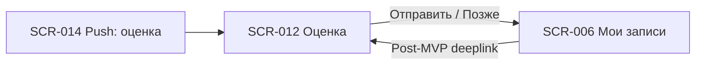

# 07. Оценка — индекс экранов

**Домен:** 07. Оценка  
**Приложение:** Скалодром «Вертикаль»  
**Релиз:** Post-MVP (экран вне релиза 1.0.0)

---

## Экраны домена

| ID | Название | Файл ТЗ | Приоритет | Зона авторизации | Статус |
|----|----------|---------|-----------|------------------|--------|
| SCR-012 | Rating Screen | [SCR-012_Rating-Screen.md](SCR-012_Rating-Screen.md) | Low | АЗ | Черновик |

> **Примечание:** SCR-012 реализуется в Post-MVP. В релизе 1.0.0 экран и связанные push-варианты SCR-014 (вариант D) не включаются в сборку.

---

## Связанные логики

| Логика | Экраны | Описание |
|--------|--------|----------|
| [LOGIC-014](../09_Logics/LOGIC-014_Оценка-инструктора.md) | SCR-012 | Валидация окна оценки, отправка звёзд, обработка недоступных состояний |

---

## Навигация домена

---

## Связанные требования

- [FR-029, FR-030, FR-031](../../2-requirements/functional-requirements.md) — оценка инструктора и push-приглашение
- [DB-012](../../3-design-brief/design-briefs.md) — постановка на дизайн
