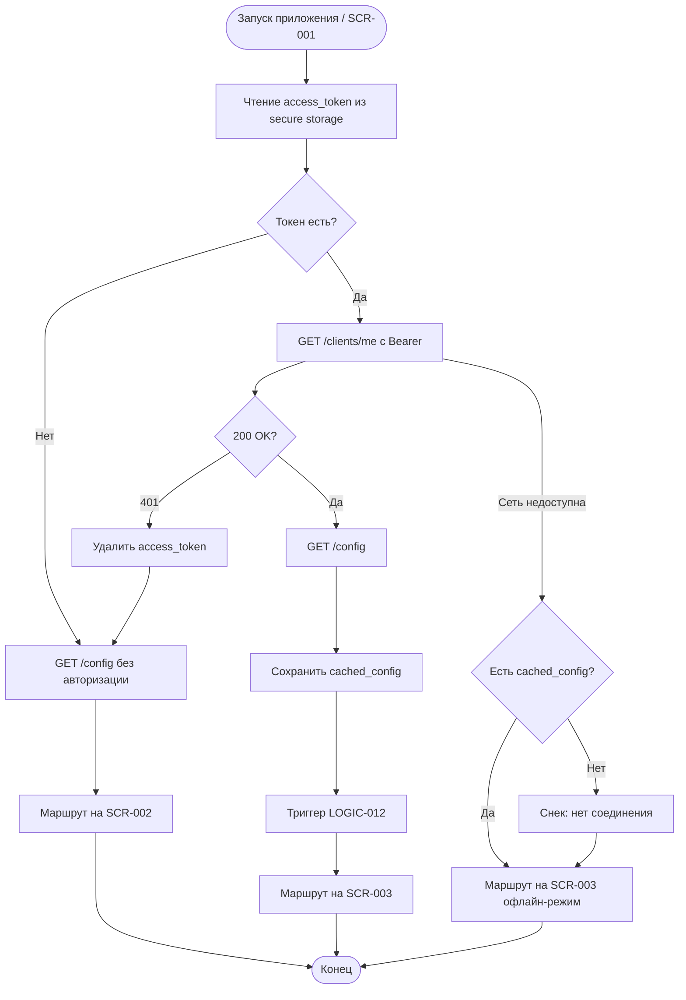

# Проверка сессии при запуске

**ID:** LOGIC-001  
**Тип:** Логика  
**Домен:** 09. Логики  
**Приоритет:** Critical  
**Статус:** Актуален  
**Функциональные блоки:** FB-AUTH-001, FB-APP-001

---

## История изменений

| Релиз | ТЗ | Описание изменений |
|-------|-----|-------------------|
| 1.0.0 | [LOGIC-001](LOGIC-001_Проверка-сессии-при-запуске.md) | Первоначальная документация |

---

## Входные данные

| Название | Тип | Возможные значения | Описание |
|----------|-----|-------------------|----------|
| `access_token` | Защищённое хранилище | JWT-строка, `null` | Токен авторизации из предыдущей сессии |
| `cached_config` | Локальный кэш | `SystemConfig`, `null` | Кэшированные системные параметры |

---

## Обзор

При запуске приложения на экране [SCR-001 Splash Screen](../01_Authentication/SCR-001_Splash-Screen.md) выполняется проверка наличия JWT в защищённом хранилище. При наличии токена — опциональная валидация через API и загрузка системной конфигурации. По результату пользователь направляется на регистрацию (SCR-002) или расписание (SCR-003).

### User Story

> Как клиент скалодрома, я хочу, чтобы приложение запоминало мою сессию,
> чтобы не регистрироваться заново при каждом открытии.

### Бизнес-ценность

- Снижение трения при повторных визитах в приложение
- Ранняя загрузка `SystemConfig` для корректной валидации UI (BR-006, BR-012, BR-027)
- Безопасное хранение токена вне обычного кэша

---

## Точки применения

| Экран/Компонент | Элемент/Триггер | Условие |
|-----------------|-----------------|---------|
| [SCR-001 Splash Screen](../01_Authentication/SCR-001_Splash-Screen.md) | При открытии приложения (cold start) | Всегда |
| Глобальный `AppRouter` | Инициализация навигации | После завершения проверки сессии |

---

## Флоу

---

## Описание логики

### Шаг 1: Чтение локального токена

Приложение читает ключ `access_token` из защищённого хранилища (iOS Keychain / Android EncryptedSharedPreferences). Отсутствие ключа трактуется как неавторизованная сессия.

### Шаг 2: Валидация сессии (опционально)

Если токен найден, выполняется запрос [`getCurrentClient`](../api/openapi.yaml) для проверки актуальности JWT. Ответ 200 подтверждает сессию; 401 — токен удаляется, пользователь считается неавторизованным.

### Шаг 3: Загрузка системной конфигурации

Параллельно или последовательно выполняется [`getSystemConfig`](../api/openapi.yaml). Результат сохраняется в `cached_config` для использования логиками расписания, записи и отмены.

### Шаг 4: Маршрутизация

- Нет валидной сессии → [SCR-002 Registration Screen](../01_Authentication/SCR-002_Registration-Screen.md)
- Валидная сессия → [SCR-003 Schedule Screen](../02_Schedule/SCR-003_Schedule-Screen.md)
- При успешной авторизации — инициируется [LOGIC-012](LOGIC-012_Регистрация-push-токена.md)

---

## API запросы

### GET /clients/me — `getCurrentClient`

**Триггер:** Наличие `access_token` при запуске

**Headers:**

| Поле | Описание |
|------|----------|
| `Authorization` | `Bearer {access_token}` |

**Обработка ответа:**

| Результат | Действие |
|-----------|----------|
| Загрузка | Индикатор на SCR-001 (spinner) |
| Успех (200) | Сессия валидна, сохранить профиль в памяти приложения |
| Ошибка 401 | Удалить `access_token`, маршрут на SCR-002 |
| Ошибка 5xx | Снек «Произошла ошибка. Попробуйте позже», маршрут на SCR-003 с кэшем |
| Ошибка сети | При наличии токена — маршрут на SCR-003 в офлайн-режиме |

### GET /config — `getSystemConfig`

**Триггер:** При каждом запуске приложения

**Headers:** Не требуются (публичный endpoint)

**Обработка ответа:**

| Результат | Действие |
|-----------|----------|
| Успех (200) | Сохранить в `cached_config` |
| Ошибка сети | Использовать `cached_config` если есть; иначе дефолты из OpenAPI example |
| Ошибка 5xx | Использовать `cached_config`, не блокировать навигацию |

---

## Локальное хранение

| Ключ | Тип хранения | Описание |
|------|--------------|----------|
| `access_token` | Защищённое хранилище | JWT; удаляется при 401 |
| `cached_config` | Локальный кэш | `SystemConfig`: `booking_cutoff_minutes`, `cancellation_forbidden_minutes`, `reminder_hours_before`, `visits_for_loyalty`, `violations_for_sanctions` |

---

## Связанные требования

### Функциональные (FR)

| ID | Название | Приоритет |
|----|----------|-----------|
| FR-026 | Регистрация по телефону | High |

### Бизнес-правила (BR)

| ID | Название |
|----|----------|
| BR-027 | Горизонт планирования и навигация (конфиг `reminder_hours_before`) |
| BR-006 | Ограничение времени записи (`booking_cutoff_minutes`) |
| BR-012 | Запрет отмены (`cancellation_forbidden_minutes`) |

### Интеграции (NFR)

| ID | Название | Приоритет |
|----|----------|-----------|
| NFR-006 | Конфигурируемые параметры | High |
| NFR-008 | Интеграция с существующим бэкендом | High |

---

## Критерии приёмки

| ID | Критерий |
|----|----------|
| AC-001 | **Дано** приложение запускается впервые без токена, **Когда** отображается SCR-001, **Тогда** пользователь перенаправляется на SCR-002 |
| AC-002 | **Дано** в secure storage есть валидный `access_token`, **Когда** GET /clients/me возвращает 200, **Тогда** пользователь перенаправляется на SCR-003 |
| AC-003 | **Дано** токен просрочен (401), **Когда** выполняется проверка сессии, **Тогда** токен удаляется и открывается SCR-002 |
| AC-004 | **Дано** успешный запуск, **Когда** GET /config завершён, **Тогда** `cached_config` обновлён актуальными параметрами |
| AC-005 | **Дано** валидная сессия, **Когда** проверка завершена, **Тогда** инициируется LOGIC-012 (регистрация push-токена) |

---

## Обработка ошибок

| Тип ошибки | Контекст | Действие |
|------------|----------|----------|
| 401 Unauthorized | GET /clients/me | Удалить токен, SCR-002 |
| Нет сети при валидации | Cold start с токеном | SCR-003 + кэш расписания, баннер «Офлайн-режим» |
| Нет сети и нет cached_config | Cold start | SCR-003/002 с дефолтными параметрами, снек о сети |
