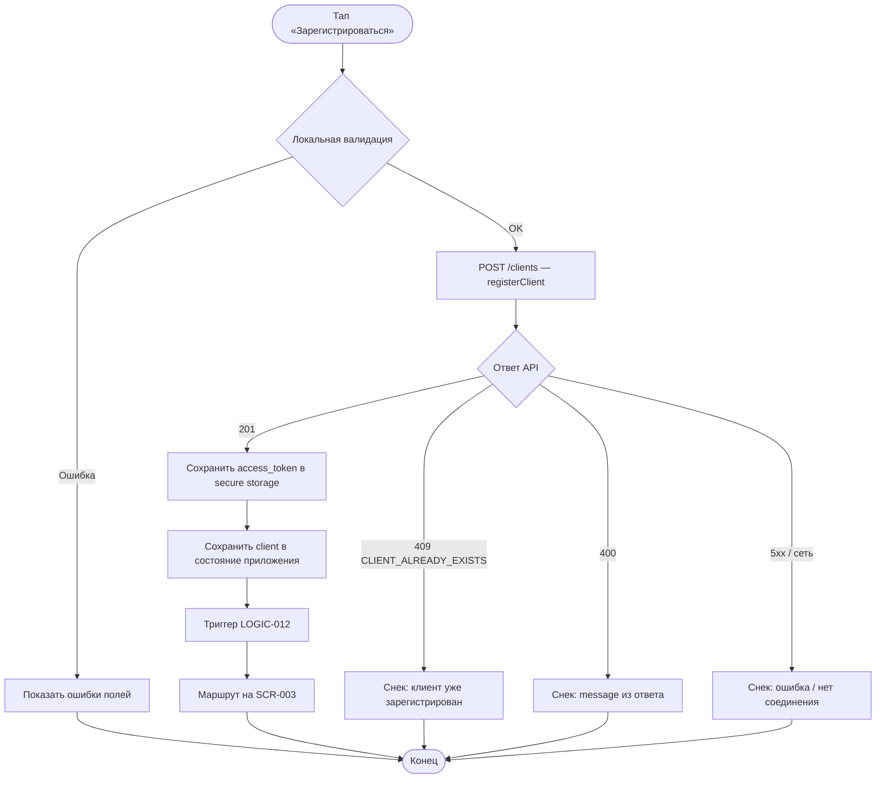

# Регистрация клиента

**ID:** LOGIC-002  
**Тип:** Логика  
**Домен:** 09. Логики  
**Приоритет:** Critical  
**Статус:** Актуален  
**Функциональные блоки:** FB-AUTH-002

---

## История изменений

| Релиз | ТЗ | Описание изменений |
|-------|-----|-------------------|
| 1.0.0 | [LOGIC-002](LOGIC-002_Регистрация-клиента.md) | Первоначальная документация |

---

## Входные данные

| Название | Тип | Возможные значения | Описание |
|----------|-----|-------------------|----------|
| `phone` | Состояние формы | E.164 строка | Номер телефона пользователя |
| `full_name` | Состояние формы | строка 1–200 символов | ФИО клиента |
| `birth_date` | Состояние формы | `YYYY-MM-DD` | Дата рождения |

---

## Обзор

Логика регистрации нового клиента по телефону на экране [SCR-002 Registration Screen](../01_Authentication/SCR-002_Registration-Screen.md). Отправляет данные в API, сохраняет JWT в защищённое хранилище и перенаправляет на расписание.

### User Story

> Как новый клиент, я хочу зарегистрироваться по номеру телефона,
> чтобы записываться на тренировки без участия администратора.

### Бизнес-ценность

- Самостоятельный онбординг без звонков в скалодром (BR-001)
- Единая учётная запись для всех записей и уведомлений
- Соответствие обязательным полям регистрации (BR-030)

---

## Точки применения

| Экран/Компонент | Элемент/Триггер | Условие |
|-----------------|-----------------|---------|
| [SCR-002 Registration Screen](../01_Authentication/SCR-002_Registration-Screen.md) | Тап «Зарегистрироваться» | Все поля валидны |
| [SCR-002 Registration Screen](../01_Authentication/SCR-002_Registration-Screen.md) | Валидация полей on blur | Всегда |

---

## Флоу

---

## Описание логики

### Шаг 1: Локальная валидация

Перед отправкой проверяются:
- `phone` — формат E.164 (`^\+[1-9]\d{6,14}$`)
- `full_name` — непустая строка, max 200 символов
- `birth_date` — валидная дата, клиент старше допустимого возраста (если задано в конфиге)

Кнопка «Зарегистрироваться» неактивна при невалидных полях.

### Шаг 2: Отправка запроса регистрации

Выполняется [`registerClient`](../api/openapi.yaml) без заголовка Authorization.

### Шаг 3: Обработка успеха

Из `ClientRegistrationResponse` извлекаются `access_token` и `client`. Токен сохраняется в `access_token` (secure storage). Профиль — в глобальное состояние. Запускается LOGIC-012. Навигация на SCR-003.

### Шаг 4: Обработка конфликта 409

Код `CLIENT_ALREADY_EXISTS` — показать сообщение «Клиент с указанным номером телефона уже зарегистрирован». Предложить связаться с администратором или проверить номер (восстановление сессии — вне MVP).

---

## API запросы

### POST /clients — `registerClient`

**Триггер:** Тап «Зарегистрироваться» после успешной валидации

**Headers:** Не требуются

**Параметры/Body:**

| Параметр | Тип | Описание | Значение/Источник |
|----------|-----|----------|-------------------|
| `phone` | string | Телефон E.164 | Поле формы SCR-002 |
| `full_name` | string | ФИО | Поле формы SCR-002 |
| `birth_date` | date | Дата рождения | Поле формы SCR-002 |

**Обработка ответа:**

| Результат | Действие |
|-----------|----------|
| Загрузка | Блокировка формы, spinner на кнопке |
| Успех (201) | Сохранить токен, SCR-003 |
| Ошибка 409 `CLIENT_ALREADY_EXISTS` | Снек с `message`, форма остаётся |
| Ошибка 400 | Снек с `message`, подсветка полей при наличии `details` |
| Ошибка 5xx | Снек «Произошла ошибка. Попробуйте позже» |
| Ошибка сети | Снек «Нет соединения. Проверьте подключение к интернету» |

---

## Локальное хранение

| Ключ | Тип хранения | Описание |
|------|--------------|----------|
| `access_token` | Защищённое хранилище | JWT из `ClientRegistrationResponse.access_token` |

---

## Связанные требования

### Функциональные (FR)

| ID | Название | Приоритет |
|----|----------|-----------|
| FR-026 | Регистрация по телефону | High |

### Бизнес-правила (BR)

| ID | Название |
|----|----------|
| BR-030 | Регистрация по телефону; обязательные поля: ФИО, телефон, дата рождения |
| BR-001 | Самостоятельная запись клиентов |

---

## Критерии приёмки

| ID | Критерий |
|----|----------|
| AC-001 | **Дано** валидные данные формы, **Когда** пользователь нажимает «Зарегистрироваться», **Тогда** отправляется POST /clients и при 201 открывается SCR-003 |
| AC-002 | **Дано** успешная регистрация, **Когда** получен ответ 201, **Тогда** `access_token` сохранён в secure storage |
| AC-003 | **Дано** телефон уже зарегистрирован, **Когда** API возвращает 409 `CLIENT_ALREADY_EXISTS`, **Тогда** отображается снек с текстом из `message` |
| AC-004 | **Дано** пустое поле ФИО, **Когда** пользователь нажимает «Зарегистрироваться», **Тогда** запрос не отправляется, показана ошибка валидации |
| AC-005 | **Дано** успешная регистрация, **Когда** токен сохранён, **Тогда** инициируется LOGIC-012 |

---

## Обработка ошибок

| Тип ошибки | Контекст | Действие |
|------------|----------|----------|
| `CLIENT_ALREADY_EXISTS` | POST /clients 409 | Снек, остаться на SCR-002 |
| Невалидный формат телефона | Локальная валидация | Подсветка поля, disable кнопки |
| Сетевая ошибка | POST /clients | Снек, разблокировать форму |
