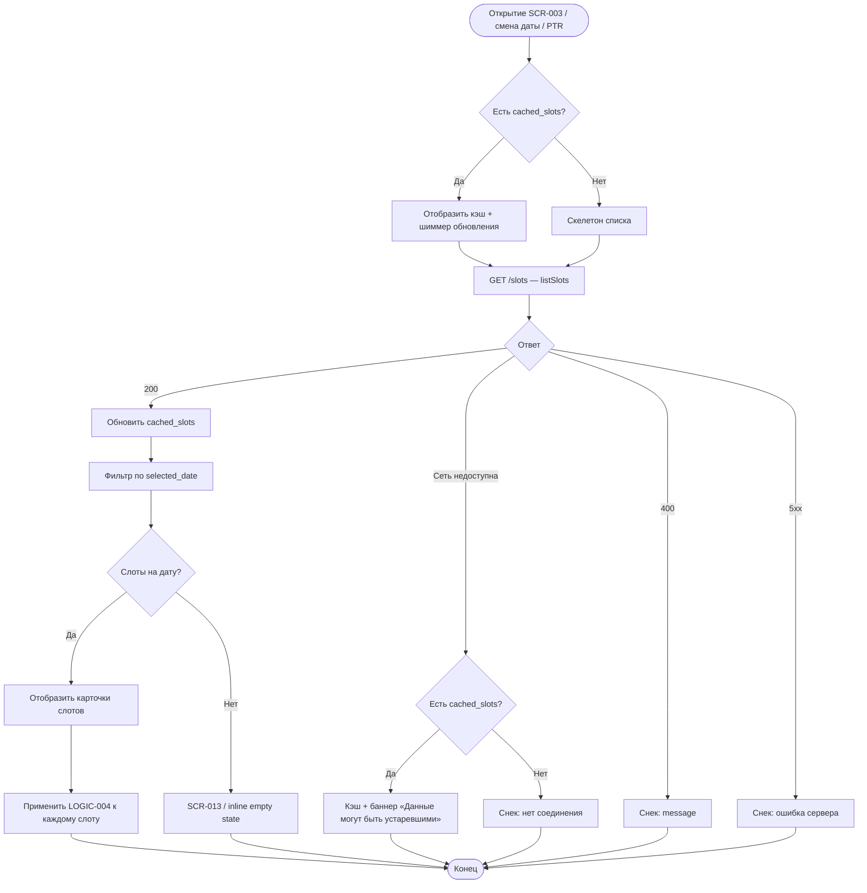

# Загрузка расписания слотов

**ID:** LOGIC-003  
**Тип:** Логика  
**Домен:** 09. Логики  
**Приоритет:** High  
**Статус:** Актуален  
**Функциональные блоки:** FB-SCHED-001, FB-SCHED-002

---

## История изменений

| Релиз | ТЗ | Описание изменений |
|-------|-----|-------------------|
| 1.0.0 | [LOGIC-003](LOGIC-003_Загрузка-расписания-слотов.md) | Первоначальная документация |

---

## Входные данные

| Название | Тип | Возможные значения | Описание |
|----------|-----|-------------------|----------|
| `selected_date` | Состояние | `YYYY-MM-DD` | Выбранная дата на SCR-003 |
| `cached_slots` | Локальный кэш | `{ fetched_at, from, to, items[] }` | Кэш расписания |
| `cached_config` | Локальный кэш | `SystemConfig` | Горизонт 7 дней, cutoff |

---

## Обзор

Логика загрузки и кэширования списка слотов тренировок для экрана [SCR-003 Schedule Screen](../02_Schedule/SCR-003_Schedule-Screen.md). Поддерживает фильтрацию по дате, pull-to-refresh (PTR) и офлайн-просмотр из кэша.

### User Story

> Как клиент, я хочу видеть актуальное расписание тренировок на 7 дней,
> чтобы выбрать удобное время для записи.

### Бизнес-ценность

- Самостоятельный просмотр слотов без звонка (BR-001, BR-027)
- Быстрый доступ к расписанию через кэш (NFR-007)
- Актуальные данные при наличии сети (NFR-002)

---

## Точки применения

| Экран/Компонент | Элемент/Триггер | Условие |
|-----------------|-----------------|---------|
| [SCR-003 Schedule Screen](../02_Schedule/SCR-003_Schedule-Screen.md) | При открытии экрана | Всегда |
| [SCR-003 Schedule Screen](../02_Schedule/SCR-003_Schedule-Screen.md) | Смена даты в календаре | Пользователь выбрал другую дату |
| [SCR-003 Schedule Screen](../02_Schedule/SCR-003_Schedule-Screen.md) | Pull-to-refresh | Пользователь потянул список вниз |
| [SCR-013 Empty State Screen](../02_Schedule/SCR-013_Empty-State-Screen.md) | Возврат к расписанию | После выбора другой даты |

---

## Флоу



---

## Описание логики

### Шаг 1: Определение периода запроса

Горизонт планирования — 7 дней (BR-027). Параметры запроса:
- `from` — сегодня (или `selected_date` если она раньше сегодня — не допускается)
- `to` — `from + 7 дней`
- `date` — опционально для фильтрации одного дня (FR-002)

При смене даты в UI фильтрация может выполняться локально из полного кэша периода без повторного запроса, если кэш актуален (< 5 минут с момента `fetched_at`).

### Шаг 2: Загрузка с API

Выполняется [`listSlots`](../api/openapi.yaml). Endpoint публичный (без Authorization). Ответ включает отменённые слоты (`slot_status = cancelled_by_gym`, FR-006, BR-019).

### Шаг 3: Кэширование

Полный ответ сохраняется в `cached_slots` с меткой времени `fetched_at`. Структура:

```json
{
  "fetched_at": "2026-07-04T12:00:00Z",
  "from": "2026-07-04",
  "to": "2026-07-11",
  "items": [ "...TrainingSlotSummary" ]
}
```

### Шаг 4: Pull-to-refresh

PTR принудительно инвалидирует кэш и выполняет новый запрос. Индикатор PTR скрывается после завершения запроса (успех или ошибка).

### Шаг 5: Empty state

Если на `selected_date` нет слотов со статусом `active` и `cancelled_by_gym` — показать FR-005: «Пока нет доступных тренировок».

---

## API запросы

### GET /slots — `listSlots`

**Триггер:** Открытие SCR-003, PTR, смена даты (при устаревшем кэше)

**Headers:** Не требуются

**Параметры/Body:**

| Параметр | Тип | Описание | Значение/Источник |
|----------|-----|----------|-------------------|
| `from` | date | Начало периода | Сегодня |
| `to` | date | Конец периода | from + 7 дней |
| `date` | date | Фильтр одного дня (опционально) | `selected_date` |

**Обработка ответа:**

| Результат | Действие |
|-----------|----------|
| Загрузка | Скелетон / PTR-индикатор |
| Успех (200) | Обновить `cached_slots`, отрисовать список |
| Ошибка 400 | Снек с `message` |
| Ошибка 5xx | Снек «Произошла ошибка. Попробуйте позже», показать кэш если есть |
| Ошибка сети | Кэш + баннер офлайн; без кэша — снек |

---

## Локальное хранение

| Ключ | Тип хранения | Описание |
|------|--------------|----------|
| `cached_slots` | Локальный кэш | Массив `TrainingSlotSummary` за 7-дневный период |
| `cached_config` | Локальный кэш | `booking_cutoff_minutes` для UI (читается LOGIC-004) |

---

## Связанные требования

### Функциональные (FR)

| ID | Название | Приоритет |
|----|----------|-----------|
| FR-001 | Просмотр расписания на 7 дней | High |
| FR-002 | Фильтрация слотов по дате | High |
| FR-005 | Empty state при отсутствии слотов | High |
| FR-006 | Отображение отменённых слотов | High |

### Бизнес-правила (BR)

| ID | Название |
|----|----------|
| BR-027 | Горизонт планирования 7 дней |
| BR-019 | Отменённый слот остаётся в списке с пометкой |
| BR-009 | Формат «осталось X из Y» |

### Интеграции (NFR)

| ID | Название | Приоритет |
|----|----------|-----------|
| NFR-002 | Актуальность данных из API | High |
| NFR-007 | Производительность доступа к расписанию | High |

---

## Критерии приёмки

| ID | Критерий |
|----|----------|
| AC-001 | **Дано** есть сеть, **Когда** открывается SCR-003, **Тогда** выполняется GET /slots с from/to на 7 дней |
| AC-002 | **Дано** успешный ответ, **Когда** данные получены, **Тогда** `cached_slots` обновлён |
| AC-003 | **Дано** нет слотов на выбранную дату, **Когда** список отрисован, **Тогда** показан empty state FR-005 |
| AC-004 | **Дано** пользователь выполняет PTR, **Когда** запрос завершён, **Тогда** список обновлён актуальными данными |
| AC-005 | **Дано** нет сети и есть `cached_slots`, **Когда** открывается SCR-003, **Тогда** отображается кэш с предупреждением об офлайн-режиме |
| AC-006 | **Дано** слот отменён скалодромом, **Когда** он в ответе API, **Тогда** отображается с пометкой об отмене (BR-019) |

---

## Обработка ошибок

| Тип ошибки | Контекст | Действие |
|------------|----------|----------|
| Нет сети | GET /slots | Кэш + баннер |
| 5xx | GET /slots | Снек + кэш |
| Пустой период | 200 с `items: []` | Empty state SCR-013 |
