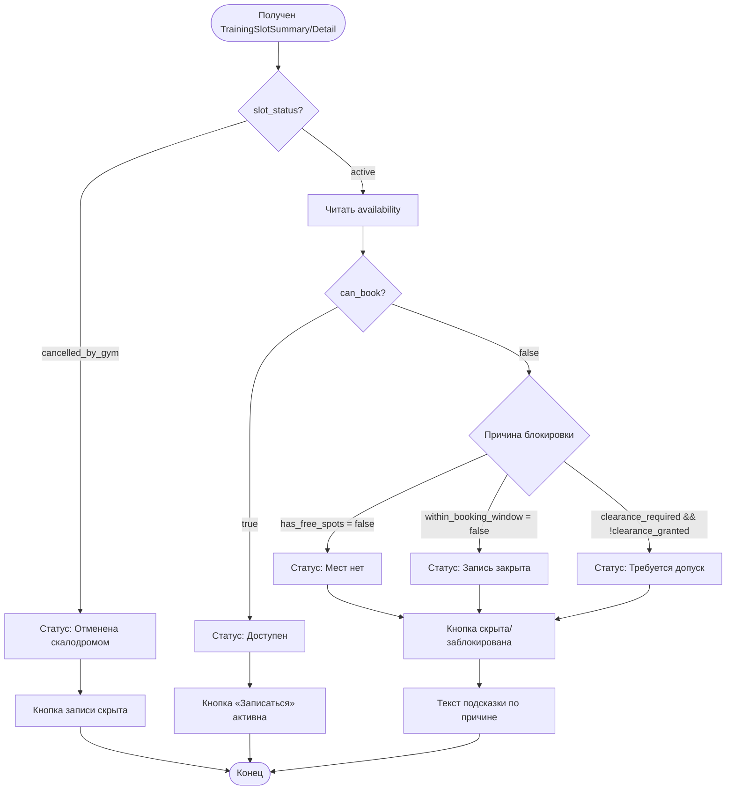

# Отображение доступности слота

**ID:** LOGIC-004  
**Тип:** Логика  
**Домен:** 09. Логики  
**Приоритет:** High  
**Статус:** Актуален  
**Функциональные блоки:** FB-SCHED-003, FB-SCHED-004

---

## История изменений

| Релиз | ТЗ | Описание изменений |
|-------|-----|-------------------|
| 1.0.0 | [LOGIC-004](LOGIC-004_Отображение-доступности-слота.md) | Первоначальная документация |

---

## Входные данные

| Название | Тип | Возможные значения | Описание |
|----------|-----|-------------------|----------|
| `slot.availability` | API-ответ | `BookingAvailability` | Флаги из `TrainingSlotSummary` / `TrainingSlotDetail` |
| `slot.slot_status` | API-ответ | `active`, `cancelled_by_gym` | Статус слота |
| `slot.zone.format_type` | API-ответ | `bouldering_instruction`, `rope_routes` | Формат тренировки |
| `client.risk_consent_accepted` | Состояние / API | `true`, `false` | Для косвенной подсказки при записи |

---

## Обзор

Логика преобразования флагов доступности из API в состояния UI карточки слота и кнопки «Записаться» на [SCR-003](../02_Schedule/SCR-003_Schedule-Screen.md) и [SCR-004](../02_Schedule/SCR-004_Slot-Detail-Screen.md). Использует объект `availability` и `slot_status` без дублирования бизнес-расчётов на клиенте.

### User Story

> Как клиент, я хочу видеть, доступна ли запись на тренировку,
> чтобы понимать, могу ли я записаться прямо сейчас.

### Бизнес-ценность

- Прозрачные правила записи (BR-006, BR-007, BR-008)
- Единообразное отображение на списке и деталях
- Снижение ошибок при попытке записи на недоступный слот

---

## Точки применения

| Экран/Компонент | Элемент/Триггер | Условие |
|-----------------|-----------------|---------|
| [SCR-003 Schedule Screen](../02_Schedule/SCR-003_Schedule-Screen.md) | Карточка слота в списке | После LOGIC-003 |
| [SCR-004 Slot Detail Screen](../02_Schedule/SCR-004_Slot-Detail-Screen.md) | Блок статуса и кнопка «Записаться» | При открытии / обновлении слота |
| Компонент `SlotAvailabilityBadge` | Отображение статуса | Переиспользуемый на SCR-003, SCR-004, SCR-009 |

---

## Флоу

---

## Описание логики

### Шаг 1: Приоритет статуса слота

Если `slot_status = cancelled_by_gym` (BR-019, FR-006):
- Показать бейдж «Отменена скалодромом»
- Кнопка записи скрыта
- Остальные флаги `availability` не учитываются для кнопки

### Шаг 2: Интерпретация `BookingAvailability`

| Флаг | Значение false | UI-сообщение | FR / BR |
|------|----------------|--------------|---------|
| `has_free_spots` | Нет мест | «Мест нет» | FR-007, BR-008 |
| `within_booking_window` | < 30 мин до начала | «Запись закрыта» | FR-008, BR-006 |
| `clearance_required` + `!clearance_granted` | Нет допуска | «Требуется допуск инструктора» | FR-009, BR-007 |
| `can_book` | Итог false | Кнопка заблокирована | — |

Клиент **не пересчитывает** `can_book` локально — использует значение из API (NFR-002).

### Шаг 3: Отображение мест

Формат: «осталось {free_spots} из {capacity}» (BR-009, FR-003). Значения из `availability.free_spots` и `slot.capacity`.

### Шаг 4: Детальный экран

На SCR-004 при открытии выполняется дополнительный [`getSlot`](../api/openapi.yaml) для актуальных флагов и `rental_availability`.

### Шаг 5: Оценка инструктора (Post-MVP)

Если `instructor.average_rating` не null — отобразить звёзды (FR-004, BR-035).

---

## API запросы

### GET /slots/{slotId} — `getSlot`

**Триггер:** Открытие SCR-004

**Headers:** Не требуются

**Параметры/Body:**

| Параметр | Тип | Описание | Значение/Источник |
|----------|-----|----------|-------------------|
| `slotId` | uuid | ID слота | Навигация с SCR-003 |

**Обработка ответа:**

| Результат | Действие |
|-----------|----------|
| Загрузка | Скелетон SCR-004 |
| Успех (200) | Применить логику доступности, отрисовать UI |
| Ошибка 404 | Снек «Слот не найден», возврат на SCR-003 |
| Ошибка сети | Данные из `cached_slots` если слот есть в кэше |

### GET /clients/me/clearances — `getClientClearances`

**Триггер:** Авторизованный пользователь открывает SCR-004 для `rope_routes` (опционально, если флаги устарели)

**Обработка ответа:**

| Результат | Действие |
|-----------|----------|
| Успех (200) | Использовать только для информационного баннера; итоговое решение — `availability` из слота |

---

## Локальное хранение

| Ключ | Тип хранения | Описание |
|------|--------------|----------|
| `cached_slots` | Локальный кэш | Источник данных для SCR-003 без сети |
| `cached_config` | Локальный кэш | `booking_cutoff_minutes` для текстов подсказок |

---

## Связанные требования

### Функциональные (FR)

| ID | Название | Приоритет |
|----|----------|-----------|
| FR-003 | Отображение информации о слоте | High |
| FR-004 | Отображение средней оценки инструктора | Low (Post-MVP) |
| FR-006 | Отображение отменённых слотов | High |
| FR-007 | Блокировка кнопки при отсутствии мест | High |
| FR-008 | Блокировка записи менее чем за 30 минут | High |
| FR-009 | Блокировка записи без допуска | High |

### Бизнес-правила (BR)

| ID | Название |
|----|----------|
| BR-006 | Ограничение времени записи (30 мин) |
| BR-007 | Допуск для «трасс с верёвкой» |
| BR-008 | Блокировка при 0 мест |
| BR-009 | Формат свободных мест |
| BR-019 | Отменённые слоты в списке |
| BR-035 | Рейтинг инструктора до записи |

---

## Критерии приёмки

| ID | Критерий |
|----|----------|
| AC-001 | **Дано** `can_book = true`, **Когда** слот отображается, **Тогда** кнопка «Записаться» активна |
| AC-002 | **Дано** `has_free_spots = false`, **Когда** слот в списке, **Тогда** кнопка записи скрыта, текст «Мест нет» |
| AC-003 | **Дано** `within_booking_window = false`, **Когда** открыт SCR-004, **Тогда** кнопка заблокирована, текст «Запись закрыта» |
| AC-004 | **Дано** `clearance_required = true` и `clearance_granted = false`, **Когда** формат `rope_routes`, **Тогда** показано «Требуется допуск инструктора» |
| AC-005 | **Дано** `slot_status = cancelled_by_gym`, **Когда** слот в списке, **Тогда** видна пометка об отмене, кнопки записи нет |
| AC-006 | **Дано** слот активен, **Когда** отображаются места, **Тогда** формат «осталось X из Y» |

---

## Обработка ошибок

| Тип ошибки | Контекст | Действие |
|------------|----------|----------|
| Устаревшие флаги после 409 при записи | LOGIC-005 | Обновить слот из ответа конфликта |
| 404 на getSlot | SCR-004 | Возврат на расписание |
