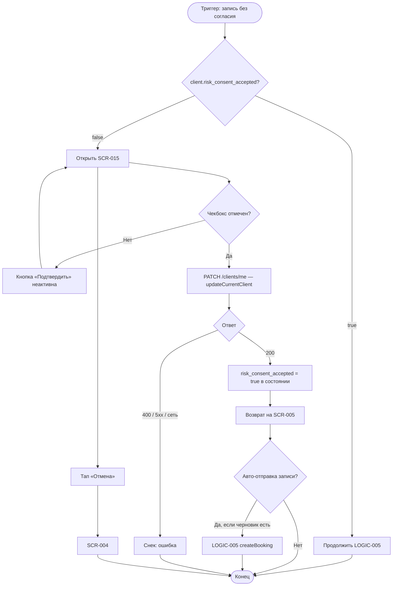

# Подтверждение согласия на риск

**ID:** LOGIC-006  
**Тип:** Логика  
**Домен:** 09. Логики  
**Приоритет:** High  
**Статус:** Актуален  
**Функциональные блоки:** FB-BOOK-003

---

## История изменений

| Релиз | ТЗ | Описание изменений |
|-------|-----|-------------------|
| 1.0.0 | [LOGIC-006](LOGIC-006_Подтверждение-согласия-на-риск.md) | Первоначальная документация |

---

## Входные данные

| Название | Тип | Возможные значения | Описание |
|----------|-----|-------------------|----------|
| `client.risk_consent_accepted` | Состояние / API | `true`, `false` | Флаг из профиля клиента |
| `consent_checkbox` | Состояние формы | `true`, `false` | Чекбокс на SCR-015 |
| `booking_draft` | Локальный кэш | объект черновика | Сохраняется при переходе на SCR-015 |

---

## Обзор

Логика подтверждения согласия на риск при первой записи клиента. Проверяет флаг `risk_consent_accepted` в профиле, отображает экран согласия SCR-015 и отправляет PATCH в API.

### User Story

> Как клиент, я хочу подтвердить осведомлённость о рисках скалолазания,
> чтобы записаться на первую тренировку в соответствии с правилами скалодрома.

### Бизнес-ценность

- Юридическая фиксация согласия (BR-031)
- Блокировка записи без согласия на уровне API и UI
- Однократное подтверждение — не показывается при повторных записях

---

## Точки применения

| Экран/Компонент | Элемент/Триггер | Условие |
|-----------------|-----------------|---------|
| SCR-015 Consent Screen | Тап «Подтвердить» | Чекбокс отмечен |
| SCR-005 Booking Screen | Перед createBooking | `risk_consent_accepted = false` |
| [LOGIC-005](LOGIC-005_Создание-записи-на-тренировку.md) | Ответ 403 `RISK_CONSENT_REQUIRED` | Бэкенд-проверка |

---

## Флоу

---

## Описание логики

### Шаг 1: Проверка перед записью

При инициализации SCR-005 и перед POST /bookings читается `client.risk_consent_accepted` из:
1. Глобального состояния (после регистрации / getCurrentClient)
2. Ответа [`getCurrentClient`](../api/openapi.yaml) при устаревших данных

Если `false` — навигация на SCR-015, `booking_draft` сохраняется.

### Шаг 2: Экран согласия

SCR-015 отображает текст соглашения. Кнопка «Подтвердить» активна только при `consent_checkbox = true`.

### Шаг 3: Отправка согласия

PATCH с телом `{ "risk_consent_accepted": true }` через [`updateCurrentClient`](../api/openapi.yaml).

### Шаг 4: Возврат к записи

После 200 — обновить профиль в состоянии, вернуться на SCR-005. Опционально автоматически продолжить LOGIC-005 если пользователь уже нажимал «Подтвердить запись».

### Шаг 5: Повторные записи

При `risk_consent_accepted = true` SCR-015 не показывается (FR-012).

---

## API запросы

### PATCH /clients/me — `updateCurrentClient`

**Триггер:** Тап «Подтвердить» на SCR-015

**Headers:**

| Поле | Описание |
|------|----------|
| `Authorization` | `Bearer {access_token}` |

**Параметры/Body:**

| Параметр | Тип | Описание | Значение/Источник |
|----------|-----|----------|-------------------|
| `risk_consent_accepted` | boolean | Подтверждение риска | `true` |

**Обработка ответа:**

| Результат | Действие |
|-----------|----------|
| Загрузка | Spinner на кнопке |
| Успех (200) | Обновить `client`, вернуться на SCR-005 |
| Ошибка 400 | Снек с `message` |
| Ошибка 401 | LOGIC-001: очистить токен, SCR-002 |
| Ошибка 5xx | Снек «Произошла ошибка. Попробуйте позже» |
| Ошибка сети | Снек «Нет соединения. Проверьте подключение к интернету» |

### GET /clients/me — `getCurrentClient`

**Триггер:** Открытие SCR-005 для актуализации флага

**Обработка ответа:**

| Результат | Действие |
|-----------|----------|
| Успех (200) | Использовать `client.risk_consent_accepted` |

---

## Локальное хранение

| Ключ | Тип хранения | Описание |
|------|--------------|----------|
| `booking_draft` | Локальный кэш | Сохраняется при переходе SCR-005 → SCR-015 |
| `access_token` | Защищённое хранилище | Authorization |

---

## Связанные требования

### Функциональные (FR)

| ID | Название | Приоритет |
|----|----------|-----------|
| FR-012 | Подтверждение согласия на риск | High |
| FR-013 | Создание записи через API | High |

### Бизнес-правила (BR)

| ID | Название |
|----|----------|
| BR-031 | Согласие на риск при первой записи |

---

## Критерии приёмки

| ID | Критерий |
|----|----------|
| AC-001 | **Дано** `risk_consent_accepted = false`, **Когда** пользователь пытается записаться, **Тогда** открывается SCR-015 |
| AC-002 | **Дано** чекбокс не отмечен, **Когда** на SCR-015, **Тогда** кнопка «Подтвердить» неактивна |
| AC-003 | **Дано** пользователь подтвердил согласие, **Когда** PATCH возвращает 200, **Тогда** `client.risk_consent_accepted = true` |
| AC-004 | **Дано** согласие принято, **Когда** пользователь возвращается на SCR-005, **Тогда** запись может быть отправлена через LOGIC-005 |
| AC-005 | **Дано** `risk_consent_accepted = true`, **Когда** открывается SCR-005, **Тогда** SCR-015 не показывается |
| AC-006 | **Дано** POST /bookings вернул 403 `RISK_CONSENT_REQUIRED`, **Когда** ошибка обработана, **Тогда** открывается SCR-015 |

---

## Обработка ошибок

| Тип ошибки | Контекст | Действие |
|------------|----------|----------|
| 403 RISK_CONSENT_REQUIRED | createBooking | SCR-015 |
| 401 | PATCH /clients/me | Разлогин, SCR-002 |
| Отмена на SCR-015 | Тап «Отмена» | SCR-004, черновик сохранён |
