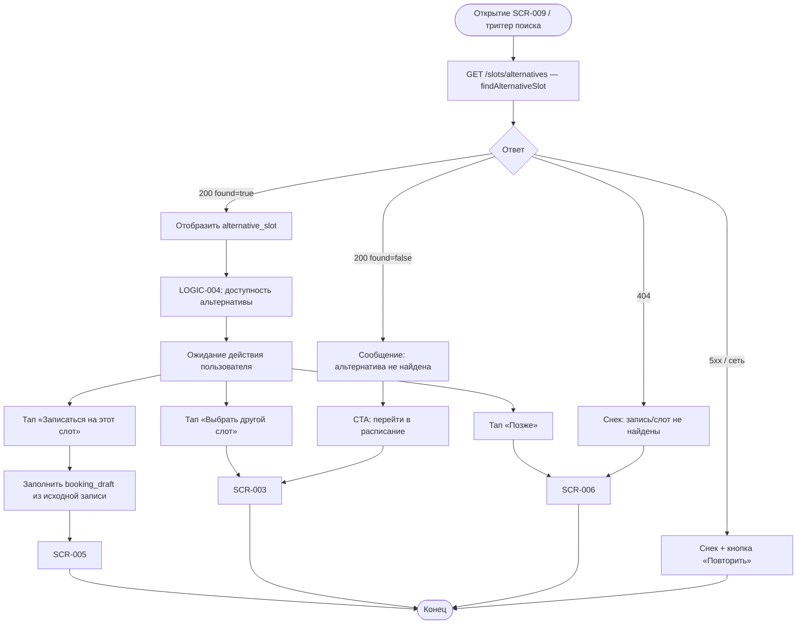

# Предложение альтернативного слота

**ID:** LOGIC-009  
**Тип:** Логика  
**Домен:** 09. Логики  
**Приоритет:** Medium  
**Статус:** Актуален  
**Функциональные блоки:** FB-BOOK-008

---

## История изменений

| Релиз | ТЗ | Описание изменений |
|-------|-----|-------------------|
| 1.0.0 | [LOGIC-009](LOGIC-009_Предложение-альтернативного-слота.md) | Первоначальная документация |

---

## Входные данные

| Название | Тип | Возможные значения | Описание |
|----------|-----|-------------------|----------|
| `cancelled_slot_id` | Навигация / push | uuid | ID отменённого слота |
| `booking_id` | Навигация / push | uuid | ID отменённой записи |
| `alternative_response` | API-ответ | `AlternativeSlotResponse` | Результат поиска |

---

## Обзор

Логика поиска и отображения альтернативного слота при отмене тренировки скалодромом. Вызывает API, обрабатывает `found = false` и направляет клиента на запись или самостоятельный поиск в расписании.

### User Story

> Как клиент, чья тренировка отменена скалодромом, я хочу получить предложение ближайшей замены,
> чтобы быстро записаться на аналогичное занятие.

### Бизнес-ценность

- Снижение оттока после отмены скалодромом (BR-020)
- Автоматический подбор слота с теми же параметрами
- Запрет повторной записи на тот же отменённый слот (BR-018)

---

## Точки применения

| Экран/Компонент | Элемент/Триггер | Условие |
|-----------------|-----------------|---------|
| SCR-009 Alternative Slot Offer Screen | При открытии | После отмены скалодромом |
| SCR-007 Booking Detail Screen | Тап «Найти альтернативу» | `booking_status = cancelled_by_gym` |
| [LOGIC-013](LOGIC-013_Маршрутизация-deep-link-и-push.md) | Push `gym_cancellation` | Тап «Посмотреть альтернативы» |

---

## Флоу

---

## Описание логики

### Шаг 1: Параметры запроса

Обязательный `cancelled_slot_id`. Опциональный `booking_id` — для учёта параметров проката исходной записи (BR-020: зона, сложность, инструктор, прокат).

### Шаг 2: Успех с альтернативой

При `found = true` и непустом `alternative_slot`:
- Отобразить карточку слота (дата, зона, инструктор, места, тариф)
- Применить LOGIC-004 для кнопки «Записаться на этот слот»
- Проверить `rebooking_forbidden` исходной записи (BR-018) — не предлагать тот же `cancelled_slot_id`

### Шаг 3: Альтернатива не найдена

При `found = false`:
- Текст: «К сожалению, ближайший подходящий слот не найден. Выберите другое время в расписании.»
- Кнопка «Выбрать другой слот» → SCR-003
- Кнопка «Позже» → SCR-006

### Шаг 4: Запись на альтернативу

При выборе альтернативы — создать `booking_draft` с `slot_id` альтернативы, перенести `rental_lines` из исходной записи (если доступны), переход на SCR-005 → LOGIC-005.

### Шаг 5: Причина отмены

На SCR-009 отображается `cancellation_reason` из исходной записи (FR-021, BR-016).

---

## API запросы

### GET /slots/alternatives — `findAlternativeSlot`

**Триггер:** Открытие SCR-009, тап «Найти альтернативу» на SCR-007

**Headers:**

| Поле | Описание |
|------|----------|
| `Authorization` | `Bearer {access_token}` |

**Параметры/Body:**

| Параметр | Тип | Описание | Значение/Источник |
|----------|-----|----------|-------------------|
| `cancelled_slot_id` | uuid | Отменённый слот | Из записи / push |
| `booking_id` | uuid | Отменённая запись | Опционально, из SCR-007 |

**Обработка ответа:**

| Результат | Действие |
|-----------|----------|
| Загрузка | Скелетон SCR-009 |
| Успех (200), `found=true` | Показать `alternative_slot` |
| Успех (200), `found=false` | Empty state с CTA на расписание |
| Ошибка 404 | Снек, SCR-006 |
| Ошибка 5xx | Снек «Произошла ошибка. Попробуйте позже» |
| Ошибка сети | Снек «Нет соединения. Проверьте подключение к интернету» |

### GET /bookings/{bookingId} — `getBooking`

**Триггер:** Открытие SCR-009 из push/deep link

**Обработка ответа:**

| Результат | Действие |
|-----------|----------|
| Успех (200) | Извлечь `cancelled_slot_id`, `cancellation_reason` |

---

## Локальное хранение

| Ключ | Тип хранения | Описание |
|------|--------------|----------|
| `booking_draft` | Локальный кэш | Заполняется при выборе альтернативного слота |
| `access_token` | Защищённое хранилище | Authorization |

---

## Связанные требования

### Функциональные (FR)

| ID | Название | Приоритет |
|----|----------|-----------|
| FR-020 | Push при отмене скалодромом | High |
| FR-021 | Отображение причины отмены | High |
| FR-022 | Предложение альтернативного слота | Medium |

### Бизнес-правила (BR)

| ID | Название |
|----|----------|
| BR-016 | Статус и причина отмены скалодромом |
| BR-018 | Запрет повторной записи на отменённый слот |
| BR-020 | Предложение ближайшего свободного слота |
| BR-017 | Обязательный push при отмене |

---

## Критерии приёмки

| ID | Критерий |
|----|----------|
| AC-001 | **Дано** запись отменена скалодромом, **Когда** открывается SCR-009, **Тогда** выполняется GET /slots/alternatives |
| AC-002 | **Дано** `found = true`, **Когда** ответ получен, **Тогда** отображается карточка `alternative_slot` |
| AC-003 | **Дано** `found = false`, **Когда** ответ получен, **Тогда** показано сообщение и CTA на SCR-003 |
| AC-004 | **Дано** альтернатива найдена, **Когда** пользователь нажимает «Записаться на этот слот», **Тогда** открывается SCR-005 с заполненным черновиком |
| AC-005 | **Дано** исходная запись, **Когда** отображается SCR-009, **Тогда** видна причина отмены из `cancellation_reason` |
| AC-006 | **Дано** `rebooking_forbidden = true`, **Когда** альтернатива совпадает с отменённым слотом, **Тогда** такой слот не предлагается |

---

## Обработка ошибок

| Тип ошибки | Контекст | Действие |
|------------|----------|----------|
| found=false | GET alternatives | CTA расписание, не блокировать UX |
| 404 | Невалидные id | SCR-006, снек |
| Альтернатива стала недоступна | LOGIC-004 can_book=false | Предупреждение + SCR-003 |
