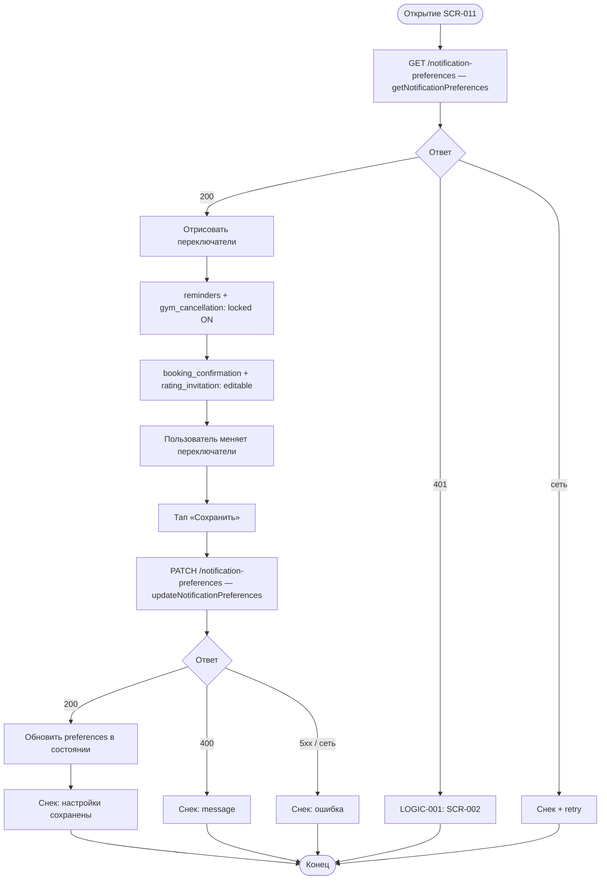

# Управление настройками уведомлений

**ID:** LOGIC-011  
**Тип:** Логика  
**Домен:** 09. Логики  
**Приоритет:** Medium  
**Статус:** Актуален  
**Функциональные блоки:** FB-NOTIF-001

---

## История изменений

| Релиз | ТЗ | Описание изменений |
|-------|-----|-------------------|
| 1.0.0 | [LOGIC-011](LOGIC-011_Управление-настройками-уведомлений.md) | Первоначальная документация |

---

## Входные данные

| Название | Тип | Возможные значения | Описание |
|----------|-----|-------------------|----------|
| `preferences` | Состояние / API | `NotificationPreferences` | Текущие настройки |
| `local_toggles` | Состояние формы | boolean × 4 | Локальные переключатели до сохранения |

---

## Обзор

Логика загрузки и сохранения настроек push-уведомлений на SCR-011. Обязательные типы (`reminders_enabled`, `gym_cancellation_enabled`) отображаются как заблокированные (read-only, всегда `true`).

### User Story

> Как клиент, я хочу управлять необязательными уведомлениями,
> чтобы получать только важные для меня push-сообщения.

### Бизнес-ценность

- Баланс между информированием и навязчивостью (BR-028, BR-029)
- Обязательные уведомления о напоминаниях и отмене скалодромом
- Синхронизация предпочтений с бэкендом для доставки push

---

## Точки применения

| Экран/Компонент | Элемент/Триггер | Условие |
|-----------------|-----------------|---------|
| SCR-011 Notification Settings Screen | При открытии | Авторизованный пользователь |
| SCR-011 Notification Settings Screen | Тап «Сохранить» | Изменены отключаемые поля |
| SCR-010 Profile Screen | Переход в настройки | Тап «Настройки уведомлений» |

---

## Флоу



---

## Описание логики

### Шаг 1: Загрузка настроек

При открытии SCR-011 — [`getNotificationPreferences`](../api/openapi.yaml).

### Шаг 2: Отображение переключателей

| Поле | Отключаемое | UI | BR |
|------|-------------|-----|-----|
| `booking_confirmation_enabled` | Да | Switch активен | BR-029 |
| `rating_invitation_enabled` | Да (Post-MVP) | Switch активен | BR-029 |
| `reminders_enabled` | Нет | Switch заблокирован, ON | BR-028 |
| `gym_cancellation_enabled` | Нет | Switch заблокирован, ON | BR-028 |

Заблокированные переключатели визуально отличаются (disabled + иконка замка). Подпись: «Обязательное уведомление».

### Шаг 3: Сохранение

PATCH отправляет **только** изменяемые поля:

```json
{
  "booking_confirmation_enabled": false,
  "rating_invitation_enabled": true
}
```

Попытка изменить locked-поля в запросе не выполняется клиентом. Если API вернёт 400 — показать `message`.

### Шаг 4: Кнопка «Сохранить»

Активна только при отличии `local_toggles` от загруженных `preferences` для editable-полей.

---

## API запросы

### GET /clients/me/notification-preferences — `getNotificationPreferences`

**Триггер:** Открытие SCR-011

**Headers:**

| Поле | Описание |
|------|----------|
| `Authorization` | `Bearer {access_token}` |

**Обработка ответа:**

| Результат | Действие |
|-----------|----------|
| Загрузка | Скелетон переключателей |
| Успех (200) | Заполнить форму |
| Ошибка 401 | SCR-002 |
| Ошибка 5xx | Снек + retry |
| Ошибка сети | Снек «Нет соединения. Проверьте подключение к интернету» |

### PATCH /clients/me/notification-preferences — `updateNotificationPreferences`

**Триггер:** Тап «Сохранить»

**Параметры/Body:**

| Параметр | Тип | Описание | Значение/Источник |
|----------|-----|----------|-------------------|
| `booking_confirmation_enabled` | boolean | Подтверждение записи | Switch SCR-011 |
| `rating_invitation_enabled` | boolean | Приглашение к оценке | Switch SCR-011 |

**Обработка ответа:**

| Результат | Действие |
|-----------|----------|
| Загрузка | Spinner на кнопке |
| Успех (200) | Снек «Настройки сохранены» |
| Ошибка 400 | Снек с `message` |
| Ошибка 5xx | Снек «Произошла ошибка. Попробуйте позже» |
| Ошибка сети | Снек «Нет соединения. Проверьте подключение к интернету» |

---

## Локальное хранение

| Ключ | Тип хранения | Описание |
|------|--------------|----------|
| `access_token` | Защищённое хранилище | Authorization |

> Настройки не кэшируются локально постоянно — при каждом открытии SCR-011 загружаются с API (NFR-002).

---

## Связанные требования

### Функциональные (FR)

| ID | Название | Приоритет |
|----|----------|-----------|
| FR-032 | Управление настройками уведомлений | Medium |
| FR-015 | Push о подтверждении записи | High |
| FR-031 | Push-приглашение к оценке | Low (Post-MVP) |

### Бизнес-правила (BR)

| ID | Название |
|----|----------|
| BR-026 | Push-уведомления в MVP |
| BR-028 | Обязательные уведомления |
| BR-029 | Отключаемые уведомления |

### Интеграции (NFR)

| ID | Название | Приоритет |
|----|----------|-----------|
| NFR-004 | Обязательность push-уведомлений | High |

---

## Критерии приёмки

| ID | Критерий |
|----|----------|
| AC-001 | **Дано** авторизованный пользователь, **Когда** открывается SCR-011, **Тогда** загружаются настройки через GET |
| AC-002 | **Дано** настройки загружены, **Когда** форма отрисована, **Тогда** `reminders_enabled` и `gym_cancellation_enabled` заблокированы в ON |
| AC-003 | **Дано** пользователь отключил подтверждение записи, **Когда** нажато «Сохранить», **Тогда** PATCH с `booking_confirmation_enabled: false` |
| AC-004 | **Дано** PATCH вернул 200, **Когда** сохранение завершено, **Тогда** снек «Настройки сохранены» |
| AC-005 | **Дано** настройки не изменены, **Когда** SCR-011 открыт, **Тогда** кнопка «Сохранить» неактивна |
| AC-006 | **Дано** нет сети при сохранении, **Когда** PATCH не выполнен, **Тогда** снек о сети, локальные изменения не потеряны |

---

## Обработка ошибок

| Тип ошибки | Контекст | Действие |
|------------|----------|----------|
| 401 | GET/PATCH | Разлогин |
| 400 при locked fields | PATCH (не должно с клиента) | Снек, откат формы |
| Нет сети | GET | Retry, пустая форма с placeholder |
