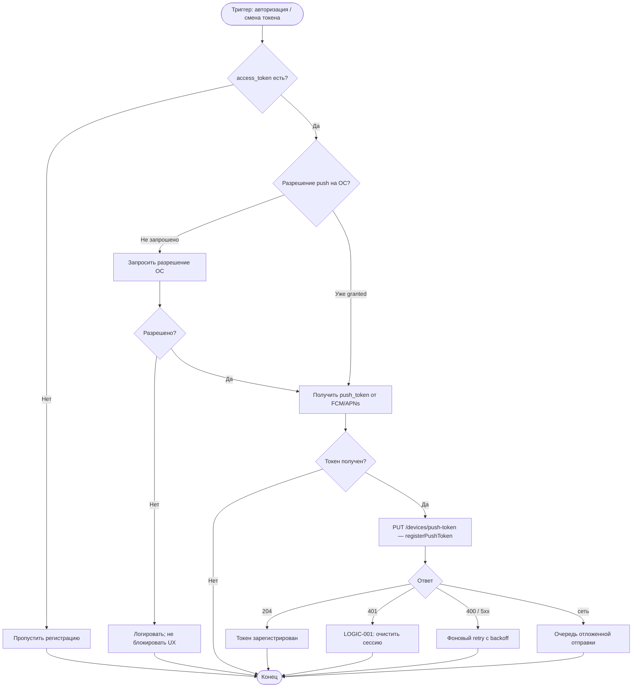

# Регистрация push-токена

**ID:** LOGIC-012  
**Тип:** Логика  
**Домен:** 09. Логики  
**Приоритет:** High  
**Статус:** Актуален  
**Функциональные блоки:** FB-NOTIF-002, FB-APP-002

---

## История изменений

| Релиз | ТЗ | Описание изменений |
|-------|-----|-------------------|
| 1.0.0 | [LOGIC-012](LOGIC-012_Регистрация-push-токена.md) | Первоначальная документация |

---

## Входные данные

| Название | Тип | Возможные значения | Описание |
|----------|-----|-------------------|----------|
| `access_token` | Защищённое хранилище | JWT | Наличие авторизации |
| `push_token` | OS / FCM / APNs | строка | Токен устройства |
| `platform` | Состояние | `ios`, `android` | Платформа |

---

## Обзор

Логика регистрации push-токена устройства на бэкенде после успешной авторизации. Выполняется без блокировки UI, повторяется при смене токена ОС.

### User Story

> Как клиент, я хочу получать push-уведомления о записях и тренировках,
> чтобы не пропускать важные изменения расписания.

### Бизнес-ценность

- Доставка обязательных уведомлений (BR-017, BR-028)
- Подтверждение записи и напоминания (FR-015, FR-024, FR-025)
- Связь устройства с учётной записью клиента

---

## Точки применения

| Экран/Компонент | Элемент/Триггер | Условие |
|-----------------|-----------------|---------|
| [LOGIC-001](LOGIC-001_Проверка-сессии-при-запуске.md) | После валидной сессии | `access_token` есть |
| [LOGIC-002](LOGIC-002_Регистрация-клиента.md) | После успешной регистрации | 201 от registerClient |
| `PushTokenService` | Callback смены токена от FCM/APNs | Токен обновлён ОС |
| `AppLifecycle` | Возврат в foreground | Опциональная перерегистрация |

---

## Флоу

---

## Описание логики

### Шаг 1: Условие запуска

Регистрация выполняется **только** при наличии валидного `access_token`. Без авторизации запрос не отправляется.

### Шаг 2: Разрешения ОС

На iOS/Android запрашивается разрешение на уведомления (NFR-004). Отказ не блокирует использование приложения — регистрация пропускается.

### Шаг 3: Получение токена

- Android: FCM token
- iOS: APNs device token

`platform` определяется автоматически.

### Шаг 4: Отправка на бэкенд

[`registerPushToken`](../api/openapi.yaml) — PUT, тело `PushTokenRequest`. Успех — 204 No Content.

### Шаг 5: Повторная регистрация

При обновлении токена FCM/APNs (callback `onTokenRefresh`) — повторный PUT с новым токеном.

### Шаг 6: Фоновая обработка ошибок

Ошибки сети и 5xx — отложенный retry (exponential backoff, max 3 попытки). UI не блокируется.

---

## API запросы

### PUT /devices/push-token — `registerPushToken`

**Триггер:** После авторизации, при смене push-токена

**Headers:**

| Поле | Описание |
|------|----------|
| `Authorization` | `Bearer {access_token}` |

**Параметры/Body:**

| Параметр | Тип | Описание | Значение/Источник |
|----------|-----|----------|-------------------|
| `token` | string | FCM/APNs токен | SDK push-сервиса |
| `platform` | string | `ios` / `android` | Определяется ОС |

**Обработка ответа:**

| Результат | Действие |
|-----------|----------|
| Загрузка | Без UI-индикатора (фоновая операция) |
| Успех (204) | Логировать успех, сохранить last_registered_token в памяти |
| Ошибка 400 | Логировать, не retry |
| Ошибка 401 | Очистить сессию при следующем API-вызове |
| Ошибка 5xx | Retry с backoff |
| Ошибка сети | Очередь retry при появлении сети |

---

## Локальное хранение

| Ключ | Тип хранения | Описание |
|------|--------------|----------|
| `access_token` | Защищённое хранилище | Обязателен для запроса |

> `push_token` не сохраняется в persistent storage — всегда запрашивается у push-SDK.

---

## Связанные требования

### Функциональные (FR)

| ID | Название | Приоритет |
|----|----------|-----------|
| FR-015 | Push о подтверждении записи | High |
| FR-020 | Push при отмене скалодромом | High |
| FR-024 | Push-напоминание за сутки | High |
| FR-025 | Push-напоминание за N часов | High |
| FR-031 | Push-приглашение к оценке | Low (Post-MVP) |

### Бизнес-правила (BR)

| ID | Название |
|----|----------|
| BR-026 | Push-уведомления в MVP |
| BR-017 | Обязательный push при отмене скалодромом |
| BR-027 | Напоминания за сутки и за N часов |

### Интеграции (NFR)

| ID | Название | Приоритет |
|----|----------|-----------|
| NFR-004 | Обязательность push-уведомлений | High |

---

## Критерии приёмки

| ID | Критерий |
|----|----------|
| AC-001 | **Дано** успешная регистрация (LOGIC-002), **Когда** получен access_token, **Тогда** выполняется PUT /devices/push-token |
| AC-002 | **Дано** валидная сессия при запуске, **Когда** LOGIC-001 завершён, **Тогда** инициируется регистрация push-токена |
| AC-003 | **Дано** пользователь не авторизован, **Когда** получен push_token от ОС, **Тогда** PUT не отправляется |
| AC-004 | **Дано** PUT вернул 204, **Когда** регистрация завершена, **Тогда** UI не показывает ошибок |
| AC-005 | **Дано** FCM обновил токен, **Когда** callback получен, **Тогда** повторный PUT с новым token |
| AC-006 | **Дано** нет сети, **Когда** регистрация не удалась, **Тогда** запрос ставится в очередь retry |

---

## Обработка ошибок

| Тип ошибки | Контекст | Действие |
|------------|----------|----------|
| Нет разрешения ОС | Первый запуск | Пропуск, не блокировать |
| 401 | PUT | Не retry до re-auth |
| Сеть | PUT | Очередь retry |
| Invalid token 400 | PUT | Лог, запросить новый токен у SDK |
