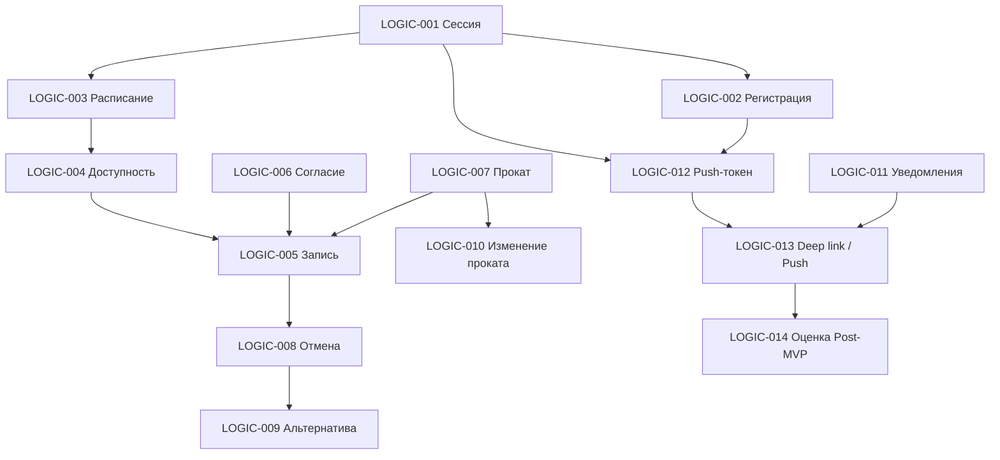

# 09. Логики — индекс

**Домен:** 09. Логики  
**Приложение:** Скалодром «Вертикаль»  
**Релиз:** 1.0.0

---

## Назначение домена

Домен «Логики» описывает переиспользуемое бизнес-поведение клиентского приложения, не привязанное к одному экрану. Каждая логика определяет триггеры, флоу, API-взаимодействия, локальное хранение и критерии приёмки.

**Шаблон:** [\_LOGIC_TEMPLATE.md](../_LOGIC_TEMPLATE.md)

---

## Реестр логик

| ID | Название | Файл | Приоритет | Статус | API (operationId) |
|----|----------|------|-----------|--------|-------------------|
| LOGIC-001 | Проверка сессии при запуске | [LOGIC-001_Проверка-сессии-при-запуске.md](LOGIC-001_Проверка-сессии-при-запуске.md) | Critical | Актуален | `getCurrentClient`, `getSystemConfig` |
| LOGIC-002 | Регистрация клиента | [LOGIC-002_Регистрация-клиента.md](LOGIC-002_Регистрация-клиента.md) | Critical | Актуален | `registerClient` |
| LOGIC-003 | Загрузка расписания слотов | [LOGIC-003_Загрузка-расписания-слотов.md](LOGIC-003_Загрузка-расписания-слотов.md) | High | Актуален | `listSlots`, `getSystemConfig` |
| LOGIC-004 | Отображение доступности слота | [LOGIC-004_Отображение-доступности-слота.md](LOGIC-004_Отображение-доступности-слота.md) | High | Актуален | `getSlot`, `getClientClearances` |
| LOGIC-005 | Создание записи на тренировку | [LOGIC-005_Создание-записи-на-тренировку.md](LOGIC-005_Создание-записи-на-тренировку.md) | Critical | Актуален | `createBooking`, `getSlot` |
| LOGIC-006 | Подтверждение согласия на риск | [LOGIC-006_Подтверждение-согласия-на-риск.md](LOGIC-006_Подтверждение-согласия-на-риск.md) | High | Актуален | `updateCurrentClient`, `getCurrentClient` |
| LOGIC-007 | Выбор проката и расчёт стоимости | [LOGIC-007_Выбор-проката-и-расчёт-стоимости.md](LOGIC-007_Выбор-проката-и-расчёт-стоимости.md) | High | Актуален | `listRentalEquipmentTypes`, `getSlotRentalAvailability` |
| LOGIC-008 | Отмена записи с учётом политики | [LOGIC-008_Отмена-записи-с-учётом-политики.md](LOGIC-008_Отмена-записи-с-учётом-политики.md) | High | Актуален | `cancelBooking`, `getBooking` |
| LOGIC-009 | Предложение альтернативного слота | [LOGIC-009_Предложение-альтернативного-слота.md](LOGIC-009_Предложение-альтернативного-слота.md) | Medium | Актуален | `findAlternativeSlot` |
| LOGIC-010 | Изменение проката в записи | [LOGIC-010_Изменение-проката-в-записи.md](LOGIC-010_Изменение-проката-в-записи.md) | Medium | Актуален | `updateBookingRental`, `getSlotRentalAvailability` |
| LOGIC-011 | Управление настройками уведомлений | [LOGIC-011_Управление-настройками-уведомлений.md](LOGIC-011_Управление-настройками-уведомлений.md) | Medium | Актуален | `getNotificationPreferences`, `updateNotificationPreferences` |
| LOGIC-012 | Регистрация push-токена | [LOGIC-012_Регистрация-push-токена.md](LOGIC-012_Регистрация-push-токена.md) | High | Актуален | `registerPushToken` |
| LOGIC-013 | Маршрутизация deep link и push | [LOGIC-013_Маршрутизация-deep-link-и-push.md](LOGIC-013_Маршрутизация-deep-link-и-push.md) | High | Актуален | — |
| LOGIC-014 | Оценка инструктора (Post-MVP) | [LOGIC-014_Оценка-инструктора.md](LOGIC-014_Оценка-инструктора.md) | Low | Черновик | `createInstructorRating` |

---

## Матрица логика ↔ экран

| Логика | Экраны | Домены экранов |
|--------|--------|----------------|
| LOGIC-001 | [SCR-001](../01_Authentication/SCR-001_Splash-Screen.md) | 01. Авторизация |
| LOGIC-002 | [SCR-002](../01_Authentication/SCR-002_Registration-Screen.md) | 01. Авторизация |
| LOGIC-003 | [SCR-003](../02_Schedule/SCR-003_Schedule-Screen.md) | 02. Расписание |
| LOGIC-004 | [SCR-003](../02_Schedule/SCR-003_Schedule-Screen.md), [SCR-004](../02_Schedule/SCR-004_Slot-Detail-Screen.md) | 02. Расписание |
| LOGIC-005 | [SCR-005](../03_Booking/SCR-005_Booking-Screen.md) | 03. Запись |
| LOGIC-006 | [SCR-015](../03_Booking/SCR-015_Consent-Screen.md), [SCR-005](../03_Booking/SCR-005_Booking-Screen.md) | 03. Запись |
| LOGIC-007 | [SCR-005](../03_Booking/SCR-005_Booking-Screen.md), [SCR-007](../04_My_Bookings/SCR-007_Booking-Detail-Screen.md) | 03. Запись, 04. Мои записи |
| LOGIC-008 | [SCR-006](../04_My_Bookings/SCR-006_My-Bookings-Screen.md), [SCR-007](../04_My_Bookings/SCR-007_Booking-Detail-Screen.md), [SCR-008](../04_My_Bookings/SCR-008_Cancellation-Confirmation-Screen.md) | 04. Мои записи |
| LOGIC-009 | [SCR-009](../04_My_Bookings/SCR-009_Alternative-Slot-Offer-Screen.md) | 04. Мои записи |
| LOGIC-010 | [SCR-007](../04_My_Bookings/SCR-007_Booking-Detail-Screen.md) | 04. Мои записи |
| LOGIC-011 | [SCR-011](../05_Profile/SCR-011_Notification-Settings-Screen.md) | 05. Профиль |
| LOGIC-012 | [SCR-001](../01_Authentication/SCR-001_Splash-Screen.md), [SCR-002](../01_Authentication/SCR-002_Registration-Screen.md) | 01. Авторизация |
| LOGIC-013 | [SCR-014](../06_Notifications/SCR-014_Push-Notification-View.md), глобальный роутер | 06. Уведомления |
| LOGIC-014 | [SCR-012](../07_Rating/SCR-012_Rating-Screen.md) (Post-MVP) | 07. Оценка |

---

## Матрица логика ↔ FR

| Логика | FR |
|--------|-----|
| LOGIC-001 | FR-026 |
| LOGIC-002 | FR-026 |
| LOGIC-003 | FR-001, FR-002, FR-005, FR-006 |
| LOGIC-004 | FR-003, FR-004, FR-006, FR-007, FR-008, FR-009 |
| LOGIC-005 | FR-010, FR-012, FR-013, FR-014 |
| LOGIC-006 | FR-012 |
| LOGIC-007 | FR-010, FR-011, FR-028 |
| LOGIC-008 | FR-017, FR-018, FR-019 |
| LOGIC-009 | FR-022 |
| LOGIC-010 | FR-028 |
| LOGIC-011 | FR-032 |
| LOGIC-012 | FR-015, FR-020, FR-024, FR-025 |
| LOGIC-013 | FR-015, FR-020, FR-024, FR-025, FR-031 |
| LOGIC-014 | FR-029, FR-030, FR-031 |

---

## Зависимости между логиками

